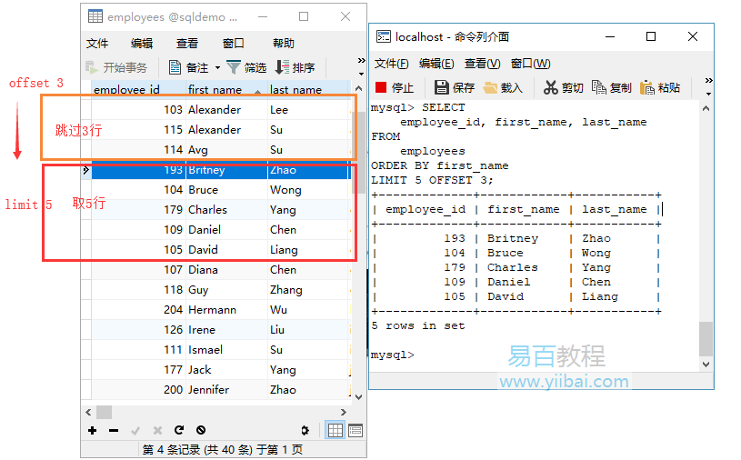
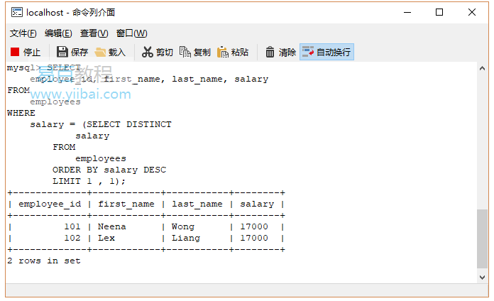
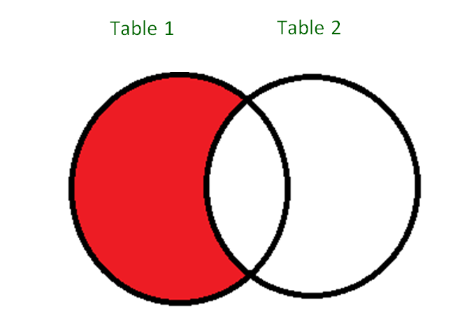
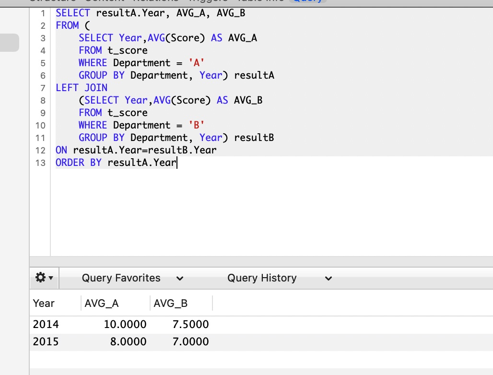

#基本SQL

>  SELECT
    	
    SELECT column1 name, column2 name FROM table name
    	
>  INSERT

	INSERT (column 1, column 2, column 3) INTO table name;
	
	INSERT INTO Employee VALUES(1,'Mandy',12000);

>  UPDATE

	UPDATE table_name
	SET column1_name = value 1…
	WHERE condition1, condition2…

>  WHERE <>, =, IN, NOT IN, AND, OR

	SELECT MAX(SALARY) FROM Employee;
	SELECT MAX(SALARY) FROM Employee WHERE SALARY < (SELECT MAX(SALARY) FROM Employee);
	

>  CREATE TABLE

	CREATE TABLE Employee 
	( 
	ID INTEGER, 
	NAME VARCHAR(20), 
	SALARY INTEGER 
	)

# Limit

1. SQL LIMIT子句简介要检索查询返回的行的一部分，请使用LIMIT和OFFSET子句。 以下说明了这些子句的语法：

		SELECT 
		    column_list
		FROM
		    table1
		ORDER BY column_list
		LIMIT row_count OFFSET offset;
		
		SELECT 
		    employee_id, first_name, last_name
		FROM
		    employees
		ORDER BY first_name
		LIMIT 5 OFFSET 3;
		//更多请阅读：https://www.yiibai.com/sql/sql-limit.html

此查询的假设是每个员工都有不同的薪水。**如果有两个或更多具有相同第二高薪的员工，则查询只返回第一个。**
要解决此问题，可以使用以下语句首先获得第二高薪。

	mysql> SELECT DISTINCT
	    salary
	FROM
	    employees
	ORDER BY salary DESC
	LIMIT 1 , 1;
	
	+--------+
	| salary |
	+--------+
	| 17000  |
	+--------+
	1 row in set

如果使用子查询，则可以将两个查询组合到单个查询中，如下所示：

	SELECT 
	    employee_id, first_name, last_name, salary
	FROM
	    employees
	WHERE
	    salary = (SELECT DISTINCT
	            salary
	        FROM
	            employees
	        ORDER BY salary DESC
	        LIMIT 1 , 1);

在本教程中，我们向您介绍了SQL LIMIT和OFFSET子句，这些子句用于限制查询返回的行数。

#MINUS (mysql 不支持）

SELECT column1 , column2 , ... columnN
FROM table_name
WHERE condition
MINUS
SELECT column1 , column2 , ... columnN
FROM table_name
WHERE condition;

#Second highest salary
[https://leetcode.com/problems/second-highest-salary/solution/](https://leetcode.com/problems/second-highest-salary/solution/)

#SQL query to find second highest salary? 找到第二高的薪水（这里面有一个隐藏的问题，就是有没有多个相同值）

	Name     Salary
	---------------
	abc     100000
	bcd     1000000
	efg     40000
	ghi     500000

	// 获得最高的highest salary
	 SELECT * FROM employee 
	 WHERE salary=(select MAX(salary) FROM employee);

使用了Limit的offset：

(极限情况，table里面只有一个record来说, 会返回空结果):

	SELECT * FROM employee 
	ORDER BY  salary DESC LIMIT 1,1;
	
	SELECT 
		column_list
	FROM table1
	ORDER BY column_list
	LIMIT row_count OFFSET offset;

使用嵌套实现（这里没有使用Order by语句）：

	SELECT name, MAX(salary) AS salary 
	FROM employee 
	WHERE salary <> (SELECT MAX(salary) 
	FROM employee);
	
	
	SELECT 
	    employee_id, first_name, last_name, salary
	FROM
	    employees
	WHERE
	    salary = ( SELECT MAX(salary) AS salary 
	                  FROM employee 
				WHERE salary <> ( SELECT MAX(salary) 
								    FROM employee));
	
使用开窗函数（这里使用了Order by语句）：

	WITH temp AS
	(
	SELECT *, DENSE_RANK() OVER (ORDER BY Score Desc) AS 'rank'
	FROM Employees
	)
	SELECT Name
	FROM temp
	WHERE rank=2;
	
	Mysql: 
	SELECT * FROM(
		SELECT *, DENSE_RANK() OVER (ORDER BY Score Desc) as ranking
			FROM t_score
		) A
    WHERE ranking = 2
    
    Every derived table must have its own alias

这句话的意思是说每个派生出来的表都必须有一个自己的别名。
一般在多表查询时，会出现此错误。
因为，进行嵌套查询的时候子查询出来的的结果是作为一个派生表来进行上一级的查询的，所以子查询的结果必须要有一个别名
把MySQL语句改成：select * from (select * from ……) as 别名;
	
使用Minus (这种返回的值会是多个，只是排除了最大Salary的集合，并不能作为答案)： 

	SELECT name, MAX(salary) AS salary 
	FROM employee 
	WHERE salary IN
	(SELECT salary FROM employee MINUS SELECT MAX(salary) 
	FROM employee); 
	

# IFNULL

SELECT
    IFNULL(
      (SELECT DISTINCT Salary
       FROM Employee
       ORDER BY Salary DESC
        LIMIT 1 OFFSET 1),
    NULL) AS SecondHighestSalary
    
FNULL() 函数用于判断第一个表达式是否为 NULL，如果为 NULL 则返回第二个参数的值，如果不为 NULL 则返回第一个参数的值。
IFNULL() 函数语法格式为：
IFNULL(expression, alt_value)

# CASE 
	select grouping_channel_30d , 
	COUNT(distinct CASE WHEN operation = ‘click’ THEN event_id ELSE null END) / 
	COUNT(distinct CASE WHEN operation = impression THEN event_id ELSE null END) as CTR
	from temp
	where banner_id = XXX
	group by grouping_channel_30d

# with 
	
	with temp as (
	select *, cast( json_extract_scalar(data, '$.banner_id) as BIGINT) as banner_id
	from xxx.mkt_channel_mart_dwd_traffic_event_attr_last_click_30d_hi
	where grass_date = XXX and grass_region = XXX
	and is_valid = true
	and page_type = ‘home’
	and target_type = ‘pop_up_banner’
	and operation in (‘click’, ‘impression’)
	)
	select grouping_channel_30d , 
	COUNT(distinct CASE WHEN operation = ‘click’ THEN event_id ELSE null END) / 
	COUNT(distinct CASE WHEN operation = impression THEN event_id ELSE null END) as CTR
	from temp
	where banner_id = XXX
	group by grouping_channel_30d

#SQL练习
[https://www.w3resource.com/sql-exercises/employee-database-exercise/index.php](https://www.w3resource.com/sql-exercises/employee-database-exercise/index.php)

# Group by

	input table, table_name: t_score
	
	Year   Department  Score
	2014    B 			9
	2015    A 			8
	2014    A 			10
	2015    B 			7
	2014    B 			6
	
	Output
	Year   AVG_A   AVG_B
	2014    10      7.5
	2015    8       7

AVG_A AVG_B is the average value of the score for department A, B correspondingly.
	
	SELECT resultA.Year, AVG_A, AVG_B
	FROM (SELECT Year,AVG(Score) AS AVG_A
		FROM t_score 
		WHERE Department = 'A'
		GROUP BY Department, Year) resultA
	LEFT JOIN
		(SELECT Year,AVG(Score) AS AVG_B
		FROM t_score 
		WHERE Department = 'B'
		GROUP BY Department, Year) resultB
	ON resultA.Year=resultB.Year
	ORDER BY resultA.Year

#笛卡尔乘积

#Left Join

#

#

# 

#开窗函数
ROW_NUMBER : Returns a unique number for each row starting with 1. For rows that have duplicate values,numbers are arbitarily assigned.

Rank : Assigns a unique number for each row starting with 1,except for rows that have duplicate values,in which case the same ranking is assigned and a gap appears in the sequence for each duplicate ranking.

[https://stackoverflow.com/questions/7747327/sql-rank-versus-row-number/7747342](https://stackoverflow.com/questions/7747327/sql-rank-versus-row-number/7747342)

	No     MFGPN
	1      Z363700Z01
	2      Z363700Z01
	3      0119-960-1
	4      1A3F1-0503-01

	SELECT RANK() OVER(ORDER BY MFGPN) As [Item], MFGPN FROM Table1 ORDER BY [No] ASC
	
	RESULT
	
	Item   MFGPN           Desired Result
	3      Z363700Z01            1
	3      Z363700Z01            1
	1      0119-960-1            2
	2      1A3F1-0503-01         3

注意，相同的value会给一个相同的rank
	
	WITH T(StyleID, ID)
	     AS (SELECT 1,1 UNION ALL
	         SELECT 1,1 UNION ALL
	         SELECT 1,1 UNION ALL
	         SELECT 1,2)
	SELECT *,
	       RANK() OVER(PARTITION BY StyleID ORDER BY ID)       AS 'RANK',
	       ROW_NUMBER() OVER(PARTITION BY StyleID ORDER BY ID) AS 'ROW_NUMBER',
	       DENSE_RANK() OVER(PARTITION BY StyleID ORDER BY ID) AS 'DENSE_RANK'
	FROM   T  
	
	Returns
	
	StyleID     ID       RANK      ROW_NUMBER      DENSE_RANK
	----------- -------- --------- --------------- ----------
	1             1       	   1          		1                        1
	1             1        	   1          		2                       1
	1             1       	   1          		3                       1
	1             2        	   4         		4                       2

	order_mart_dwd_dp_order_item_all_ent_df

        select grass_region, grass_date, appsflyer_device_id, media_source
        from 
        (
        	SELECT distinct 
        	grass_region, grass_date, event_time, media_source,
        	coalesce(idfa, advertising_id) as appsflyer_device_id, 
        	row_number() OVER (PARTITION BY coalesce(idfa, advertising_id) ORDER BY event_time,is_retargeting ASC) AS row_num
        	from 
        	(
        	select grass_region, grass_date, media_source, platform, event_time, idfa, advertising_id, is_retargeting
        	from af_tab_freq
        	WHERE grass_date <= date '2020-12-31'
        	and event_name in ('install', 'OrderPlaced')
        	and grass_region = 'BR'
        	union 
        	select grass_region, grass_date, media_source, platform, event_time, idfa, advertising_id, is_retargeting
        	from ods_appsflyer_freq_tab_v3 
        	WHERE grass_date between date '2021-01-01' and date '2021-04-30'
        	and event_name in ('install', 'OrderPlaced')
        	and grass_region = 'BR'
        	)
        )
        where row_num = 1
        LIMIT 10

#什么是坏的查询

