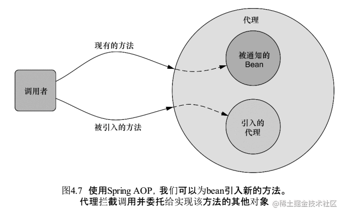
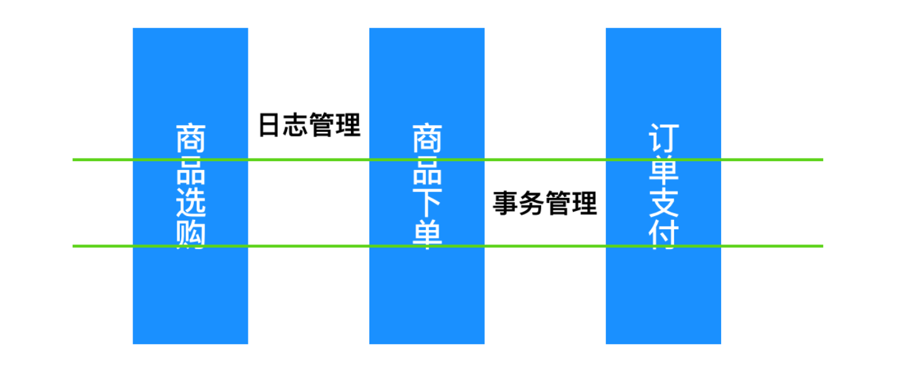
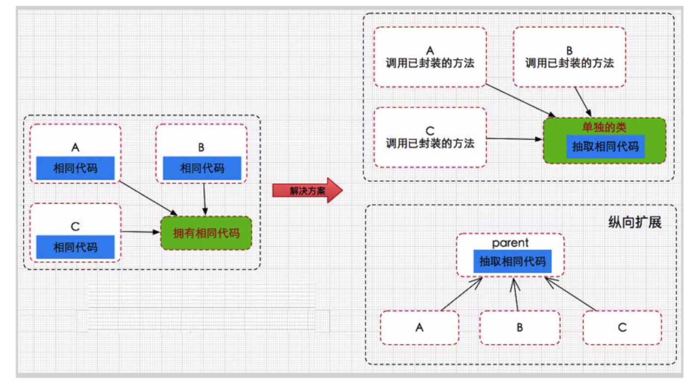

# Spring IOC & APO
Spring 最初核心的两大核心功能 Spring IoC 和 Spring Aop 成就了 Spring，Spring 在这两大核心功能上不断的发展，才有了 Spring 事务、Spring MVC 等一系列伟大的产品，最终成就了 Spring 帝国，到了后期 Spring 几乎可以解决企业开发中的所有问题。

#Spring APO

**Spring AOP默认是使用JDK动态代理，如果代理的类没有接口则会使用CGLib代理。
**
[https://juejin.cn/post/6844903609889456142](https://juejin.cn/post/6844903609889456142)

[https://www.cnblogs.com/cxuanBlog/p/13060510.html](https://www.cnblogs.com/cxuanBlog/p/13060510.html)

[https://mp.weixin.qq.com/s?__biz=MzI4Njg5MDA5NA==&mid=2247483954&idx=1&sn=b34e385ed716edf6f58998ec329f9867&chksm=ebd74333dca0ca257a77c02ab458300ef982adff3cf37eb6d8d2f985f11df5cc07ef17f659d4#rd](https://mp.weixin.qq.com/s?__biz=MzI4Njg5MDA5NA==&mid=2247483954&idx=1&sn=b34e385ed716edf6f58998ec329f9867&chksm=ebd74333dca0ca257a77c02ab458300ef982adff3cf37eb6d8d2f985f11df5cc07ef17f659d4#rd)

如果是单例的我们最好使用CGLib代理，如果是多例的我们最好使用JDK代理

原因：
**JDK在创建代理对象时的性能要高于CGLib代理，而生成代理对象的运行性能却比CGLib的低。
如果是单例的代理，推荐使用CGLib**

看到这里我们就应该知道什么是Spring AOP(面向切面编程)了：将相同逻辑的重复代码横向抽取出来，使用动态代理技术将这些重复代码织入到目标对象方法中，实现和原来一样的功能。

**这样一来，我们就在写业务时只关心业务代码，而不用关心与业务无关的代码**

面向切面编程(Aspect-oriented Programming，俗称AOP)提供了一种面向对象编程(Object-oriented Programming，俗称OOP)的补充，面向对象编程最核心的单元是类(class)，然而面向切面编程最核心的单元是切面(Aspects)。与面向对象的顺序流程不同，AOP采用的是横向切面的方式，注入与主业务流程无关的功能，例如事务管理和日志管理。

Aop： aspect object programming  面向切面编程

**功能： 让关注点代码与业务代码分离！**
**面向切面编程就是指： 对很多功能都有的重复的代码抽取，再在运行的时候往业务方法上动态植入“切面类代码”。**

**关注点**：
重复代码就叫做关注点。

**切面：**
关注点形成的类，就叫切面(类)！切面由切点和增强/通知组成，它既包括了横切逻辑的定义、也包括了连接点的定义。

**切入点表达式**：
指定哪些类的哪些方法被拦截

**连接点(Join point)：**
能够被拦截的地方：Spring AOP是基于动态代理的，所以是方法拦截的。每个成员方法都可以称之为连接点~

**切点(Poincut)：**
具体定位的连接点：上面也说了，每个方法都可以称之为连接点，我们具体定位到某一个方法就成为切点。
执行目标对象方法，动态植入切面代码。
可以通过切入点表达式，指定拦截哪些类的哪些方法； 给指定的类在运行的时候植入切面类代码。

**增强/通知(Advice)：**
表示添加到切点的一段逻辑代码，并定位连接点的方位信息。
简单来说就定义了是干什么的，具体是在哪干
Spring AOP提供了5种Advice类型给我们：前置、后置、返回、异常、环绕给我们使用！

我们之前手动的实现AOP编程是需要自己来编写代理工厂的，现在有了Spring，就不需要我们自己写代理工厂了。Spring内部会帮我们创建代理工厂。

也就是说，不用我们自己写代理对象了。
因此，我们只要关心切面类、切入点、编写切入表达式指定拦截什么方法就可以了！

还是以上一个例子为案例，使用Spring的注解方式来实现AOP编程

我们的代码是这样的：每次写Before、After等，都要重写一次切入点表达式，这样就不优雅了。

    @Before("execution(* aa.*.*(..))")
    public void begin() {
        System.out.println("开始事务");
    }

    @After("execution(* aa.*.*(..))")
    public void close() {
        System.out.println("关闭事务");
    }
    
于是乎，我们要使用@Pointcut这个注解，来指定切入点表达式，在用到的地方中，直接引用就行了！

那么我们的代码就可以改造成这样了：
	
	@Component
	@Aspect//指定为切面类
	public class AOP {
	
	
	    // 指定切入点表达式，拦截哪个类的哪些方法
	    @Pointcut("execution(* aa.*.*(..))")
	    public void pt() {
	
	    }
	
	    @Before("pt()")
	    public void begin() {
	        System.out.println("开始事务");
	    }
	
	
	    @After("pt()")
	    public void close() {
	        System.out.println("关闭事务");
	    }
	}

切入点表达式主要就是来配置拦截哪些类的哪些方法

纵向继承体系：

在改进方案之前，我们或许都遇到过 IDEA 对你输出 Duplicate Code 的时候，这个时候的类的设计是很糟糕的，代码写的也很冗余，基本上 if...else... 完成所有事情，这个时候就需要把相同的代码抽取出来成为公共的方法，降低耦合性。这种提取代码的方式是纵向抽取，纵向抽取的代码之间的关联关系非常密切。

**横向抽取也是代码提取的一种方式**，不过这种方式不会修改主要业务逻辑代码，只是在此基础上添加一些与主要的业务逻辑无关的功能，AOP 采取横向抽取机制，补充了传统纵向继承体系(OOP)无法解决的重复性 代码优化(性能监视、事务管理、安全检查、缓存)，将业务逻辑和系统处理的代码(关闭连接、事务管理、操作日志记录)解耦。

#代理（Proxy)
[https://blog.csdn.net/hon_3y/article/details/70655966](https://blog.csdn.net/hon_3y/article/details/70655966)

代理（Proxy）是一种设计模式， 提供了对目标对象另外的访问方式；即通过代理访问目标对象。 这样好处： 可以在目标对象实现的基础上，增强额外的功能操作。(扩展目标对象的功能)。

可以做到在不修改目标对象的功能前提下，对目标对象功能扩展

可以理解为： 无论外界是想要我干什么，都要经过我的经纪人。我的经纪人也会在其中考虑收费、推脱它们的请求。

静态代理

直接使用例子来说明吧…现在我有一个IUserDao的接口，拥有save方法()

// 接口

	public interface IUserDao {
	    void save();
	    }
	    
UserDao实现该接口，重写save()方法
	
	public class UserDao implements IUserDao{
	
	    @Override
	    public void save() {
	        System.out.println("-----已经保存数据！！！------");
	    }
	
	}
	

	public class UserDaoProxy implements IUserDao{
	
	    // 接收保存目标对象【真正做事的还是UserDao】，因此需要维护userDao的引用
	    private IUserDao target;
	    public UserDaoProxy(IUserDao target) {
	        this.target = target;
	    }
	
	    @Override
	    public void save() {
	        System.out.println("开始事务...");
	
	        target.save();          // 执行目标对象的方法
	
	        System.out.println("提交事务...");
	    }
	}

外界并不是直接去找UserDao,而是要通过代理才能找到userDao

    public static void main(String[] args) {
        // 目标对象
        IUserDao target = new UserDao();

        // 代理
        IUserDao proxy = new UserDaoProxy(target);
        proxy.save();  // 执行的是，代理的方法
    }

#为什么要用动态代理？
[https://blog.csdn.net/hon_3y/article/details/70655966](https://blog.csdn.net/hon_3y/article/details/70655966)

我们首先来看一下静态代理的不足：

如果接口改了，代理的也要跟着改，很烦！
因为代理对象，需要与目标对象实现一样的接口。所以会有很多代理类，类太多。

**动态代理比静态代理好的地方：**

代理对象，不需要实现接口【就不会有太多的代理类了】
代理对象的生成，是利用JDKAPI， 动态地在内存中构建代理对象(需要我们指定创建 代理对象/目标对象 实现的接口的类型；)

**动态代理快速入门**

**动态代理也有个约束：目标对象一定是要有接口的，没有接口就不能实现动态代理 (如果没有接口，就必须是cglib代理**)**

Java提供了一个Proxy类，调用它的newInstance方法可以生成某个对象的代理对象,该方法需要三个参数：

参数一：生成代理对象使用哪个类装载器【一般我们使用的是代理类的装载器】
参数二：生成哪个对象的代理对象，通过接口指定【指定要代理类的接口】
参数三：生成的代理对象的方法里干什么事【实现handler接口，我们想怎么实现就怎么实现】
在编写动态代理之前，要明确两个概念：

代理对象拥有目标对象相同的方法【因为参数二指定了对象的接口】
用户调用代理对象的什么方法，都是在调用处理器的invoke方法。
使用JDK动态代理必须要有接口【参数二需要接口】

	public class XiaoMing implements Person {
	
	    @Override
	    public void sing(String name) {
	
	        System.out.println("小明唱" + name);
	    }
	
	    @Override
	    public void dance(String name) {
	
	        System.out.println("小明跳" + name);
	
	    }
	}
	
	 public interface Person {
	    void sing(String name);
	
	    void dance(String name);
	}

	public class XiaoMingProxy {
	
	    //代理只是一个中介，实际干活的还是小明，于是需要在代理类上维护小明这个变量
	    XiaoMing xiaoMing = new XiaoMing();
	
	
	    //返回代理对象
	    public Person getProxy() {
	
	        /**
	         * 参数一：代理类的类加载器
	         * 参数二：被代理对象的接口
	         * 参数三：InvocationHandler实现类
	         */
	        return (Person)Proxy.newProxyInstance(XiaoMingProxy.class.getClassLoader(), xiaoMing.getClass().getInterfaces(), new InvocationHandler() {
	
	            /**
	             * proxy : 把代理对象自己传递进来
	             * method：把代理对象当前调用的方法传递进来
	             * args:把方法参数传递进来
	             */
	            @Override
	            public Object invoke(Object proxy, Method method, Object[] args) throws Throwable {
	
	                //如果别人想要让小明唱歌
	                if (method.getName().equals("sing")) {
	
	                    System.out.println("给1000万来再唱");
	
	                    //实际上唱歌的还是小明
	                    method.invoke(xiaoMing, args);
	                }
	                return null;
	            }
	        });
	
	    }
	}

    public static void main(String[] args) {

        //外界通过代理才能让小明唱歌
        XiaoMingProxy xiaoMingProxy = new XiaoMingProxy();
        Person proxy = xiaoMingProxy.getProxy();
        proxy.sing("我爱你");

    } 

动态代理应用

我们之前写中文过滤器的时候，需要使用包装设计模式来设计一个request类。如果不是Servlet提供了实现类给我们，我们使用包装设计模式会出现麻烦

现在我们学习了动态代理了，动态代理就是拦截直接访问对象，可以给对象进行增强的一项技能

中文过滤器

    public void doFilter(final ServletRequest req, ServletResponse resp, FilterChain chain) throws ServletException, IOException {
        final HttpServletRequest request = (HttpServletRequest) req;
        HttpServletResponse response = (HttpServletResponse) resp;

        response.setContentType("text/html;charset=UTF-8");
        request.setCharacterEncoding("UTF-8");

        //放出去的是代理对象
        chain.doFilter((ServletRequest) Proxy.newProxyInstance(CharacterEncodingFilter.class.getClassLoader(), request.getClass().getInterfaces(), new InvocationHandler() {
            @Override
            public Object invoke(Object proxy, Method method, Object[] args) throws Throwable {

                //判断是不是getParameter方法
                if (!method.getName().equals("getParameter")) {

                    //不是就使用request调用
                   return method.invoke(request, args);
                }

                //判断是否是get类型的
                if (!request.getMethod().equalsIgnoreCase("get")) {
                   return method.invoke(request, args);
                }

                //执行到这里，只能是get类型的getParameter方法了。
                String value = (String) method.invoke(request, args);
                if (value == null) {
                    return null;
                }
                return new String(value.getBytes("ISO8859-1"), "UTF-8");
            }

        }), response);

    }
    

#cglib代理也叫子类代理
cglib代理也叫子类代理，从内存中构建出一个子类来扩展目标对象的功能！

CGLIB是一个强大的高性能的代码生成包，它可以在运行期扩展Java类与实现Java接口。它广泛的被许多AOP的框架使用，例如Spring AOP和dynaop，为他们提供方法的interception（拦截）。

接下来我们就讲讲怎么写cglib代理：

需要引入cglib – jar文件， 但是spring的核心包中已经包括了cglib功能，所以直接引入spring-core-3.2.5.jar即可。
引入功能包后，就可以在内存中动态构建子类
代理的类不能为final，否则报错【在内存中构建子类来做扩展，当然不能为final，有final就不能继承了】
目标对象的方法如果为final/static, 那么就不会被拦截，即不会执行目标对象额外的业务方法。

	//需要实现MethodInterceptor接口
	public class ProxyFactory implements MethodInterceptor{
	
	    // 维护目标对象
	    private Object target;
	    public ProxyFactory(Object target){
	        this.target = target;
	    }
	
	    // 给目标对象创建代理对象
	    public Object getProxyInstance(){
	        //1. 工具类
	        Enhancer en = new Enhancer();
	        //2. 设置父类
	        en.setSuperclass(target.getClass());
	        //3. 设置回调函数
	        en.setCallback(this);
	        //4. 创建子类(代理对象)
	        return en.create();
	    }
	
	
	    @Override
	    public Object intercept(Object obj, Method method, Object[] args,
	            MethodProxy proxy) throws Throwable {
	
	        System.out.println("开始事务.....");
	
	        // 执行目标对象的方法
	        Object returnValue = method.invoke(target, args);
	
	        System.out.println("提交事务.....");
	
	        return returnValue;
	    }
	}
	
**测试：**

	public class App {
	
	    public static void main(String[] args) {
	
	        UserDao userDao = new UserDao();
	        UserDao factory = (UserDao) new ProxyFactory(userDao).getProxyInstance();
	        factory.save();
	    }
	}

使用cglib就是为了弥补动态代理的不足【动态代理的目标对象一定要实现接口】

#控制反转IoC(Inversion of Control)
　　所以控制反转IoC(Inversion of Control)是说创建对象的控制权进行转移，以前创建对象的主动权和创建时机是由自己把控的，而现在这种权力转移到第三方，比如转移交给了IoC容器，它就是一个专门用来创建对象的工厂，你要什么对象，它就给你什么对象，有了 IoC容器，依赖关系就变了，原先的依赖关系就没了，它们都依赖IoC容器了，通过IoC容器来建立它们之间的关系。
　　
　　　　这是我对Spring的IoC(控制反转)的理解。DI(依赖注入)其实就是IOC的另外一种说法，DI是由Martin Fowler 在2004年初的一篇论文中首次提出的。他总结：控制的什么被反转了？就是：获得依赖对象的方式反转了。

#2.2、DI(依赖注入)

　　IoC的一个重点是在系统运行中，动态的向某个对象提供它所需要的其他对象。这一点是通过DI（Dependency Injection，依赖注入）来实现的。比如对象A需要操作数据库，以前我们总是要在A中自己编写代码来获得一个Connection对象，有了 spring我们就只需要告诉spring，A中需要一个Connection，至于这个Connection怎么构造，何时构造，A不需要知道。在系统运行时，spring会在适当的时候制造一个Connection，然后像打针一样，注射到A当中，这样就完成了对各个对象之间关系的控制。A需要依赖 Connection才能正常运行，而这个Connection是由spring注入到A中的，依赖注入的名字就这么来的。那么DI是如何实现的呢？ Java 1.3之后一个重要特征是反射（reflection），它允许程序在运行的时候动态的生成对象、执行对象的方法、改变对象的属性，spring就是通过反射来实现注入的。

　　理解了IoC和DI的概念后，一切都将变得简单明了，剩下的工作只是在spring的框架中堆积木而已。

#Spring

#Spring Cloud

#SpringBoot

#Mybatis

#Dubbo

#Framework Principles