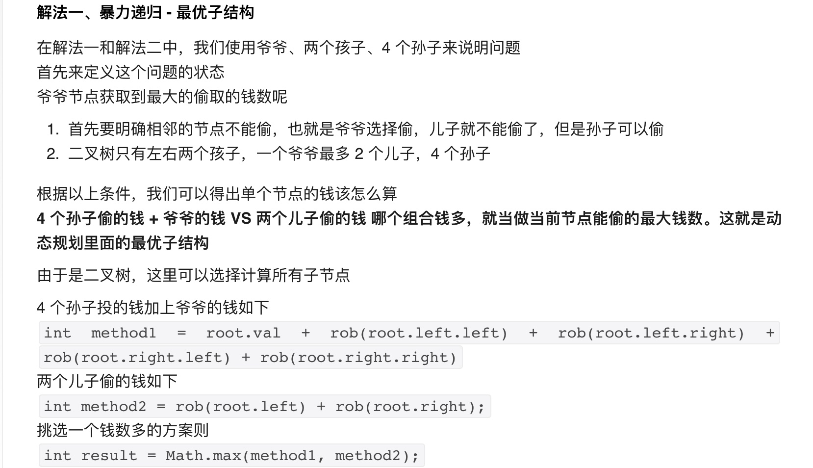

具体这次复习分为几个部分：

>从心态上看，算法是一个套路和实践双结合的问题，就是套路要知道，练得要足够，手够热。

>读面经，有助于快速吸收知识，补足不懂的地方，提问是引起检查知识缺陷和快速进入面试状态的一种方式

1. 广泛的过一遍知识点，在状态好的时候，写题目，在状态不好的时候，见缝插针读题目。唤醒和加强记忆技法。
2. 实际去写题目，进行一些简单的预备，进入考试和面试的那种状态。
3. 复习一下相关的java知识点
4. 复习一下现有的工作的知识点

**基础结构**

	/**
	 * Definition for a binary tree node.
	 * public class TreeNode {
	 *     int val;
	 *     TreeNode left;
	 *     TreeNode right;
	 *     TreeNode(int x) { val = x; }
	 * }
	 */

LinkedList<Integer> list=new LinkedList<>();
PriorityQueue<Integer> pq=new PriorityQueue<>((o1,o2)->{
	return o2-o1;
});
for(Map.Entry<String,String> tmp:map.entrySet()){
	System.out.println(tmp.getKey()+"->"+tmp.getValue());
}
for(String tmp:map.KeySet()){
	System.out.println(tmp);
}

HashSet<String> set=new HashSet<>();
for(String tmp:set){
	System.out.println(tmp);
}

table.foreach(
(key,value) - > {
	System.out.println(key+" "+value); 
}
Stack<Integer> stack=new Stack<>();
stack.push(a);
stack.pop();
stack.peek();
stack.size();
while(stack.isEmpty()){
	
}

**数组**，       ====> OK

如何找到数组中的奇数节点，和偶数节点 i%2==0

给一个数组，实现奇数位置从大到小排列，偶数位置从小到大排列 （LinkedList, sort, 一个从removeFirst()，一个从removeLast()拿, 偶数节点 i%2==0
1 , 2，3，4

	int[] a=new int[]{1,2,3,4};
	int size=a.length;
	List<Integer> list=Arrays.asList(a);
	Arrays.sort(a);

* 数组经常考双指针。
* 快慢指针。
* 移除0。
* 桶排序。

**字符串**，       ====> OK

	String --->  str.length();  

**矩阵**，

int[][] a =new int[m][n];

* 矩阵这种，经常在DP中用到

**链表**
prev、cur、next 

* 链表要注意边界条件（链表为空情况）
*  合并两个有序链表
*  给定一个链表的头结点，也给定这个结点的指针，在O(1)的时间删除该节点（例如该节点为target), target=target.next;
*  找到单链表第k个节点。

* 将链表逆转
* 拼接两个有序链表
* 删除单链表倒数第 n 个节点(里面有两种情况）

* 求单链表的中间节点(快慢指针）
* 快慢指针，有环没环

* 找到环的入口点（要理解证明过程）
* 求两个无环单链表的第一个相交点（第一个公共交点）

> 
> 　有环时查找入环点的方法的证明过程如下：
> 　　当fast与slow相遇时，slow还没走完链表，而fast已经在环内循环了n圈了，假设slow在相遇前走了s步，则fast走了2s步，设环长为r，有2s=s+nr，即s=nr.
> 　　由上图可知a+x=s, x+y=r，而我们的目标是找到a的位置。设上图那个拱起的曲线的长度为y，有a+x=s=nr=(n-1)r+r=(n-1)r+y+x，则a=(n-1)r+y. 这个公式告诉我们，从链表头和相遇点分别设一个指针，每次各走一步，这两个指针必定相遇，且相遇的第一个点为环入口点。

* 判断两个无环单链表是否相交（转换为环解决，hashmap解决，或者将两个链表都移到最后一个点，因为如果相交的话，最后一个点一定是相同的）

> 无环单链表是否相交判断有多种方法：
> 方法1：先循环链表1，将每个节点的地址进行hash计算存入哈希表，然后计算链表2的每个节点的地址的hash值，若与hash表中对应位置有值，则相交，否则不相交。
> 方法2：见链表1与2进行首尾相连，判断新链表是否有环，若没有，则不相交，若有环，则是相交的。
> 方法3：先计算两个链表的长度L1、L2，若L1 > L2，则先将链表1移动（L1 - L2）个节点，等到链表1和链表2剩下的长度一样的时候，一起向后移动，依次判断当前链表的节点是否相等，若相等，则相交，若到队尾还没有相等的，则不相交

* 判断两个有环单链表是否相交

链表经典题目：
[https://www.jianshu.com/p/a2d53142860c](https://www.jianshu.com/p/a2d53142860c)

**队列**,

使用两个队列，做一个栈。(看queue1是空的话，就插入到queue2，然后将queue1的都装进来，弹出的时候，直接从有数据的那个queue直接弹出。这样就保证了后进先出。)

**堆栈**，  
使用两针堆栈，模拟一个队列
倒序打印一个单链表
stack.peek();
stack.push(x);
stack.pop();
最小栈
有效的括号

**二叉树**，固定算法结构。

构建二叉树，根据先根和中根遍历，构造二叉树。(root.left=rebuildTree(preorder, inorder, start, mid-1), root.right=rebuildTree(preorder, inorder, mid+1, end);
构建二叉树，根据后根和中跟遍历，构造二叉树。
二叉树，输出其镜像（每个节点的左右子节点交换）==》 left.val==right.val && symm(left.left,right.right) && symm(left.right,right.left)

序列化和反序列化二叉树. 
	public void serializeHelper(TreeNode root, List<String> list) {
	        if (root == null) {
	            list.add("#");
	            return;
	        }
	        list.add(String.valueOf(root.val));
	        serializeHelper(root.left, list);
	        serializeHelper(root.right, list);
	        return;
    }
	

**二叉搜索树**

判断二叉搜索树的后根遍历序列。。（二叉树右子树的值一定大于root, 先找到第一个大于root的值，这个值是右子树的根mid index，然后分别verify(postorder, start, mid-1) && verify(postorder,mid,end-1))

**排序**，  

快排。
Arrays.sort(a);
Collections.sort(b, (o1,o2)->{
     return o1-o2;
});
桶排序

**快慢指针**
判断链表是否有环，环的入口在哪里

**哈希表**，

哈希表的结构

**双指针**，两指针问题，考察运用语言基本能力，灵活解题能力。

移动零

**优先级队列**，    ====> OK

PriorityQueue 
O(nlogn)

**桶排序**, 首先，桶的最长长度是可以确定的，然后可以根据一定的规则把所有的值分桶（topK） ====> OK 

**排列**

全排列 ===> DPS解法
全排列，但是不能有重复 ===>  DPS解法+HashSet

**回溯**，

**贪心**，

**枚举(穷举)**，即通过for loop一定可以将问题分为一类，另一类：字符串轮转，一定可以通过穷举找到所有的情况

**BFS**，即通过固定模板，先广度再下一步。

腐烂的橘子

**DFS**, 即通过固定模板，先向下搜索到末尾，再回溯。

二叉树先根遍历
电话号码的字母组合

**递归**，

**DP-动态规划**，动态规划

一个有名的理发师会收到源源不断的预约请求，每个预约都可以选择接或不接。在每次预约服务之间要有休息时间，因此她不能接受相邻的预约。给定一个预约请求序列，替理发师找到最优的预约集合（总预约时间最长），返回总的分钟数。

示例 1：
输入： [1,2,3,1]
输出： 4
解释： 选择 1 号预约和 3 号预约，总时长 = 1 + 3 = 4。

dp[i]=Math.max(dp[i-2]+nums[i], dp[i-1]);

213. 打家劫舍 II (这个地方所有的房屋都 围成一圈 ，这意味着第一个房屋和最后一个房屋是紧挨着的)
[https://leetcode.cn/problems/house-robber-ii/solution/da-jia-jie-she-ii-by-leetcode-solution-bwja/](https://leetcode.cn/problems/house-robber-ii/solution/da-jia-jie-she-ii-by-leetcode-solution-bwja/)

根据上述思路，可以得到时间复杂度 O(n) 和空间复杂度 O(n) 的实现。考虑到每间房屋的最高总金额只和该房屋的前两间房屋的最高总金额相关，因此可以使用滚动数组，在每个时刻只需要存储前两间房屋的最高总金额，将空间复杂度降到 O (1).

 打家劫舍 （每间房屋的最高总金额只和该房屋的前两间房屋的最高总金额相关）
dp[i]=Math.max(dp[i-2]+nums[i], dp[i-1]);

可以使用滚动数组计算，把空间降低到1.

 打家劫舍 II
**思路2：** 怎么就没想到把环形分成两个单排呢 (一个是去掉首，一个去掉尾)，然后比较这两个大小。

		class Solution {
		    public int rob(int[] nums) {
		        int length = nums.length;
		        if (length == 1) {
		            return nums[0];
		        } else if (length == 2) {
		            return Math.max(nums[0], nums[1]);
		        }
		        return Math.max(robRange(nums, 0, length - 2), robRange(nums, 1, length - 1));
		    }
	
		    public int robRange(int[] nums, int start, int end) {
		    //滚动数组，每间房屋的最高总金额只和该房屋的前两间房屋的最高总金额相关
		        int first = nums[start], second = Math.max(nums[start], nums[start + 1]);
		        for (int i = start + 2; i <= end; i++) {
		            int temp = second;
		            second = Math.max(first + nums[i], second);
		            first = temp;
		        }
		        return second;
		    }
		}

打家劫舍 三 （二叉树）

	public int rob(TreeNode root) {
	    if (root == null) return 0;
	
	    int money = root.val;
	    if (root.left != null) {
	        money += (rob(root.left.left) + rob(root.left.right));
	    }
	
	    if (root.right != null) {
	        money += (rob(root.right.left) + rob(root.right.right));
	    }
	    return Math.max(money, rob(root.left) + rob(root.right));
	}
	
解法二、记忆化 - 解决重复子问题

针对解法一种速度太慢的问题，经过分析其实现，我们发现爷爷在计算自己能偷多少钱的时候，同时计算了 4 个孙子能偷多少钱，也计算了 2 个儿子能偷多少钱。这样在儿子当爷爷时，就会产生重复计算一遍孙子节点。

于是乎我们发现了一个动态规划的关键优化点

重复子问题

我们这一步针对重复子问题进行优化，我们在做斐波那契数列时，使用的优化方案是记忆化，但是之前的问题都是使用数组解决的，把每次计算的结果都存起来，下次如果再来计算，就从缓存中取，不再计算了，这样就保证每个数字只计算一次。
由于二叉树不适合拿数组当缓存，我们这次使用哈希表来存储结果，TreeNode 当做 key，能偷的钱当做 value

解法一加上记忆化优化后代码如下：

	public int rob(TreeNode root) {
	    HashMap<TreeNode, Integer> memo = new HashMap<>();
	    return robInternal(root, memo);
	}
	
	public int robInternal(TreeNode root, HashMap<TreeNode, Integer> memo) {
	    if (root == null) return 0;
	    if (memo.containsKey(root)) return memo.get(root);
	    int money = root.val;
	
	    if (root.left != null) {
	        money += (robInternal(root.left.left, memo) + robInternal(root.left.right, memo));
	    }
	    if (root.right != null) {
	        money += (robInternal(root.right.left, memo) + robInternal(root.right.right, memo));
	    }
	    int result = Math.max(money, robInternal(root.left, memo) + robInternal(root.right, memo));
	    memo.put(root, result);
	    return result;
	}	 
	 

**二分查找**，

	public int binarySearch(int[] arr, int target){
		int left=0;
		int right=arr.length-1;
		
		while(left<=right){
			int mid=(left+right)/2;
			if(nums[mid]==target){
				return mid;
			}
			if(nums[mid]>target){
				right=mid-1;
			}else{
				left=mid+1;
			}
		}
		return -1;
	}

**快排**，

**堆排序**，

**LRU**

**Snowflake id**

