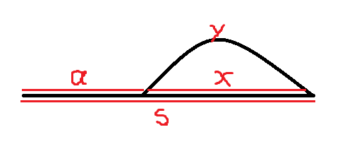
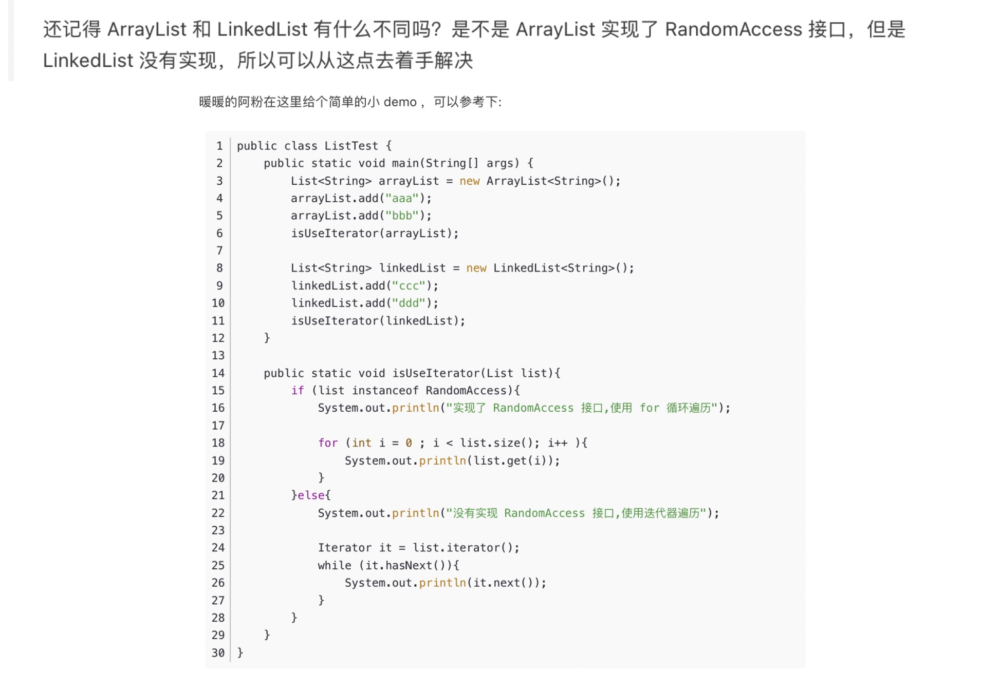
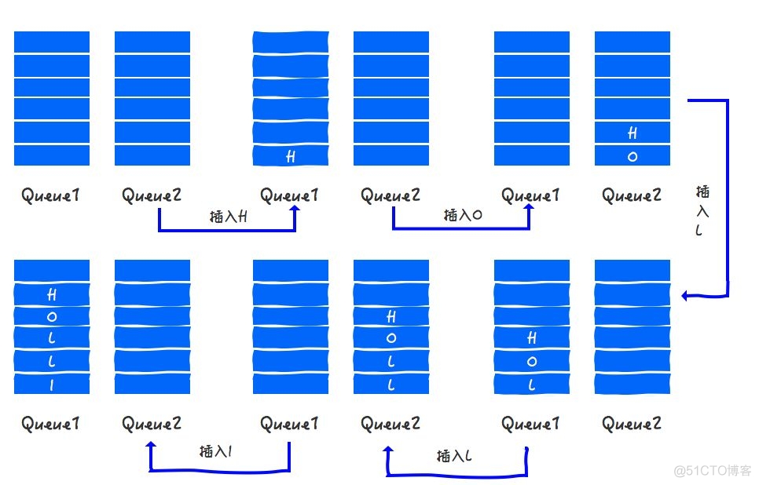
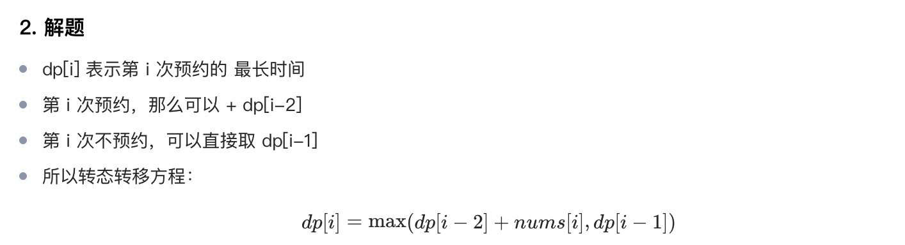
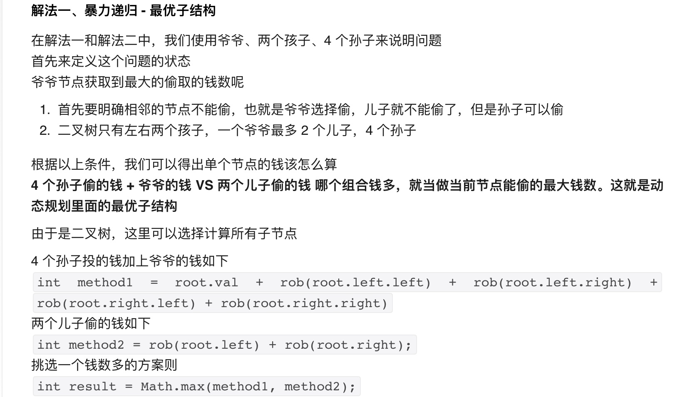

具体这次复习分为几个部分：

网上算法教程：

牛客网左程云亲自上场带你刷爆数据结构与算法-金九银十最新版！
[https://www.bilibili.com/video/BV1N44y1C7Dq/](https://www.bilibili.com/video/BV1N44y1C7Dq/)

刷题技巧网站：
[https://labuladong.github.io/algo/2/20/23/](https://labuladong.github.io/algo/2/20/23/)
https://labuladong.github.io/algo/1/

设计模式：
[https://refactoringguru.cn/design-patterns/singleton](https://refactoringguru.cn/design-patterns/singleton)

>从心态上看，算法是一个套路和实践双结合的问题，就是套路要知道，练得要足够，手够热。

>读面经，有助于快速吸收知识，补足不懂的地方，提问是引起检查知识缺陷和快速进入面试状态的一种方式

1. 广泛的过一遍知识点，在状态好的时候，写题目，在状态不好的时候，见缝插针读题目。唤醒和加强记忆技法。
2. 实际去写题目，进行一些简单的预备，进入考试和面试的那种状态。
3. 复习一下相关的java知识点
4. 复习一下现有的工作的知识点

遇到一道题目的思考路径：

**动态规划,深度优先搜索(dfs),广度优先搜索(bfs),排序,二分查找,双指针,栈,堆（优先队列）,回溯,递归,分治,单调栈,枚举,队列,状态压缩,记忆化搜索,哈希函数,单调队列,快速选择,桶排序,模拟,贪心**

**基础结构**

	 //在写dp中经常遇到
	 int[] dp=new int[n];
	 //赋值一维数组
	 Arrays.fill(dp, -1);
	 
	     int[] cnt1 = new int[26];
        int[] cnt2 = new int[26];
        for (int i = 0; i < n; ++i) {
            ++cnt1[s1.charAt(i) - 'a'];
            ++cnt2[s2.charAt(i) - 'a'];
        }
        // 判断两个arr相等
        if (Arrays.equals(cnt1, cnt2)) {
            return true;
        }

	链接：https://leetcode.cn/problems/permutation-in-string/solutions/599202/zi-fu-chuan-de-pai-lie-by-leetcode-solut-7k7u/
	 
	 
	 
	 //赋值二维数组
	 int[][] dp=new int[m][n];
	 for(int i=0;i<m;i++){
	   Arrays.fill(dp[i],-1);
	 }

	/**
	 * Definition for a binary tree node.
	 * public class TreeNode {
	 *     int val;
	 *     TreeNode left;
	 *     TreeNode right;
	 *     TreeNode(int x) { val = x; }
	 * }
	 */

	LinkedList<Integer> list=new LinkedList<>();
	PriorityQueue<Integer> pq=new PriorityQueue<>((o1,o2)->{
		return o2-o1;
	});
	for(Map.Entry<String,String> tmp:map.entrySet()){
		System.out.println(tmp.getKey()+"->"+tmp.getValue());
	}
	for(String tmp:map.KeySet()){
		System.out.println(tmp);
	}
	
	HashSet<String> set=new HashSet<>();
	for(String tmp:set){
		System.out.println(tmp);
	}
	
	table.foreach(
	(key,value) -> {
		System.out.println(key+" "+value); 
	}
	Stack<Integer> stack=new Stack<>();
	stack.push(a);
	stack.pop();
	stack.peek();
	stack.size();
	while(!stack.isEmpty()){
		
	}

           HashMap<String, String> map=new 			 HashMap<String,String>(){
                {
                    put("key1","value1");
                    put("key2","value2");
                }
            };
            
**二进制** (toBinaryString)

		  int l = 10;
		 "Binary is " + Integer.toBinaryString(l)

        int l = 10;
        // returns the string representation of the unsigned int value
        // represented by the argument in binary (base 2)
        System.out.println("Binary is " + Integer.toBinaryString(l));
  
        l = 9;
        System.out.println("Binary is " + Integer.toBinaryString(l));

	public static String toBinaryString(int num)
	
	Parameter : The function accepts a single mandatory parameter num 
	num - This parameter specifies the number to be converted to binary string. 
	It is of int data-type 
	Return Value: This function returns the string representation of the unsigned Integer value represented by the argument in binary (base 2).
	Examples:
	
	Input : 10 
	Output : 1010 
	
	Input : 9
	Output : 1001 

**数组**，       ====> OK

如何找到数组中的奇数节点，和偶数节点 i%2==0

给一个数组，实现奇数位置从大到小排列，偶数位置从小到大排列 （LinkedList, sort, 一个从removeFirst()，一个从removeLast()拿, 偶数节点 i%2==0
1 , 2，3，4

	int[] a=new int[]{1,2,3,4};
	int size=a.length;
	List<Integer> list=Arrays.asList(a);
	Arrays.sort(a);

* 数组经常考双指针。
* 快慢指针。
* 移除0。
* 桶排序。

**字符串**，       ====> OK

	String --->  str.length();  
	
	   str.substring(start,end);
	   
	   
	   int index=s1.charAt(i) - 'a';  // index to (0 to 26)
	   
	     int[] count1 = new int[26]; // s1每个字符出现的次数
        int[] count2 = new int[26]; // s2每个字符出现的次数
        
        // 1. 进行统计
        for (int i = 0; i < s1.length(); i++) {
            count1[s1.charAt(i) - 'a']++;
            count2[s2.charAt(i) - 'a']++;
        }
        
	原文链接：https://blog.csdn.net/afei__/article/details/85058158
	   
	
		public static void main(String args[]) {
		String str = "I love shopee !";
		ListNode curr=node;
		
		for(Character tmp:str.toCharArray()) {
			ListNode newNode=new ListNode();
			newNode.value=tmp+"";
			curr.next=newNode;
			curr=curr.next;
		}
		ListNode returnNode=FindKthToTail(node,1);
		System.out.println(returnNode.value);
	}
	
	
	String string1 = "foo bar";
	String string2 = "foo bar";
	
	// java string compare example
	if (string1.compareTo(string2) == 0)
	{
	    // this line WILL print
	    System.out.println("The two strings are the same.")
	}

**Compares two strings lexicographically. The comparison is based on the Unicode value of each character in the strings.** 

说明：
如果第一个字符和参数的第一个字符不等，结束比较，返回第一个字符的ASCII码差值。
如果第一个字符和参数的第一个字符相等，则以第二个字符和参数的第二个字符做比较，以此类推,直至不等为止，返回该字符的ASCII码差值。 如果两个字符串不一样长，可对应字符又完全一样，则返回两个字符串的长度差值。

				        // 0并不能单独成为一个编码
			            if(s.charAt(i-1)-'0'!=0){
			                dp[i]+=dp[i-1];
			            }

			   		// 极限case
			        if(s.charAt(0)-'0'==0){
			            return 0;
			        }
			      System.out.println(s.charAt(0)-'0');

			// Decode ways 里面compare字符串是否>="10",并且<="26"
           if (i >= 2 && (s.substring(i - 2, i).compareTo("10") >= 0 && s.substring(i - 2, i).compareTo("26") <= 0)) {
                dp[i] += dp[i - 2];
            }

	 public int compareTo(String anotherString) {
	        byte v1[] = value;
	        byte v2[] = anotherString.value;
	        if (coder() == anotherString.coder()) {
	            return isLatin1() ? StringLatin1.compareTo(v1, v2)
	                              : StringUTF16.compareTo(v1, v2);
	        }
	        return isLatin1() ? StringLatin1.compareToUTF16(v1, v2)
	                          : StringUTF16.compareToLatin1(v1, v2);
	     }

	
	     // 另一种处理字符串的方法:
        String str="27";
        int ten = (str.charAt(0) - '0') * 10;
        int one = (str.charAt(1) - '0');
        System.out.println(ten+" "+one+" "+(ten+one));
        if((ten+one)>26){
            System.out.println(">26");
        }
        // output: 20 7 27
        // output: >26
	
	

**矩阵**，

int[][] a =new int[m][n];

		   // 构造方向向量
		   public int[][] dirs = {{-1, 0}, {1, 0}, {0, -1}, {0, 1}};
        //遍历方向向量, 对多维数组,遍历单维度
        for (int[] dir : dirs) {
            int newRow = row + dir[0], newColumn = column + dir[1];
            //判断是否越界,另外是否新的搜寻方向的值>现在搜寻的当前节点的值(是否递增)
            if (newRow >= 0 && newRow < rows && newColumn >= 0 && newColumn < columns && matrix[newRow][newColumn] > matrix[row][column]) {
                // 比较,从下一个节点开始(该节点可能以前走过,也可能是第一次走),所以要Math.max(xx,xx),否则一旦是新节点,可能小于了之前值
                memo[row][column] = Math.max(memo[row][column], dfs(matrix, newRow, newColumn, memo) + 1);
            }
        }

* 矩阵这种，经常在DP中用到

**链表**
prev、cur、next 

* 链表要注意边界条件（链表为空情况）
*  合并两个有序链表
*  给定一个链表的头结点，也给定这个结点的指针，在O(1)的时间删除该节点（例如该节点为target), target=target.next;
*  找到单链表第k个节点。

* 将链表逆转
* 拼接两个有序链表
* 删除单链表倒数第 n 个节点(里面有两种情况）

* 求单链表的中间节点(快慢指针）
* 快慢指针，有环没环

* 找到环的入口点（要理解证明过程）
* 求两个无环单链表的第一个相交点（第一个公共交点）

> 
> 　有环时查找入环点的方法的证明过程如下：
> 　　当fast与slow相遇时，slow还没走完链表，而fast已经在环内循环了n圈了，假设slow在相遇前走了s步，则fast走了2s步，设环长为r，有2s=s+nr，即s=nr.
> 　　由上图可知a+x=s, x+y=r，而我们的目标是找到a的位置。设上图那个拱起的曲线的长度为y，有a+x=s=nr=(n-1)r+r=(n-1)r+y+x，则a=(n-1)r+y. 这个公式告诉我们，从链表头和相遇点分别设一个指针，每次各走一步，这两个指针必定相遇，且相遇的第一个点为环入口点。

* 判断两个无环单链表是否相交（转换为环解决，hashmap解决，或者将两个链表都移到最后一个点，因为如果相交的话，最后一个点一定是相同的）

> 无环单链表是否相交判断有多种方法：
> 方法1：先循环链表1，将每个节点的地址进行hash计算存入哈希表，然后计算链表2的每个节点的地址的hash值，若与hash表中对应位置有值，则相交，否则不相交。
> 方法2：见链表1与2进行首尾相连，判断新链表是否有环，若没有，则不相交，若有环，则是相交的。
> 方法3：先计算两个链表的长度L1、L2，若L1 > L2，则先将链表1移动（L1 - L2）个节点，等到链表1和链表2剩下的长度一样的时候，一起向后移动，依次判断当前链表的节点是否相等，若相等，则相交，若到队尾还没有相等的，则不相交

* 判断两个有环单链表是否相交

链表经典题目：
[https://www.jianshu.com/p/a2d53142860c](https://www.jianshu.com/p/a2d53142860c)

**LinkedList**

	LinkedList<String> list=new LinkedList<>();
	
	List<Integer> special = specials.get(i), clone = new ArrayList<Integer>(needs);
	list.set(i, value);
	// 替换index=j的值为diff
	clone.set(j, diff);
	
	list.removeFirst();
	list.removeLast();
	list.add(x);  ==> list.addLast(x);
	
	Iterator<String> it=list.iterator();
	while(it.hasNext()){
		System.out.println(it.next());
	}
	
	List<String> res = new LinkedList<>();
	res.toArray(new String[0]);  // 转array
	res.remove(0); // 按位置删除
	
	LinkedList<Integer> list = new LinkedList<>();
	list.get(i);
	list.set(i, newValue);
	
	Iterator<String> it=list.iterator();
	while(it.hasNext())[
	   System.out.println(it.next());
	}
		

**队列**,

使用两个队列，做一个栈。(看queue1是空的话，就插入到queue2，然后将queue1的都装进来，弹出的时候，直接从有数据的那个queue直接弹出。这样就保证了后进先出。)

**堆栈**，  
使用两针堆栈，模拟一个队列
倒序打印一个单链表
stack.peek();
stack.push(x);
stack.pop();
最小栈
有效的括号

**二叉树**，固定算法结构。

构建二叉树，根据先根和中根遍历，构造二叉树。(root.left=rebuildTree(preorder, inorder, start, mid-1), root.right=rebuildTree(preorder, inorder, mid+1, end);
构建二叉树，根据后根和中跟遍历，构造二叉树。
二叉树，输出其镜像（每个节点的左右子节点交换）==》 left.val==right.val && symm(left.left,right.right) && symm(left.right,right.left)

序列化和反序列化二叉树. 
	public void serializeHelper(TreeNode root, List<String> list) {
	        if (root == null) {
	            list.add("#");
	            return;
	        }
	        list.add(String.valueOf(root.val));
	        serializeHelper(root.left, list);
	        serializeHelper(root.right, list);
	        return;
    }
	

**二叉搜索树**

判断二叉搜索树的后根遍历序列。。（二叉树右子树的值一定大于root, 先找到第一个大于root的值，这个值是右子树的根mid index，然后分别verify(postorder, start, mid-1) && verify(postorder,mid,end-1))

**排序**，  

快排。
Arrays.sort(a);
Arrays.sort(a, (o1,o2)->{
     return o1-o2;
});
Collections.sort(b, (o1,o2)->{
     return o1-o2;
});
桶排序

**快慢指针**
判断链表是否有环，环的入口在哪里

**哈希表**，

哈希表的结构

**双指针**，两指针问题，考察运用语言基本能力，灵活解题能力。

移动零

**优先级队列**，    ====> OK

PriorityQueue<Integer> pq=new PriorityQueue<>((o1,o2)->{
  return o2-o1;
});

pq.add(x);
pq.poll();
pq.peek();

O(nlogn)

**桶排序**, 首先，桶的最长长度是可以确定的，然后可以根据一定的规则把所有的值分桶（topK） ====> OK 

**排列**

全排列 ===> DPS解法
全排列，但是不能有重复 ===>  DPS解法+HashSet

**回溯**，

	List<List<Integer>> res = new LinkedList<>();
	// 记录回溯算法的递归路径
	LinkedList<Integer> track = new LinkedList<>();
	
	// 主函数
	public List<List<Integer>> subsets(int[] nums) {
	    backtrack(nums, 0);
	    return res;
	}
	
	// 回溯算法核心函数，遍历子集问题的回溯树
	void backtrack(int[] nums, int start) {
	
	    // 前序位置，每个节点的值都是一个子集
	    res.add(new LinkedList<>(track));
	    
	    // 回溯算法标准框架
	    for (int i = start; i < nums.length; i++) {
	        // 做选择
	        track.addLast(nums[i]);
	        // 通过 start 参数控制树枝的遍历，避免产生重复的子集
	        backtrack(nums, i + 1);
	        // 撤销选择
	        track.removeLast();
	    }
	}

**贪心**，

**枚举(穷举)**，即通过for loop一定可以将问题分为一类，另一类：字符串轮转，一定可以通过穷举找到所有的情况

**BFS**，即通过固定模板，先广度再下一步。
腐烂的橘子

**DFS**, 即通过固定模板，先向下搜索到末尾，再回溯。
二叉树先根遍历
电话号码的字母组合

**递归**，

二叉树的递归

	public void preOrderTraverse(TreeNode root) {
	        if (root != null) {
	            System.out.print(root.val + "->");
	            preOrderTraverse(root.left);
	            preOrderTraverse(root.right);
	        }
	    }

非递归实现 二叉树先根遍历：

	public void preOrderTraverse2(TreeNode root) {
	        Stack<TreeNode> stack = new Stack<>();
	        TreeNode node = root;
	        while (node != null || !stack.empty()) {
	            if (node != null) {
	                System.out.print(node.val + "->");
	                stack.push(node);
	                node = node.left;
	            } else {
	                TreeNode tem = stack.pop();
	                node = tem.right;
	            }
	        }
	    }

binarySearch递归

	public int binarySearch(int[] nums, int target, int left, int right){
		if(left<0 || right>nums.length || left>right){
			return -1;  //结束条件
		}
		while(left<=right){
			int mid=(left+right)/2;
			if(nums[mid]==target){
				return mid;
			}else if(nums[mid]>target){
				return binarySearch(nums,target,left, mid-1);
			}else{
				return binarySearch(nums,target,mid+1,right);
			}
		}
	}

递归回退：

	int count = 1;
	ListNode node;

	public ListNode FindKthToTail(ListNode head,int k) {
	    if(head != null){
	        this.FindKthToTail(head.next,k);
	        if(count++ == k){
	            node = head;
	        }
	    }
	    return node;
	}

Two Sum BST(binary Search  Tree)

	public boolean findTarget(TreeNode root, int target){
		HashSet<Integer> set=new HashSet<>();
		return dfs(root,target,set);
	}
	
	public boolean dfs(TreeNode root, int target, HashSet<Integer> set){
		if(root==null){
			return false;
		}
		
		if(set.contains(target-root.val){
			return true;
		}
		set.add(root.val);
	
		return dfs(root.left, target, set) || dfs(root.right, target, set);
	}

**DP-动态规划**，动态规划

一个有名的理发师会收到源源不断的预约请求，每个预约都可以选择接或不接。在每次预约服务之间要有休息时间，因此她不能接受相邻的预约。给定一个预约请求序列，替理发师找到最优的预约集合（总预约时间最长），返回总的分钟数。

示例 1：
输入： [1,2,3,1]
输出： 4
解释： 选择 1 号预约和 3 号预约，总时长 = 1 + 3 = 4。

dp[i]=Math.max(dp[i-2]+nums[i], dp[i-1]);

213. 打家劫舍 II (这个地方所有的房屋都 围成一圈 ，这意味着第一个房屋和最后一个房屋是紧挨着的)
[https://leetcode.cn/problems/house-robber-ii/solution/da-jia-jie-she-ii-by-leetcode-solution-bwja/](https://leetcode.cn/problems/house-robber-ii/solution/da-jia-jie-she-ii-by-leetcode-solution-bwja/)

根据上述思路，可以得到时间复杂度 O(n) 和空间复杂度 O(n) 的实现。考虑到每间房屋的最高总金额只和该房屋的前两间房屋的最高总金额相关，因此可以使用滚动数组，在每个时刻只需要存储前两间房屋的最高总金额，将空间复杂度降到 O (1).

 打家劫舍 （每间房屋的最高总金额只和该房屋的前两间房屋的最高总金额相关）
dp[i]=Math.max(dp[i-2]+nums[i], dp[i-1]);

可以使用滚动数组计算，把空间降低到1.

 打家劫舍 II
**思路2：** 怎么就没想到把环形分成两个单排呢 (一个是去掉首，一个去掉尾)，然后比较这两个大小。

		class Solution {
		    public int rob(int[] nums) {
		        int length = nums.length;
		        if (length == 1) {
		            return nums[0];
		        } else if (length == 2) {
		            return Math.max(nums[0], nums[1]);
		        }
		        return Math.max(robRange(nums, 0, length - 2), robRange(nums, 1, length - 1));
		    }
	
		    public int robRange(int[] nums, int start, int end) {
		    //滚动数组，每间房屋的最高总金额只和该房屋的前两间房屋的最高总金额相关
		        int first = nums[start], second = Math.max(nums[start], nums[start + 1]);
		        for (int i = start + 2; i <= end; i++) {
		            int temp = second;
		            second = Math.max(first + nums[i], second);
		            first = temp;
		        }
		        return second;
		    }
		}

打家劫舍 三 （二叉树）

	public int rob(TreeNode root) {
	    if (root == null) return 0;
	
	    int money = root.val;
	    if (root.left != null) {
	        money += (rob(root.left.left) + rob(root.left.right));
	    }
	
	    if (root.right != null) {
	        money += (rob(root.right.left) + rob(root.right.right));
	    }
	    return Math.max(money, rob(root.left) + rob(root.right));
	}
	
解法二、记忆化 - 解决重复子问题

针对解法一种速度太慢的问题，经过分析其实现，我们发现爷爷在计算自己能偷多少钱的时候，同时计算了 4 个孙子能偷多少钱，也计算了 2 个儿子能偷多少钱。这样在儿子当爷爷时，就会产生重复计算一遍孙子节点。

于是乎我们发现了一个动态规划的关键优化点

重复子问题

我们这一步针对重复子问题进行优化，我们在做斐波那契数列时，使用的优化方案是记忆化，但是之前的问题都是使用数组解决的，把每次计算的结果都存起来，下次如果再来计算，就从缓存中取，不再计算了，这样就保证每个数字只计算一次。
由于二叉树不适合拿数组当缓存，我们这次使用哈希表来存储结果，TreeNode 当做 key，能偷的钱当做 value

解法一加上记忆化优化后代码如下：

	public int rob(TreeNode root) {
	    HashMap<TreeNode, Integer> memo = new HashMap<>();
	    return robInternal(root, memo);
	}
	
	public int robInternal(TreeNode root, HashMap<TreeNode, Integer> memo) {
	    if (root == null) return 0;
	    if (memo.containsKey(root)) return memo.get(root);
	    int money = root.val;
	
	    if (root.left != null) {
	        money += (robInternal(root.left.left, memo) + robInternal(root.left.right, memo));
	    }
	    if (root.right != null) {
	        money += (robInternal(root.right.left, memo) + robInternal(root.right.right, memo));
	    }
	    int result = Math.max(money, robInternal(root.left, memo) + robInternal(root.right, memo));
	    memo.put(root, result);
	    return result;
	}	 
	 

**二分查找**，

	public int binarySearch(int[] arr, int target){
		int left=0;
		int right=arr.length-1;
		
		while(left<=right){
			int mid=(left+right)/2;
			if(nums[mid]==target){
				return mid;
			}
			if(nums[mid]>target){
				right=mid-1;
			}else{
				left=mid+1;
			}
		}
		return -1;
	}

**快排**，

**堆排序**，
如果所有上部节点大于其下部孩子节点，我们叫做大根堆。 
如果所有上部节点小于其下部孩子节点，我们较多小根堆。

**LRU**

**Snowflake id**

# Must write
**极为常见**:    

			String --->  str.length();  
			Array---> arr.length; 
			List--->int len=list.size();
			
			Math.max(a,b);
			Math.min(a,b);
			
			if(max.length() < Math.max(s1.length(),s2.length()))
                max = s1.length() > s2.length() ? s1 : s2;
        	}
			
			String.valueOf(char[] ch);
			
			Arrays.sort(array[])  //对数组进行快排
		System.out.print(Arrays.toString(array));//输出快排后的数组  ---> [1,2,7,9,11]
			
			Collections.sort(List<xxxx>);
			
			Collections.reverse(list);
			
			//static int  binarySearch(List list, Object key) 使用二分查找法查找指定元素在指定列表的索引位置 
			int index = Collections.binarySearch(list, 4);
			
		  List<Integer> res = new ArrayList();
        // 使用字典，统计每个元素出现的次数，元素为键，元素出现的次数为值
                res.addAll(list);   //添加另一个list的所有元素到这个list中
			
			
		//static void swap(List list, int i, int j) :将指定列表中的两个索引进行位置互换
		Collections.swap(list, 0, 1);

       List<String> list2 = Arrays.asList("Monday,Tuesday,".split(","));
        System.out.println(list2);
        
       List<String> list3 = Arrays.asList(new String[]{"Monday","Tuesday"});
        System.out.println(list3);

     	 int[] array = {23, 43, 55, 12};
        int[] copiedArray = array.clone();

        for(int tmp:copiedArray){
            System.out.print(tmp+" ");
        }
		 [Output] 23 43 55 12 
			
		 // copying array org to copy 
		 copyOf(int[] original, int newLength) 
        int[] copy = Arrays.copyOf(org, 5); 
        
##常见算法套路

常考：

**数组**，       ====> OK
**字符串**，       ====> OK
**矩阵**，
**链表**
**队列**,
**二叉树**，固定算法结构。
**二叉搜索树**
**排序**，  
**快慢指针**
**堆栈**，  
**哈希表**，
**双指针**，两指针问题，考察运用语言基本能力，灵活解题能力。
**优先级队列**，    ====> OK
> **桶排序** ， 首先，桶的最长长度是可以确定的，然后可以根据一定的规则把所有的值分桶（topK） ====> OK 
**回溯**，
**贪心**，
**枚举(穷举)**，即通过for loop一定可以将问题分为一类，另一类：字符串轮转，一定可以通过穷举找到所有的情况
**BFS**，即通过固定模板，先广度再下一步。
**DFS**, 即通过固定模板，先向下搜索到末尾，再回溯。
**递归**，
**DP-动态规划**，动态规划
**二分查找**，
**快排**，
**堆排序**，
**LRU**
**Snowflake id**

不常考：

**字典树**
**分治**
**TreeMap**
**单调栈**
**滑动窗口**
**记忆化搜索**
**组合数学**
**线段树**
**状态压缩**
**并查集**
**位运算**
**前缀和**
**滚动哈希**
**最小生成树**
**扫描线**
**水塘抽样**

#常用变形

	  if (map.containsKey(num)) {
	     map.put(num, map.get(num) + 1);
	   } else {
	      map.put(num, 1);
	   }
	             
	  for(int tmp:nums){
            map.put(tmp,map.getOrDefault(tmp,0)+1);
        }
        
	 for(Map.Entry<Integer,Integer> entry : map.entrySet()){
	 	System.out.println(entry.getKey()+" "+entry.getValue());
	 }
	 
	 PriorityQueue<Integer> pq = new PriorityQueue<>(k);//队列默认自然顺序排列，小顶堆，不必重写compare
	
       for (int i:map.keySet()) {
            q.add(i);
        }
	 
	String[] arr=new String[]{"1","2","3"};
	a++;
	String result=s1.length()>s2.length() ? s1:s2;

## Arrays:

java.util.Arrays类是数组的工具类，一般数组常用的方法包括

二分查找：

	public static int  binarySearch(array[],int key)  //返回key的下标index

#二分查找
**二分查找只适用于 已经完成排序的数组**

	public int binarySearch(int[] nums, int target){
		int l=0;
		int r=nums.length-1;
	
		while(l<=r){
			int mid=(l+r)/2;
			if(nums[mid]==target){
				return mid;
			}
	
			if(nums[mid]>target){
				r=mid-1;
			}else{
				l=mid+1;
			}
		}
		return -1;
	}

**第二种解法：**

        public static int binarySearch(int[] nums,int target, int left, int right){
            if(left>right) return -1;
            int mid=(left+right)/2;
            if(nums[mid]==target) return mid;
            if(nums[mid]>target){
                return binarySearch(nums,target,left,mid-1);
            }else{
                return binarySearch(nums,target,mid+1,right);
            }
        }

#常用的一些转换

	import java.util.*;
	
	import java.math.BigInteger;  
    BigInteger a=new BigInteger("23");
    BigInteger b=new BigInteger("13");
    BigInteger c=a.add(b);

    int intValueOfb1 = b.intValue();
    long longValueOfb1 = b.longValue();
	
	//转换成二进制
	String tmp=Integer.toBinaryString(1)
	System.out.println("Binary is " + Integer.toBinaryString(1024)); 
	
	[Output] Binary is 10000000000
	
	//转换成二进制
	public static String toBinaryString(long i)
	System.out.println("Binary is " + Long.toBinaryString(l));
	
	
	Scanner scan=new Scanner();
	scan.next();
	scan.nextInt();
	scan.nextLong();
	
	while(scan.hasNext()){
		System.out.println(scan.next());
	}

#二分查找:

	public class BinarySearch {
	    public static int binarySearch(int[] arr, int target){
	        int left=0;
	        int right=arr.length-1;
	
	        while(left<=right){
	            int mid=left+(right-left)/2;
	            if(target==arr[mid]){
	                return mid;
	            }else if(target>arr[mid]){
	                left=mid+1;
	            }else{
	                right=mid-1;
	            }
	        }
	        return -1;
	    }
	}

	    // A custom comparator that compares two Strings by their length.
        Comparator<String> stringLengthComparator = new Comparator<String>() {
            @Override
            public int compare(String s1, String s2) {
                return s1.length() - s2.length();
            }
        };

        /*
        The above Comparator can also be created using lambda expression like this =>
        Comparator<String> stringLengthComparator = (s1, s2) -> {
            return s1.length() - s2.length();
        };

        Which can be shortened even further like this =>
        Comparator<String> stringLengthComparator = Comparator.comparingInt(String::length);
        */

	
	Arrays.sort(months,
	            (String a, String b) -> a.length() - b.length());
	Or shorter:
	Arrays.sort(months, (a, b) -> a.length() - b.length());
	
	
	Arrays.sort(months, 
	    (String a, String b) -> { return Integer.signum(a.length() - b.length()); }
	);
	
	
#堆排序

	PriorityQueue<Integer> pq=new PriorityQueue<Integer>(size,new Comparactor<Integer>(){
	    public int compare(int a, int b){
	        return a-b;
	    }
	});
	
    PriorityQueue pq=new PriorityQueue<Integer>(10,(a,b)->{
         return a-b;
    });
	
	PriorityQueue<Integer> pq=new PriorityQueue<Integer>(size, (a,b)->a-b);
	
	PriorityQueue<Integer> pq=new PriorityQueue<Integer>(new Comparactor<int[]>(){
	    public int compare(int[] a, int[] b){
	        return a[0]-b[0];
	    }
	});

给你一个整数数组 nums 和一个整数 k ，请你返回其中出现频率前 k 高的元素。你可以按 任意顺序 返回答案。
示例 1:
输入: nums = [1,1,1,2,2,3], k = 2
输出: [1,2]

示例 2:
输入: nums = [1], k = 1
输出: [1]

	class Solution {
	    HashMap<Integer,Integer> map=new HashMap<Integer,Integer>();
	    public int[] topKFrequent(int[] nums, int k) {
	
	        for(int tmp:nums){
	            map.put(tmp,map.getOrDefault(tmp,0)+1);
	        }
	        List<Map.Entry<Integer,Integer>> list=new ArrayList<>();
	        for(Map.Entry<Integer,Integer> entry:map.entrySet()){
	            list.add(entry);
	        }
	        Collections.sort(list,(o1,o2)->{
	            return o2.getValue()-o1.getValue();
	        });
	        int[] result=new int[k];
	        for(int i=0;i<k;i++){
	            result[i]=list.get(i).getKey();
	        }
	        return result;
	    }
	}
	
14 ms   44 MB   Java    2022/09/06 21:34    
O(nlogn)
	
	class Solution {
	    HashMap<Integer,Integer> map=new HashMap<Integer,Integer>();
	    public int[] topKFrequent(int[] nums, int k) {
	
	        for(int tmp:nums){
	            map.put(tmp,map.getOrDefault(tmp,0)+1);
	        }
	
	        PriorityQueue<Map.Entry<Integer,Integer>> pq=new PriorityQueue<>((o1,o2)->{
	            return o2.getValue()-o1.getValue();
	        });
	        for(Map.Entry<Integer,Integer> entry:map.entrySet()){
	                pq.add(entry);
	        }
	        int[] result=new int[k];
	        for(int i=0;i<k;i++){
	            result[i]=pq.poll().getKey();
	        }
	        return result;
	    }
	}
12 ms   44.1 MB Java

O(nlogn)

	这里不能使用:
	
	        for(Map.Entry<Integer,Integer> entry:map.entrySet()){
	            if(pq.size()<k){
	                pq.add(entry);
	            }else{
	                if(pq.peek().getValue()<entry.getValue()){
	                     pq.poll();
	                     pq.add(entry);
	                }
	            }
	        }
	[4,1,-1,2,-1,2,3]
	2
	输出：
	[-1,1]
	预期结果：
	[-1,2]
	
	public class findTopK {
	
	    //找出前k个最大数，采用小顶堆实现
	    public static int[] findKMax(int[] nums, int k) {
	        PriorityQueue<Integer> pq = new PriorityQueue<>(k);//队列默认自然顺序排列，小顶堆，不必重写compare
	
	        for (int num : nums) {
	            if (pq.size() < k) {
	                pq.offer(num);
	            } else if (pq.peek() < num) {//如果堆顶元素 < 新数，则删除堆顶，加入新数入堆
	                pq.poll();
	                pq.offer(num);
	            }
	        }
	
	        int[] result = new int[k];
	        for (int i = 0; i < k&&!pq.isEmpty(); i++) {
	            result[i] = pq.poll();
	        }
	        return result;
	    }
	
	 public static void main(String[] args) {
	        int[]arr=new int[]{1, 6, 2, 3, 5, 4, 8, 7, 9};
	        System.out.println(Arrays.toString(findKMax( arr,5)));
	    }
	}
	/**
	输出：[5, 6, 7, 8, 9]
	*/

	class Solution {
	    public List<Integer> topKFrequent(int[] nums, int k) {
	        // 使用字典，统计每个元素出现的次数，元素为键，元素出现的次数为值
	        HashMap<Integer,Integer> map = new HashMap();
	        for(int num : nums){
	            if (map.containsKey(num)) {
	               map.put(num, map.get(num) + 1);
	             } else {
	                map.put(num, 1);
	             }
	        }
	        // 遍历map，用最小堆保存频率最大的k个元素
	        PriorityQueue<Integer> pq = new PriorityQueue<>(new Comparator<Integer>() {
	            @Override
	            public int compare(Integer a, Integer b) {
	                return map.get(a) - map.get(b);
	            }
	        });
	        for (Integer key : map.keySet()) {
	            if (pq.size() < k) {
	                pq.add(key);
	            } else if (map.get(key) > map.get(pq.peek())) {
	                pq.remove();
	                pq.add(key);
	            }
	        }
	        // 取出最小堆中的元素
	        List<Integer> res = new ArrayList<>();
	        while (!pq.isEmpty()) {
	            res.add(pq.remove());
	        }
	        return res;
	    }
	}
	//T (O(nlogK))
	//S (O(n))
	
	class Solution {
	    public int[] topKFrequent(int[] nums, int k) {
	        HashMap<Integer, Integer> map = new HashMap<>();
	        PriorityQueue<Integer> q = new PriorityQueue<>((x, y) -> (map.get(y) - map.get(x)));
	        for (int i : nums) {
	            map.put(i, map.getOrDefault(i, 0) + 1);
	        }
	        for (int i:map.keySet()) {
	            q.add(i);
	        }
	        int[] res = new int[k];
	        for (int i = 0; i < k; i++) {
	            res[i] = q.poll();
	        }
	        return res;
	    }
	}
	//T (O(nlogN))
	//S (O(n))

#桶排序

	//基于桶排序求解「前 K 个高频元素」
	class Solution {
	    public int[] topKFrequent(int[] nums, int k) {
	        List<Integer> res = new ArrayList();
	        // 使用字典，统计每个元素出现的次数，元素为键，元素出现的次数为值
	        HashMap<Integer,Integer> map = new HashMap();
	        for(int num : nums){
	            if (map.containsKey(num)) {
	               map.put(num, map.get(num) + 1);
	             } else {
	                map.put(num, 1);
	             }
	        }
	        
	        //桶排序
	        //将频率作为数组下标，对于出现频率不同的数字集合，存入对应的数组下标
	        List<Integer>[] listArr = new List[nums.length+1];
	        for(int key : map.keySet()){
	            // 获取出现的次数作为下标
	            int i = map.get(key);
	            if(listArr[i] == null){
	               listArr[i] = new ArrayList();
	            } 
	            listArr[i].add(key);
	        }
	        
	        // 倒序遍历数组获取出现顺序从大到小的排列
	        for(int i = listArr.length - 1;i >= 0 && res.size() < k;i--){
	            if(listArr[i] == null) continue;
	            res.addAll(listArr[i]);
	        }
	        int[] ans=new int[res.size()];
	        for(int i=0;i<k;i++){
	            ans[i]=res.get(i);
	        }
	        return ans;
	    }
	}
	//T(O(n))
	//S(O(n))

#递归

# 快排:

O(nlogn): 

	public class QuickSort {
		public static void quickSort(int[] arr, int low, int high){
			if(arr==null||arr.length==0) return;
			if(low>=high) return;
	
			int mid=low+(high-low)/2;
			int pivot=arr[mid];
	
			int l=low;
			int h=high;
	
			while(l<=h){
				while(pivot>arr[l]){
					l++;
				}
				while(pivot<arr[h]){
					h--;
				}
				if(l<=h){
					int tmp=arr[l];
					arr[l]=arr[h];
					arr[h]=tmp;
					l++;
					h--;
				}
			}
			if(l<high){
				quickSort(arr,l,high);
			}
			if(h>low){
				quickSort(arr,low,h);
			}
		}
	}
	
	
#最小栈

	Stack<int> s1=new Stack<>();
	s1.push(10);
	While(s1.isEmpty()){
		int s1.pop();
	}
	
	int peekVal=s1.peek();

#字符串轮转
给定两个字符串 s1 和 s2 ，请编写代码检查 s2 是否为 s1 旋转而成（比如， waterbottle 是 erbottlewat 旋转后的字符串）

一定可以将字符串分为两个部分，这两个部分拼凑在一起，一定可以包含另一个完整的字符串（枚举所有可能）

	class Solution {
	    public boolean isFlipedString(String s1, String s2) {
	        if(s1.equals(s2)) return true;
	        if(s1.length()!=s2.length()) return false;
	
	        for(int i=0;i<s1.length();i++){
	            String sub1=s1.substring(0,i);
	            String sub2=s1.substring(i,s1.length());
	            String changed=sub2+sub1;
	            // System.out.println(changed+" ");
	            if(changed.equals(s2)){
	                return true;
	            }
	        }
	        return false;
	    }
	}
	
#快排

	public class Solution{
		public void quickSort(int[] arr, int left, int right){
			if(arr==null||arr.length==0) return;
			if(left>=right) return;
	
			int l=left;
			int h=right;
			int mid=l+(h-l)/2;
			int pivot=arr[mid];
	
			while(l<=h){
				while(arr[l]<pivot){
					l++;
				}
				while(arr[h]>pivot){
					h--;
				}
	
				if(l<=h){
					int tmp=arr[l];
					arr[l]=arr[h];
					arr[h]=tmp;
					l++;
					h--;
				}
			}
	
			if(l<right){
				quickSort(arr,l,right);
			}
			
			if(h>left){
				quickSort(arr,left,h);
			}
		}
	}

#快速选择

Top K 问题的最优解 - 快速选择算法（Quickselect）

字节跳动面试必会：快速选择算法，TopK问题最优解

	class Solution {
	    public int findKthLargest(int[] nums, int k) {
	        return quickSelect(nums, 0, nums.length - 1, k);
	    }
	
	    int quickSelect(int[] nums, int lo, int hi, int k) {
	        int pivot = lo;
	        for (int j = lo; j < hi; j++) {
	            if (nums[j] <= nums[hi]) {
	                swap(nums, pivot++, j);
	            }
	        }
	        swap(nums, pivot, hi);
	        int count = hi - pivot + 1;
	        // 如果找到直接返回
	        if (count == k)
	            return nums[pivot];
	        // 从右边部分找
	        if (count > k)
	            return quickSelect(nums, pivot + 1, hi, k);
	        // 从左边部分找
	        return quickSelect(nums, lo, pivot - 1, k - count);
	    }
	    private void swap(int[] nums, int i, int j) {
	        if (i != j) {
	            int tmp=nums[i];
	            nums[i]=nums[j];
	            nums[j]=tmp;
	        }
	    }
	}

    // private void swap(int[] nums, int i, int j) {
    //     if (i != j) {
    //         nums[i] ^= nums[j];
    //         nums[j] ^= nums[i];
    //         nums[i] ^= nums[j];
    //     }
    // }

	// 异或交换:
	// a = a^b;    a^=b;
	// b = a^b;    b^=a;
	// a = a^b;    a^=b;

// 作者：sdwwld
// 链接：https://leetcode-cn.com/problems/kth-largest-element-in-an-array/solution/javadai-ma-de-2chong-da-an-by-sdwwld/
// 来源：力扣（LeetCode）
// 著作权归作者所有。商业转载请联系作者获得授权，非商业转载请注明出处。

# 冒泡排序
	/**
	     * 冒泡排序
	     *
	     * @param array
	     * @return
	     */
	    public static int[] bubbleSort(int[] array) {
	        if (array.length == 0)
	            return array;
	        for (int i = 0; i < array.length; i++)
	            for (int j = 0; j < array.length - 1 - i; j++)
	                if (array[j + 1] < array[j]) {
	                    int temp = array[j + 1];
	                    array[j + 1] = array[j];
	                    array[j] = temp;
	                }
	        return array;
	    }

    // 1.4 算法分析
    // 最佳情况：T(n) = O(n)   最差情况：T(n) = O(n^2)   平均情况：T(n) = O(n^2)

## Collections

     //对集合进行排序
        Collections.sort(list);

		//寻找最大和最小值
		
        int max = Collections.max(list);
        int min = Collections.min(list);
        
        
       //反转集合中的元素的顺序
        Collections.reverse(list2);
        System.out.println(list2);

	 //交换集合中指定元素的位置
	        Collections.swap(list2, 0, 3);
	        System.out.println(list2);
	        
	原文链接：https://blog.csdn.net/wangshuang1631/article/details/53200764

#操作BigInteger

操作BigInteger

	class Solution {
	    public int fib(int n) {
	        if(n==0) return 0;
	        if(n==1) return 1;
	        BigInteger a=new BigInteger("0");
	        BigInteger b=new BigInteger("1");
	        BigInteger c=a.add(b);
	        for(int i=2;i<=n;i++){
	            c=a.add(b);
	            a=b;
	            b=c;
	        }
	        return c.mod(new BigInteger("1000000007")).intValue();
	    }
	}

#字符串处理，获得length，char之间转换

	char[] arr=str.toCharArray();
	
	 Character[] c =
	        new Character[] {
	          '0', '1', '2', '3', '4', '5', '6', '7', '8', '9', 'a', 'b', 'c', 'd', 'e', 'f', 'g', 'h',
	          'i', 'j', 'k', 'l', 'm', 'n', 'o', 'p', 'q', 'r', 's', 't', 'u', 'v', 'w', 'x', 'y', 'z'
	        };
	    List<Character> list = Arrays.asList(c);
	    
	String str="test";
	char c=str.charAt(0);

#DFS

#BFS

link: https://leetcode-cn.com/problems/rotting-oranges/

994. 腐烂的橘子
难度
中等
在给定的 m x n 网格 grid 中，每个单元格可以有以下三个值之一：

值 0 代表空单元格；
值 1 代表新鲜橘子；
值 2 代表腐烂的橘子。
每分钟，腐烂的橘子 周围 4 个方向上相邻 的新鲜橘子都会腐烂。

返回 直到单元格中没有新鲜橘子为止所必须经过的最小分钟数。如果不可能，返回 -1 。

示例 1：

输入：grid = [[2,1,1],[1,1,0],[0,1,1]]
输出：4
示例 2：

输入：grid = [[2,1,1],[0,1,1],[1,0,1]]
输出：-1
解释：左下角的橘子（第 2 行， 第 0 列）永远不会腐烂，因为腐烂只会发生在 4 个正向上。
示例 3：

输入：grid = [[0,2]]
输出：0
解释：因为 0 分钟时已经没有新鲜橘子了，所以答案就是 0 。
 

提示：

m == grid.length
n == grid[i].length
1 <= m, n <= 10
grid[i][j] 仅为 0、1 或 2

	class Solution {
	    public int orangesRotting(int[][] grid) {
	        if(grid.length==0) return 0;

        int m=grid.length;
        int n=grid[0].length;

        int count=0;
        LinkedList<int[]> queue=new LinkedList<int[]>();
        for(int i=0;i<m;i++){
            for(int j=0;j<n;j++){
                if(grid[i][j]==1){
                    count++;
                }
                if(grid[i][j]==2){
                    queue.add(new int[]{i,j});
                }
            }
        }
        // add the first level end mark
        queue.add(new int[]{-1,-1});

        int minute=0;
        while(!queue.isEmpty()){
            int[] head=queue.removeFirst();
            int x=head[0];
            int y=head[1];

            if(x==-1&&y==-1){
                minute++;

                if(!queue.isEmpty()){
                    queue.add(new int[]{-1,-1});
                }
                continue;
            }

            if(x+1<m&&grid[x+1][y]==1){
                count--;
                grid[x+1][y]=2;
                queue.add(new int[]{x+1,y});
            }
            if(x-1>=0&&grid[x-1][y]==1){
                count--;
                grid[x-1][y]=2;
                queue.add(new int[]{x-1,y});
            }
            if(y+1<n&&grid[x][y+1]==1){
                count--;
                grid[x][y+1]=2;
                queue.add(new int[]{x,y+1});
            }
            if(y-1>=0&&grid[x][y-1]==1){
                count--;
                grid[x][y-1]=2;
                queue.add(new int[]{x,y-1});
            }
        }

    if(count>0) return -1;

    return minute-1;
    }
}

#17. 电话号码的字母组合
给定一个仅包含数字 2-9 的字符串，返回所有它能表示的字母组合。答案可以按 任意顺序 返回。

给出数字到字母的映射如下（与电话按键相同）。注意 1 不对应任何字母。

[Link](https://leetcode.cn/problems/letter-combinations-of-a-phone-number/).

示例 1：

输入：digits = "23"
输出：["ad","ae","af","bd","be","bf","cd","ce","cf"]
示例 2：

输入：digits = ""
输出：[]

	class Solution {
	    List<String> result=new ArrayList<String>();
	    String[] mapArr=new String[]{"","","abc","def","ghi","jkl","mno","pqrs","tuv","wxyz"};
	    public List<String> letterCombinations(String digits) {
	        if(digits.length()==0){
	            return result;
	        }
	        findAll(digits,0,"");
	        return result;
	    }
	
	    public void findAll(String digits,int index,String s){
	        //结束条件
	        if(index==digits.length()){
	            result.add(s);
	            return;
	        }
	        char c=digits.charAt(index);
	        String mapStr=mapArr[Integer.parseInt(c+"")];
	        for(int i=0;i<mapStr.length();i++){
	            findAll(digits,index+1,s+mapStr.charAt(i));
	        }
	    }
	}

#36进制由0-9，a-z，共36个字符表示，最小为’0’, ‘0’、'9’对应十进制的09，‘a’、'z’对应十进制的10 35

例如：

'1b' 换算成10进制等于 1 * 36^1 + 11 * 36^0 = 36 + 11 = 47
'2x' 换算成10进制等于 2 * 36^1 + 33 * 36^0 = 105
要求按照加法规则计算出任意两个36进制正整数的和
如：按照加法规则，计算'1b' + '2x' = '48'（解释：47 + 105 = 152）

'48' 换算成10进制等于 4 * 36^1 + 8 * 36^0 = 152

要求：
不允许把36进制数字整体转为10进制数字，计算出10进制数字的相加结果再转回为36进制

思路
按照十进制的加法方法，满36向前进一位

str1: 1b
str2: 2x

	  public static void main(String args[]) {
	    System.out.println(addNums("1b", "2x"));
	  }
	
	   public static String addNums(String str1, String str2) {
	    Character[] c =
	        new Character[] {
	          '0', '1', '2', '3', '4', '5', '6', '7', '8', '9', 'a', 'b', 'c', 'd', 'e', 'f', 'g', 'h',
	          'i', 'j', 'k', 'l', 'm', 'n', 'o', 'p', 'q', 'r', 's', 't', 'u', 'v', 'w', 'x', 'y', 'z'
	        };
	    List<Character> list = Arrays.asList(c);
	    StringBuilder sb = new StringBuilder();
	    char[] c1 = str1.toCharArray();
	    char[] c2 = str2.toCharArray();

    int i = c1.length - 1, j = c2.length - 1;

    int carry = 0;
    while (i >= 0 && j >= 0) {
      int num1 = list.indexOf(c1[i]);
      int num2 = list.indexOf(c2[j]);
      int result = num1 + num2 + carry;

      if (result >= 36) {
        carry = 1;
        result %= 36;
      } else {
        carry = 0;
      }
      System.out.println(num1 + " " + num2 + " " + carry + " result: " + result);
      sb.append(list.get(result).toString());
      i--;
      j--;
    }

    while (i >= 0) {
      int num1 = list.indexOf(c1[i]);
      int sum = num1 + carry;
      if (sum >= 36) {
        carry = 1;
        sum %= 36;
      } else {
        carry = 0;
      }
      sb.append(list.get(sum).toString());
      i--;
    }

    while (j >= 0) {
      int num2 = list.indexOf(c2[j]);
      int sum = num2 + carry;
      if (sum >= 36) {
        carry = 1;
        sum %= 36;
      } else {
        carry = 0;
      }
      sb.append(list.get(sum).toString());
      j--;
    }

    if (carry == 1) {
      sb.append("1");
    }

    return sb.reverse().toString();
  }

#33. 搜索旋转排序数组 (二分查找变形)

[https://leetcode.cn/problems/search-in-rotated-sorted-array/](https://leetcode.cn/problems/search-in-rotated-sorted-array/)

整数数组 nums 按升序排列，数组中的值 互不相同 。

在传递给函数之前，nums 在预先未知的某个下标 k（0 <= k < nums.length）上进行了 旋转，使数组变为 [nums[k], nums[k+1], ..., nums[n-1], nums[0], nums[1], ..., nums[k-1]]（下标 从 0 开始 计数）。例如， [0,1,2,4,5,6,7] 在下标 3 处经旋转后可能变为 [4,5,6,7,0,1,2] 。

给你 旋转后 的数组 nums 和一个整数 target ，如果 nums 中存在这个目标值 target ，则返回它的下标，否则返回 -1 。

你必须设计一个时间复杂度为 O(log n) 的算法解决此问题。

二分查找只能在有序的区间里面去查找，对于倒序的是没法查找的，所以只能定位到有序的区间，跳到那里去继续寻找

	class Solution {
	    public int search(int[] nums, int target) {
	        return binarySearch(nums,target);
	    }

    public int binarySearch(int[] nums, int target){
        int l=0;
        int r=nums.length-1;
        while(l<=r){
            int mid=(l+r)/2;

            if(nums[mid]==target) return mid;

            if(nums[0]<=nums[mid]){
                // target 在这个区间内
                if(nums[0]<=target && target<nums[mid]){
                    r=mid-1;
                }else{
                    l=mid+1;
                }
            }else {
                // target 在这个区间内
                if(nums[mid]<target && target<=nums[nums.length-1]){
                    l=mid+1;
                }else{
                    r=mid-1;
                }
            }
        }
        return -1;
    }
}

	
	
	class Solution {
	    public int search(int[] nums, int target) {
	        return binarySearch(nums,target);
	    }

    public int binarySearch(int[] nums, int target){
        int l=0;
        int r=nums.length-1;

        while(l<=r){

            int mid=(l+r)/2;
            if(nums[mid]==target){
                return mid;
            }
            //  只能感觉nums[mid]与nums[l]确定，mid是在左边半段还是在右边半段
            if(nums[l]<=nums[mid]){
                //如果是在左边半段，那么我们只能在左边是升序的时候，使用二分查找规则，另一种情况只能用反之else来handle
                //确定target在左边界与mid形成的右边界里面
                if(nums[l]<=target && target<nums[mid]){
                    r=mid-1;
                }else{
                    l=mid+1;
                }
            }else{  
                //如果是在右边半段，那么我们只能在右边是升序的时候，使用二分查找规则，另一种情况只能用反之else来handle
                if(nums[mid]<target && target<=nums[r]){
                    l=mid+1;
                }else{
                    r=mid-1;
                }
            }
        }
        return -1;
    }
}

#回文字符串

给你一个字符串 s，找到 s 中最长的回文子串。
示例 1：
输入：s = "babad"
输出："bab"
解释："aba" 同样是符合题意的答案。

示例 2：
输入：s = "cbbd"
输出："bb"

提示：
1 <= s.length <= 1000
s 仅由数字和英文字母组成

	class Solution {
	    public String longestPalindrome(String s) {
	        String max = "";
	        for(int i=0;i<s.length();i++){
	            String s1 = extend(s,i,i), s2 = extend(s,i,i+1); //s2 focuses on midpoint betweek 2 letters in case of even letters
	            if(max.length() < Math.max(s1.length(),s2.length()))
	                max = s1.length() > s2.length() ? s1 : s2;
	        }
	        return max;
	    }
	    
	    private String extend(String s, int l, int r){
	        while(l >= 0 && r < s.length()){
	            if(s.charAt(l) != s.charAt(r))
	                break;
	            l--;r++;
	        }
	        return s.substring(l+1,r); //handle the extra decrement in the while loop
	    }
	}

#

			
## Given a sorted (in increasing order) array with unique integer elements, write an algorithm to create a binary search tree with minimal height.  

		public void convert(int[] nums,int left,int right){
		
			if(left>right){
			return null;
			}
	
			int middle=low+((right-left)>>1);
		
			TreeNode root=new TreeNode(nums[middle]);
			
			root.left=convert(nums,left,middle-1);
			root.right=convert(nums,middle+1,right);
		
			return root;
		}
			

##Input n,m    Pick up some numbers from 1,2,3....n, to fulfill the sum of them is equal to m. --can repeat pick up numbers

		public void runPermutation(int[] a) {
			
			if(null == a || a.length == 0)
				return;
				
			int[] b = new int[a.length];//辅助空间，保存待输出排列数
			getAllPermutation(a, b, 0);
		}

		public void getAllPermutation(int[] a, int[] b, int index) {
			
			if(index == a.length){
				for(int i = 0; i < index; i++){
					System.out.print(b[i] + " ");
				}
				System.out.println();
				return;
			}
				
			for(int i = 0; i < a.length; i++){
				
				b[index] = a[i];
				getAllPermutation(a, b, index+1);
			}
			
		}
		
		public static void main(String[] args){
			
			Solution3 robot = new Solution3();
			
			int[] a = {1,2,3};
			robot.runPermutation(a);

		}

			
			
## Input m and an input Array, pick up some numbers from specfic array, to fulfill the sum of them is equal to m. (can repeat)

		public static void main(String[] args){
			Solution3 robot = new Solution3();
			int[] a = {1,2,3,6,7,3,4,10};
			robot.findSum(a,10);			
		}
	 
	 int[] nums;
		public void findSum(int[] nums,int sum){
			
			// Arrays.sort(nums);     // no need sort
			this.nums=nums;
			combine(sum);
		}
		
		
	 
			public void combine(int m) {
				
				if(m < 1 )
					return;
				
				ArrayList<Integer> arr = new ArrayList<Integer>();
				getCombination(m, arr);
			}
			public void getCombination(int m, ArrayList<Integer> arr) {
				
				if (m == 0 && arr.size() >= 1) {
					for (int i = 0; i < arr.size(); i++) {
						
						System.out.print(arr.get(i) + " ");
					}
					System.out.println();
					return;
				}
				
				if(m<0) return;
				
				for (int i = 0; i <nums.length; i++) {
					if (!arr.isEmpty() && nums[i] < arr.get(arr.size() - 1))//使集合内元素递增，防止重复
						continue;
			
					arr.add(nums[i]);
					getCombination(m - nums[i], arr);
					if(!arr.isEmpty())
					arr.remove(arr.size()-1);
				}
			}
			
	 
		
		
 
	1 1 1 1 1 1 1 1 1 1 
	1 1 1 1 1 1 1 1 2 
	1 1 1 1 1 1 1 3 
	1 1 1 1 1 1 1 3 
	1 1 1 1 1 1 2 2 
	1 1 1 1 1 1 4 
	1 1 1 1 1 2 3 
	1 1 1 1 1 2 3 
	1 1 1 1 2 2 2 
	1 1 1 1 2 4 
	1 1 1 1 3 3 
	1 1 1 1 3 3 
	1 1 1 1 3 3 
	1 1 1 1 3 3 
	1 1 1 1 6 
	1 1 1 2 2 3 
	1 1 1 2 2 3 
	1 1 1 3 4 
	1 1 1 3 4 
	1 1 1 7 
	1 1 2 2 2 2 
	1 1 2 2 4 
	1 1 2 3 3 
	1 1 2 3 3 
	1 1 2 3 3 
	1 1 2 3 3 
	1 1 2 6 
	1 1 4 4 
	1 2 2 2 3 
	1 2 2 2 3 
	1 2 3 4 
	1 2 3 4 
	1 2 7 
	1 3 3 3 
	1 3 3 3 
	1 3 3 3 
	1 3 3 3 
	1 3 6 
	1 3 3 3 
	1 3 3 3 
	1 3 3 3 
	1 3 3 3 
	1 3 6 
	2 2 2 2 2 
	2 2 2 4 
	2 2 3 3 
	2 2 3 3 
	2 2 3 3 
	2 2 3 3 
	2 2 6 
	2 4 4 
	3 3 4 
	3 3 4 
	3 7 
	3 3 4 
	3 3 4 
	3 7 
	4 6 
	10			
			

##Input n,m    Pick up some numbers from 1,2,3....n, to fulfill the sum of them is equal to m. (0/1 bag)

		LinkedList<Integer> list=new LinkedList<Integer>();
		
		
		public void find_factor(int sum,int n){
			
			if(n<=0||sum<=0) return;  //递归退出条件
			
			if(sum==n){
			  
				//reverse the list:
				Collections.reverse(list);
	//			for(int i=0;i<list.size();i++){
	//				int tmp=list1.get(i);
	//				list1.set(i, list1.get(list1.size()-1-i));
	//				list1.set(list1.size()-1-i, tmp);
	//			}
	//			
				for(int tmp:list)
					System.out.print(tmp+"+");
				
				System.out.println(n);
			}
			
			list.push(n);  // save the current try
			find_factor(sum-n,n-1);  // 将改值的Wi 放入背包，减少当前容量，并在n-1范围内再试，看能否到满足条件临界。 
			list.pop();// 还原状态，不将当前值放入背包
			find_factor(sum,n-1); // 尝试 不将当前值放入背包，在n-1范围内再试。
			
		}
		
		
====> another way to write the code:		
			
	LinkedList<Integer> list=new LinkedList<Integer>();
	
	public void find_factor(int sum,int n){
		if(sum<=0 ||n<=0) return;
	
		if(sum==n){
			for(int i=list.size()-1;i>0;i--)
			System.out.print(list.get(i)+" ");
			System.out.println();
		}
		list.push(n);
		find_factor(sum-n,n-1);
		list.pop();
		find_factor(sum,n-1);
	}

		

Output:
	
	s.find_factor(10,20);
				
	10
	9+1
	8+2
	7+3
	7+2+1
	6+4
	6+3+1
	5+4+1
	4+3+2
	4+3+2+1

##Binary operation / Bit operations  --- The sum of two binary numbers

	public static String addBinary4(String a, String b){
		if (a == null || a.length() == 0)
			return b;
		if (b == null || b.length() == 0)
			return a;

		int currA = a.length() - 1;
		int currB = b.length() - 1;
		int flag = 0;
		StringBuilder sb = new StringBuilder();

		while (currA >= 0 || currB >= 0) {

			int va = 0;
			int vb = 0;

			if (currA >= 0) {
				va = a.charAt(currA) == '0' ? 0 : 1;
				currA--;
			}

			if (currB >= 0) {
				vb = b.charAt(currB) == '0' ? 0 : 1;
				currB--;
			}

			int sum = va + vb + flag;

			if (sum >= 2) {
				sb.append(sum - 2);
				flag = 1;
			} else {
				sb.append(sum);
				flag=0;
			}

		}

		if (flag == 1) {
			sb.append("1");
		}

		return sb.reverse().toString();
 	}

##PreOrder Traversal
Without using recursion:

	   public List<Integer> preorderTraversal3(TreeNode root) {
	    	Stack<TreeNode> s=new Stack<TreeNode>();
	    	s.push(root);
	    	ArrayList<Integer> arr=new ArrayList<Integer>();
	
	    	while(!s.isEmpty()){
	         TreeNode node=s.pop();
	    	  if(node!=null){
	//    	 System.out.print(node.val+" ");
	    		  arr.add(node.val);
	    	  //Last in first out.
	    	    if(node.right!=null){
	    	        s.push(node.right);
	    	    }
	
	 
	    	    if(node.left!=null) {
	    	        s.push(node.left);
	    	    }
	    	}
	
	    	}
	
			return arr;
	
	    }
	    
Using recustion:

    //By using recursion:
    
    public List<Integer> preorderTraversal(TreeNode root) {
        
    	if(root!=null){
    		
    		System.out.println(root.val);
    		
    		if(root.left!=null) preorderTraversal(root.left);
    		
    		if(root.right!=null) preorderTraversal(root.right);
    		
    		
    	}
    	
    	
    return null;
    }

	    
	    

##InOrder Traversal

Without using recursion:

	public List<Integer> inorderTraversal(TreeNode root) {

		Stack<TreeNode> s = new Stack<TreeNode>();
		List<Integer> result = new ArrayList<Integer>();
		HashMap<TreeNode, Boolean> vistedMap = new HashMap<TreeNode, Boolean>();

		s.push(root);
		while (!s.isEmpty()) {
			TreeNode node = s.pop();

			if (node != null) {

				if (vistedMap.get(node) == null) {
					if (node.right != null) {
						s.push(node.right);
					}

					if (node.left != null || node.right != null)
						s.push(node);

					if (node.left == null && node.right == null) {
						result.add(node.val);
					}

					if (node.left != null) {
						s.push(node.left);
					}

					// marke it as visted.
					if (vistedMap.get(node) == null) {
						vistedMap.put(node, true);
					}

				} else {
					result.add(node.val);
				}

			}

		}

		return result;
	}
Using recursion:

	public List<Integer> inOrderTraversalRecursion(TreeNode root){

		if(root!=null){

		if(root.left!=null) inOrderTraversalRecursion(root.left);
		
		list.add(root.val);
		
		if(root.right!=null) inOrderTraversalRecursion(root.right);

		}
		
		return list;
	}
		

##PostOrder Traversal

Using recursion:

	public List<Integer> postOrderTraversalRecursion(TreeNode root){
		if(root.left!=null) postOrderTraversalRecursion(root.left);
		
		if(root.right!=null) postOrderTraversalRecursion(root.right);
		
		list.add(root.val);
		
		return list;
	}

##LevelOrder Traversal
    public static List<List<Integer>> levelOrder(TreeNode root) {
    	
    	if(root==null) return new ArrayList<List<Integer>>();
    	
        List<List<Integer>> result=new ArrayList<List<Integer>>();
        
        LinkedList<TreeNode> que=new LinkedList<TreeNode>();
        
        List<Integer> list=new ArrayList<Integer>();
        
        que.add(root);
        que.add(null);
        
        while(!que.isEmpty()){
        	
        	TreeNode firstNode=que.removeFirst();
 
        	
        	if(firstNode==null){
        		result.add(list);
        		//reset the list ArrayList.
        		list=new ArrayList<Integer>();
        		if(!que.isEmpty()) que.addLast(null);
        		
        	}else{
        		
            	list.add(firstNode.val);
        		if(firstNode.left!=null) que.add(firstNode.left);
        		if(firstNode.right!=null) que.add(firstNode.right);
        		
        	}

        }
        
        return result;
    }

##Deepth of binary tree Traversal

##Linked List Traversal

##Fibonacci Number

		public long find_fib2(int n){
			  
			  long v3=0;     //using long can reach:91 7540113804746346429

			  if(n==0||n==1) return 1;

			  long v1=1;
			  long v2=1;

			  for(int i=1;i<n;i++){
			    v3=v1+v2;
			    v1=v2;
			    v2=v3;
			  }

			  return v3;
			 
			}
	  

		public int find_fib(int n){
		  
		  int v3=0;   //using int only can reach: 45 1836311903 after that output becomes negative number

		  if(n==0||n==1) return 1;

		  int v1=1;
		  int v2=1;

		  for(int i=1;i<n;i++){
		    v3=v1+v2;
		    v1=v2;
		    v2=v3;
		  }

		  return v3;
		 
		}
		
		
		//using recursion:
	    public int find_fib0(int n){  // it is quite slow, when it show 43 701408733
	        
	        if(n==0||n==1) return 1;

	        return find_fib0(n-1)+find_fib0(n-2);  
	           
	        }

##BFS

##DFS

##Judge whether has cycle

	public static boolean hasCycle(ListNode head){
		ListNode first=head,second=head;
		
		if(head==null) return false;  // when head==null
		if(head.next==null) return false; // when only contain head node.
		
		// when contain more than one node
		int j=0;
		while(first.next!=null){
			first=first.next;
			j++;
			if(j==2){
				j=0;
				second=second.next;
			}
			if(first==second) return true;
			
		}
		
		return false;
	}

##find the insection node of two single lists

##find the beginning node of cycle (Linked List)

	public static ListNode detectCycle5(ListNode head) {

		ListNode first = head, second = head;

		if (head == null)
			return null; // when head==null
		if (head.next == null)
			return null; // when only contain head node.
		if(head.next.next==head) return head;

		boolean adjustFlag = false;
		// when contain more than one node
 
		int meetTime=0;
 
		while (first!=null&&first.next != null) {
 
			if(!adjustFlag){
			first = first.next.next;
			second=second.next;
			}else{
				first=first.next;
				second=second.next;
			}
			if(first==second&&first!=null&&meetTime!=2){
				System.out.println("meet:"+first.val);
				meetTime++;
				if(meetTime==2) return second;	
				adjustFlag=true;
				second=head;
			}
 

		}

		return null;
	}
	

##LRU Cache

		HashMap<Integer, Node> map = new HashMap<Integer, Node>();
	 
	
		int capacity = 0;
	
		Node head = null;
		Node rear = null;
	
		public LRUCache(int capacity) {
			this.capacity = capacity;
		}
		
		public int get(int key) {
	     
	    	if(map.get(key)!=null) {
	    		remove(map.get(key));
	    		setHead(map.get(key));
	    		return map.get(key).value;
	    	}
	    	
	    	return -1;
	    }
	
		public void set(int key, int value) {
			
			   if(map.get(key)!=null){
				 Node tmpNode=map.get(key);
				 tmpNode.value=value;
				 
				 /*
				  *  set it to the head
				  */
				 remove(tmpNode);
				 setHead(tmpNode);
			   }else{
	
				   Node newNode=new Node(key,value);
				   
				   //add this new key and value into the HashMap
				   map.put(key, newNode);
				   
				   if(map.size()<=capacity){
					   setHead(newNode);
				   }else{
					   removeRear();
					   setHead(newNode);
				   }
	 
			   }
		}
		
		public void setHead(Node node){
			
			/*
			 * 1. remove the element from LinkedList
			 * 
			 * Cannot put remove element from LinkedList here:
			 * This method will be called by two different cases:
			 * (1) add totally new node into the list
			 * (2) adjust the old node's position in the list.
			 * 
			 * So we need to use a separated method to handle this.
			 * 
			 * 
			 */
			
			//if this node is  head, no need to do the "set head operation"
			if(node==head) return;
	//		
	//		
	//		if(node.prev!=null) node.prev.next=node.next;
	//		
	//		if(node.next!=null) node.next.prev=node.prev;
			
	
			
	        /*
	 		 * 2. move it to the head.
			 *   (1) head==null
			 *   (2) head!=null		
	         */
			if(head==null) {
				head=node;
				rear=head;
			}else{
				node.prev=null;
				head.prev=node;
				node.next=head;
				head=node;
			}
			
	
			
	 
		}
		
		
		public void remove(Node node){
			/*
			 * For removing node, there are several cases:
			 * 
			 * remove from the head
			 * remove from the rear
			 * 
			 * remove from middle
			 * 
			 * 		
			 */
			
			// Consider two directions:
			// from the next direction
			if(node.next!=null){
				
	
				
				if(node.prev!=null){			
	
				}
				//if node.preve==null, that means it is head, adjust the head pointer			
				else{
					head=node.next;
				}
				
				node.next.prev=node.prev;
	//			
				
				//if node.next==null, that means it is rear. adjust the rear pointer.
			}else{
				
				rear=node.prev;
				
				if(node.prev!=null){
				node.prev.next=null;
				}
				//node.prev==null, it is head.
				else{
					head=null;
					rear=null;
				}
	 
			}
			
			
		  // Consider another direction:
		  // from the another direction:
			
			
			if(node.prev!=null){
				
				if(node.next!=null){
					
				}
				//if node.next==null, it means it is rear. need to adjust the rear pointer
				else{
					rear=node.prev;
				}
				
				node.prev.next=node.next;
				
			}
			//if node.prev==null, that means it is head, need to adjust the head pointer
			else{
				
				head=node.next;
				
				if(node.next!=null){
					head.prev=null;
					
				//node.next==null, it is rear.	
				}else{
					head=null;
					rear=null;
				}
			}
			
			
			
			
			
		}
		
		
		
		public void removeRear(){
					
			/*
			 * 1. remove the element from HashMap
	
			 * 
			 * 
			 */
			
			/*
			 *  Important!!!!:
	 public V remove(Object key) {
	        Entry<K,V> e = removeEntryForKey(key);
	        return (e == null ? null : e.value);
	    }
	
			 * 
			 */
	//		map.remove(rear);  // This is wrong.   should put key there.
			
			map.remove(rear.key);
			
	//		System.out.println("remove:"+rear.key);
	//		System.out.println(map.keySet());
			
			/*
			 * 2. adjust the pointer
			 * 	(1) rear ==null
			 *  (2) rear !=null
			 */
			if(rear==null) {
				head=rear;
			}else{
				rear=rear.prev;
				
				/*
				 * After you delete the last element:
				 * (1) There are more than one elements are left.
				 * (2) There is only one element left.  ---> no need to adjust the head pointer
				 * (3) There is no element left ---> need to adjust the head pointer.
				 * 
				 */
				
			    // (1) There are more than one elements are left.
				if(rear!=null)	{
					rear.next=null;
				
				// (3) There is no element left ---> need to adjust the head pointer.
				}else{
					head=rear;
				}
			}
			
			
		}

##Minimum Depth of Binary Tree

	public static int minDepth2(TreeNode root) {

		boolean foundFlag = false;

		if (root == null)
			return 0;

		int result = 0;
		LinkedList<TreeNode> que = new LinkedList<TreeNode>();

		que.add(root);
		que.add(null);

		while (!que.isEmpty()) {

			TreeNode firstNode = que.pop();

			if (firstNode == null) {
				result++;
				if (foundFlag)
					return result;
				if (!que.isEmpty())
					que.addLast(null);

			} else {

				if (firstNode.left == null && firstNode.right == null) {
					foundFlag = true;
				}
				if (firstNode.left != null)
					que.addLast(firstNode.left);

				if (firstNode.right != null)
					que.addLast(firstNode.right);
			}

		}

		return result;
	}

##Maximum Depth of Binary Tree

BFS:

	public static int maxDepthBFS(TreeNode root) {
		int len = 0;
		/*
		 * Because we remove and add nodes so frequently, we choose LinkedList
		 * as fundamental structure.
		 */
		LinkedList<TreeNode> que = new LinkedList<TreeNode>();

		if (root != null) { // need to consider the special cases.
			que.add(root);
			que.add(null); // add a special mark to mark the first level
		}
		/*
		 * 构造特征，并可以reuse，是必备的一种技能
		 * 
		 * Creating new features based on the basic structure is a necessary
		 * skill.
		 * 
		 */

		while (!que.isEmpty()) {

			TreeNode cur = que.removeFirst(); // Thinking why put in? --->
												// should be in.

			if (cur == null) {
				len++; // if the que is empty, it means this level's nodes are
						// visted.

				if (!que.isEmpty())
					que.addLast(null); // add the mark to mark this is the end
										// of this level.

			} else {
				if (cur.left != null)
					que.add(cur.left);
				if (cur.right != null)
					que.add(cur.right);
			}

		}

		return 0;
	}

Another method:

	public static int maxDepth(TreeNode node) {

		int left = 0, right = 0;

		if (node == null)
			return 0;
		if (node != null && node.left == null && node.right == null)
			return 1;

		if (node != null) {
			if (node.left != null) {
				left++;
				left += maxDepth(node.left);
			}

			if (node.right != null) {
				right++;
				right += maxDepth(node.right);

			}

			return Math.max(left, right);
		}

		return 0;

	}

Another method 2:
	
	public static int maxDeepbyDeepSearch(TreeNode root) {

		if (root == null)
			return 0;
		Stack<TreeNode> s = new Stack<TreeNode>();
		s.push(root);

		int maxDepth = 0;
		TreeNode prev = null;
		while (!s.empty()) {
			TreeNode curr = s.peek();

			if (prev == null || prev.left == curr || prev.right == curr) {
				if (curr.left != null)
					s.push(curr.left);
				else if (curr.right != null)
					s.push(curr.right);

			} else if (curr.left == prev) {
				if (curr.right != null)
					s.push(curr.right);
			} else {
				s.pop();
			}
			prev = curr;
			if (s.size() > maxDepth)
				maxDepth = s.size();
		}
		return maxDepth;
	}

##Binary Search

##Implement Queue using stacks

	public class ImplementQueueUsingStacks {

	// Using two stack to implement the Queue
	Stack<Integer> s1 = new Stack<Integer>();
	Stack<Integer> s2 = new Stack<Integer>();

	// Push element x to the back of queue.
	public void push(int x) {
		s1.push(x);
	}

	// Removes the element from in front of queue.
	public void pop() {
		if (s2.isEmpty()) {
			while (!s1.isEmpty()) {
				s2.push(s1.pop());
			}
		}

		// Because in the expression of the question: You may assume that all
		// operations are valid (for example, no pop or peek operations will be
		// called on an empty queue).
		// So in this place, we will not do any checking for empty.
		s2.pop();
	}

	// Get the front element.
	public int peek() {
		if (s2.isEmpty()) {
			while (!s1.isEmpty()) {
				s2.push(s1.pop());
			}
		}
		// Because in the expression of the question: You may assume that all
		// operations are valid (for example, no pop or peek operations will be
		// called on an empty queue).
		// So in this place, we will not do any checking for empty.
		return s2.peek();
	}

	// Return whether the queue is empty.
	public boolean empty() {

		return (s1.isEmpty() && s2.isEmpty()) ? true : false;
	}

	}

##Implement Stack using Queues

	
		LinkedList<Integer> l1=new LinkedList<Integer>();
		LinkedList<Integer> l2=new LinkedList<Integer>();
		
	   public void push(int x) {
		   
		   //always from l1, add elements
	       l1.addLast(x);
	   }

	   // Removes the element on top of the stack.
	   public void pop() {
		   
			
			
		   //handle only contain one element's case.
	//		   if(l1.size()==1) l1.removeFirst();
		   
		   int length=l1.size();
		   
	       for(int i=0;i<length-1;i++){
	       int removeValue=l1.removeFirst();
	       l2.addLast(removeValue);	
	//	       System.out.println("remove:"+removeValue);
	       }

	//	       l1.removeFirst();
	       
	       LinkedList<Integer> tmp=l1;
	       l1=l2;
	       l2=tmp;
	       
	       //always from l2 remove elements
	       l2.removeFirst();
	   }

	   // Get the top element.
	   public int top() {
	//	       System.out.println("top:"+l1.getLast());
	       return l1.getLast();
	   }

	   // Return whether the stack is empty.
	   public boolean empty() {
	//		   System.out.println(l1.isEmpty()&&l2.isEmpty());
	       return (l1.isEmpty()&&l2.isEmpty());
	   }

##invert binary tree
 
    /*
     * Accepted:
     * 
     * 
     */
    
    public static TreeNode invertTree(TreeNode root){
    	
    	if(root==null||(root.left==null&&root.right==null)) return root;
    	
    	if(root!=null){
    		
        	if(root.left!=null||root.right!=null){
            	TreeNode tmp=root.right;
        		root.right=root.left;
        		root.left=tmp;
        	}
    		
    		if(root.left!=null)
    			invertTree(root.left);
    		
    		if(root.right!=null)
    			invertTree(root.right);
    	}
    	return root;
    }
    
##Swap two variables without using extra space

	public static void main(String args[]){
		int a = 3;
		int b = 2;
		a = a ^ b;
		b = a ^ b;  //----> b= a^b^b ===> b=a
		a = a ^ b;  //----> a= a^a^b ===> a=b
		System.out.println(a + " " + b);
	}

##Merge two sorted arrays ===> array operation

##Merge two sorted lists

##O(1) time complexity to get minimum value of stack

	Stack<Integer> s1 = new Stack<Integer>();
	Stack<Integer> s2 = new Stack<Integer>();
	int min = (int) (Math.pow(2, 32) - 1);

	public void push(int x) {
		s1.push(x);
		
		if(!s2.isEmpty()) min=getMin();
		
		if (min > x) {
			min = x;
		}

		s2.push(min);

	}

	public void pop() {
		s1.pop();
		s2.pop();
		//if the statck is empty, should reset the min value to maximum.
		if(s2.isEmpty()){
		 min = (int) (Math.pow(2, 32) - 1);	
		}
	}

	public int top() {
		return s1.peek();
	}

	public int getMin() {
		return s2.peek();
	}	
	
	

##Move-zeroes  ===> array operation

	public static void moveZeroes4(int[] nums) {
			makeFirstBeRight4(0,nums);
			for (int tmp : nums)
				System.out.print(tmp + " ");
	}
	
	
	
	public static void makeFirstBeRight4(int begin, int[] nums) {
		
		/*
		 * Added this mark to terminate the useless all zero loop in advance
		 *  		
		 */
	
		
		//Do not use recursion method
	//	// if the begin value is not zero
	//	if (nums[begin] != 0 && begin + 1 < nums.length) {
	//		makeFirstBeRight(begin + 1, nums);
	
	
		
		/*
		 * (1) Have one pointer to indicate the first zero index in the array
		 * (2) From the head, keep searching the zero until to the end of the array
		 * (3) Once find zero, then, move this zero to after its position's 
		 * first find's non-zero number's position
		 * 
		 */
		
		
		
		int p=begin;
		boolean stopflag=false;
		
		while(p!=nums.length-1&&!stopflag){
			for(int j=p;j<nums.length;j++){
				if(nums[j]==0) {
					p=j;
				break;
				}
			}
			
			//add one terminated condition
			//If cannot be able to find any 0 in the array, it is end.
			
			
			/*
	Input:
	[0,1,0,3,12]
	Output:
	[0,1,0,3,12]
	Expected:
	[1,3,12,0,0]
	
	Reason: use below sentence, actually it has defect.
			 * 
			 * 		if(p==begin) return; 
			 */
	
			
			//if the nums[p]!=0 and p==begin, that means it did not find any zero in array. it should return.
			if(nums[p]!=0&&p==begin) return;
			
			//add one terminated condition
			//If the p is reach the end already, it should return.
			if(p==nums.length-1) return;
			
			stopflag=true;
			
	
			
			// p is the current found 0's position
			
			for (int i = p+1; i < nums.length; i++) {
				if (nums[i] != 0) {
					stopflag=false;
					nums[p] = nums[i];
					nums[i] = 0;
					break;
				}
			}	
		}
	
			//Do not use recursion method
	//		if (begin + 1 < nums.length&&!mark)
	//			makeFirstBeRight(begin + 1, nums);
	
	}
		
	
	

##Palindrome Number (回文)

	// reverse the number to see whether it is equal to previous number;
	public boolean isPalindrome3(int x) {
		int tmp = x;
		int reverse = 0;

		while (tmp != 0) {
			reverse = reverse * 10 + (tmp % 10);
			tmp /= 10;
		}

		return reverse == x;
	}

	public boolean isPalindrome2(int x) {
		if (x < 0)
			return false;

		int div = 1;
		while (x / div >= 10) {
			div *= 10;
		}

		while (x != 0) {
			int l = x / div;
			int r = x % 10;
			if (l != r)
				return false;
			x = (x % div) / 10;
			div /= 100;
		}

		return true;
	}

##Permutations [排列 (important)]

method 1:

	private static void permutation(String prefix, String str) {
 
	    int n = str.length();
	    if (n == 0) System.out.println(prefix);
	    else {
	        for (int i = 0; i < n; i++){
	        	System.out.println(prefix + str.charAt(i)+" || "+ str.substring(0, i) " || "+ str.substring(i+1, n));
	        	
	            permutation(prefix + str.charAt(i), str.substring(0, i) + str.substring(i+1, n));
	        }
	    }
	}

method 2:   ----> int[] nums should contain non-repeated numbers

	public void permutations(int[] nums,int i,int n){
		if(i==n){
			for(int tmp:nums)
			System.out.print(tmp+" ");
	
			System.out.println();
		}else{
			for(int j=i;j<nums.length;j++){
				swap(nums,i,j);
				permutations(nums,i+1,n);
				swap(nums,i,j);
			}
		}
	}
	

## Find path of Binary Tree
	
	class TreeNode{
		int val;
		TreeNode left;
		TreeNode right;
		TreeNode(int x){val=x;}
	}
	
	List<String> result=new ArrayList<String>();
	List<TreeNode> list=new ArrayList<TreeNode>();
	
	public void findPath(TreeNode root){
		
		if(root!=null){
			list.add(root);
			
			if(root.left==null&&root.right==null){
				String str="";
				for(TreeNode tmp:list)
				str+=tmp.val;
				result.add(str);
				list=new ArrayList<TreeNode>();
			}
	
			if(root.left!=null){
				findPath(root.left);
				list.remove(list.size()-1);
			}
	
			if(root.right!=null){
				findPath(root.right);
				list.remove(list.size()-1);
			}
	
		}
	
	}

The sum of path:

	boolean flag=false;
	int sum=0;
	
	public boolean hasPathSum(TreeNode root,int sum){
		
		if(root==null&&sum!=0) return false;
		if(root==null&&sum==0) return false;
		
		this.sum=sum;
 
		
		return loopTree(root,0);
	}
	
	
	public boolean loopTree(TreeNode root,int prevSum){

		//stop faster.
		if(flag) return true;

		if(root!=null){
			
			prevSum+=root.val;
	//			System.out.println(root.val);

			
			if(root.left==null&&root.right==null) {
	//				System.out.println(prevSum+"<-"+(prevSum==sum));
				if(prevSum==sum) flag=true;
			}
			
			if(root.left!=null) loopTree(root.left,prevSum);
			
	//			 result-=root.val;
			
			 if(root.right!=null) loopTree(root.right,prevSum);
		}
		
		if(flag) return true;
	 return false;
		
	}
	
##ReverseBits

	public int reverse3(int n){
		
		// Convert the n to be 32 bits Binary number.
		StringBuilder nb = new StringBuilder(Integer.toBinaryString(n));
		nb.reverse();
		// for(int i=0;i<32-nb.length();i++){ ===> this is wrong. as nb.length
		// is changing. Be careful!!!!!!!!
		int tmpN = 32 - nb.length();
		for (int i = 0; i < tmpN; i++) {
			nb.append("0");
		}
		nb = nb.reverse();
		System.out.println(nb.toString());
 
		char[] nbchar=nb.toString().toCharArray();
		int head=0;
		int end=nb.length()-1;
		
		/*
		 *   replace(old char,new char) this one will 
		 *   replace all the old char to new char.
		nbstr=nbstr.replace(nbstr.charAt(end), nbstr.charAt(head));
		nbstr=nbstr.replace(nbstr.charAt(head), tmp);
		 */
		
	while(head<end){
		char tmp=nbchar[end];
		nbchar[end]=nbchar[head];
		nbchar[head]=tmp;
 
		head++;
		end--;
	}
	
	System.out.println("final:"+String.valueOf(nbchar));
	
	return (int)Long.parseLong(String.valueOf(nbchar),2);  //Used the long first and used (int) to cast the value. So it will not cause exception.
 
	}

##Reverse Integer

	
    public static int reverse2(int x) {
        if((Math.abs(x)+"").length()==1) return x;
    	List<Integer> list=new ArrayList<Integer>();    	
    	long result=0;
    	
	//    	boolean flag=x>0?true:false;
    	
    	while(x!=0){
    	 list.add(x%10);
    	 x/=10;
    	}
    	
    	for(int tmp:list){
    		System.out.print(tmp+" ");
    	}
    	System.out.println();
    	
    	for(int i=0;i<list.size();i++){
    		result+=list.get(i)*Math.pow(10,list.size()-i-1);
    		
    		System.out.print(list.size()-i-1+" ");
    	}
    	
    	/*
    	 * Consider one issue: if the number is 100, then reverse it. The result should be 001?
    	 * 
    	 */
    	
    	
    	// Need to consider overflow(上溢) and underflow(下溢) at the same time.
	//    	if(result>Math.pow(2, 32)-1) return 0;
    	
    	/*
    	 * Java int:
    	 *  Minimum value is - 2,147,483,648.(-2^31) Maximum value is 2,147,483,647(inclusive).(2^31 -1)
    	 * 
    	 */
    	if(result>Math.pow(2, 31)-1||result<-Math.pow(2, 31)) return 0;
    	
    	System.out.println(result);
    	
    	return (int)result;
    }

##Reverse Linked List

	public ListNode reverseList3(ListNode head) {
		if (head == null)
			return head;
		if (head.next == null)
			return head;
		if (head.next.next == null) {

			ListNode next = head.next;
			next.next = head;
			head.next = null;
			return next;
		}
		ListNode prev = head;

		head = head.next;
		ListNode next = head.next;

		prev.next = null;

		while (next.next != null) {
			head.next = prev;
			prev = head;
			head = next;
			next = next.next;
		}

		if (next.next == null) {
			head.next = prev;
		}

		next.next = head;

		return next;
	}

##Rotate Array
Rotate an array of n elements to the right by k steps.

For example, with n = 7 and k = 3, the array [1,2,3,4,5,6,7] is rotated to [5,6,7,1,2,3,4].

	public static void rotate(int[] nums, int k) {
		
		int[] n=nums.clone();
		
		
		if(nums==null) return;
        
		for(int i=0;i<nums.length;i++){
			int tmp=n[i];
			
			nums[(i+k)%nums.length]=tmp;
 
 

		}
 

##Reverse Array

##Is Same Tree (/same-tree/)

	public static boolean isSameTree(TreeNode p, TreeNode q) {

		ArrayList<TreeNode> list1 = new ArrayList<TreeNode>();
		ArrayList<TreeNode> list2 = new ArrayList<TreeNode>();
		getListFromTree(p, list1);
		getListFromTree(q, list2);

		if (list1.size() != list2.size())
			return false; // need to consider the length is different case.

		for (int i = 0; i < list1.size(); i++) {
			// Compare the value
			if (list1.get(i) != null && (list2.get(i) != null) && list1.get(i).val != list2.get(i).val)
				return false;

			// Compare the structure ---> use the null to distinguish differences.
			if ((list1.get(i) == null && list2.get(i) != null) || (list1.get(i) != null && list2.get(i) == null))
				return false;
		}

		return true;
	}

	public static void getListFromTree(TreeNode tree, ArrayList list) {

		if (tree == null)
			return;

		list.add(tree); // Do not forget the root element

		if (tree.left != null) {
			getListFromTree(tree.left, list);
			list.add(tree.left);
		} else {
			list.add(tree.left); // Do not forget null---> distinguish the
									// structure
		}

		/*
		 * In order to make the logic clear to read, keep the above code
		 * 
		 * Actually, it can be replaced below:
		 * 
		 * if(tree.left!=null) getListFromTree(tree.left,list);
		 * list.add(tree.left);
		 * 
		 * 
		 */

		if (tree.right != null) {
			getListFromTree(tree.right, list);
			list.add(tree.right);
		} else {
			list.add(tree.right); // Do not forget null---> distinguish the
									// structure
		}

		/*
		 * In order to make the logic clear to read, keep the above code
		 * 
		 * Actually, it can be replaced below:
		 * 
		 * if(tree.right!=null) getListFromTree(tree.right,list);
		 * list.add(tree.right);
		 * 
		 * 
		 */

	}

## Symmetric Tree

    public static boolean isSymmetric2(TreeNode root) {
    	
    	if(root==null) return true;
    	
    	return symmSubTree(root.left,root.right);    	
    }
    
    
    public static boolean symmSubTree(TreeNode left, TreeNode right){
    	
    	if(left==null&&right==null) return true;
    	if(left!=null&&right==null) return false;
    	if(left==null&&right!=null) return false;
    	
    	if(left.val!=right.val) return false;
    	
    	if(!symmSubTree(left.left,left.right)) return false;
    	if(!symmSubTree(right.right,right.left)) return false;
    	
    	
    	return true; 	
    	
    }
	

## valid-anagram (/valid-anagram/)

Given two strings s and t, write a function to determine if t is an anagram of s.

For example,
s = "anagram", t = "nagaram", return true.
s = "rat", t = "car", return false.

Note:
You may assume the string contains only lowercase alphabets.

Follow up:
What if the inputs contain unicode characters? How would you adapt your solution to such case?

	public static boolean isAnagram(String s, String t) {

		if (s.length() != t.length())
			return false;

		HashMap<Character, Integer> sMap = new HashMap<Character, Integer>();
		HashMap<Character, Integer> tMap = new HashMap<Character, Integer>();

		char[] sCharArr = s.toCharArray();
		char[] tCharArr = t.toCharArray();

		for (Character tmp : sCharArr) {
			if (sMap.get(tmp) == null)
				sMap.put(tmp, 1);
			else {
				sMap.put(tmp, sMap.get(tmp) + 1);
			}

		}

		for (Character tmp : tCharArr) {
			if (tMap.get(tmp) == null)
				tMap.put(tmp, 1);
			else {
				tMap.put(tmp, tMap.get(tmp) + 1);
			}
		}

		for (Character tmp : tCharArr) {
			if (sMap.get(tmp) == null || tMap.get(tmp) == null){
				System.out.println(1);
				return false;
			}
			else {
				if (sMap.get(tmp).intValue()!= tMap.get(tmp).intValue()){
					return false;
				}
			}

		}

		for (Character tmp : sCharArr) {
			if (sMap.get(tmp) == null || tMap.get(tmp) == null){
				return false;
			}
			else {
				if (sMap.get(tmp).intValue()!= tMap.get(tmp).intValue()){

					return false;
				}
			}
		}

		return true;

	}
	
##HashSet iteration

import java.util.HashSet;
import java.util.Iterator;

		HashSet set=new HashSet();
		
		set.add("123");
		set.add("123");
		
		for(Iterator it=set.iterator();it.hasNext();){
			System.out.println(it.next());
		}
		
 

##HashMap iteration

Method 1:        (method 1 is better than method 2----> entry is the basic type in HashMap's implementation.)

	for(Entry<Integer, String> entry:map.entrySet())
	  {
	   System.out.println(entry.getKey()+"="+entry.getValue());
	  }
	
Method 2:
	
	for(Object obj : map.keySet()) {     
	      Object key = obj;     
	      Object value = map.get(obj);     
	      System.out.println(value);
	  }
	

##HashTable iteration

	Hashtable table = new Hashtable();
	  table.put(1, "1");
	  table.put(2, "1");
	  table.put(3, "1");
	  //遍历key
	  Enumeration e = table.keys();
	
		  while( e. hasMoreElements() ){
		
		  System.out.println( e.nextElement() );
		
		  }
	  //遍历value
	  e = table.elements();
	
	  while( e. hasMoreElements() ){
	
	  System.out.println( e.nextElement() );
	
	  }
	  
	  
	  
	  
	  
	Hashtable table=new Hashtable()
	
	table.put("dfs","fds");
	
	Enumeration keys=table.keys();
	
	while(keys.hasMoreElements()){
		str=(String) keys.nextElement();
		System.out.println(str+":"+table.get(str));
	}
		  

##MaximumSubarray

    public int maxSubArray3(int[] nums) {
        int max_ending_here=nums[0];
        int max_so_far=nums[0];
        
        for(int i=1;i<nums.length;i++){
            max_ending_here=Math.max(nums[i], max_ending_here+nums[i]);
            max_so_far=Math.max(max_so_far,max_ending_here);
        }
        
        return max_so_far;
    }
	

##LinkRightNode

Link all the same level node from left to right by using "Right" field.

	class Node
	{
	    public Node[] Children;
	    public Node Right;
	    public int val;
	    Node(int x){val=x;}
	}

	public Node linkRightNode(Node rootNode){
		
		if(rootNode==null) return null;  //consider the null case.
		
		LinkedList<Node> que=new LinkedList<Node>();
		
		que.addLast(rootNode);
		que.addLast(null);
		
		Node prev=null;
		
		while(!que.isEmpty()){
			Node firstNode=que.removeFirst();
			
			if(firstNode==null){
				prev=null;
				if(!que.isEmpty()){
					que.addLast(null);
				}
			}else{
				
				if(prev!=null){
					prev.Right=firstNode;
				}
				
				if(firstNode.Children!=null)
				for(Node tmp:firstNode.Children){
					que.addLast(tmp);
				}
				prev=firstNode;
			}
		}
		return rootNode;
	}

## 反转输出：

I love computer   to  i evol retupmoc.

	public static void main(String args[]) {
		String str = "I love shopee !";
		StringBuilder sb = new StringBuilder();
		String[] str_arr = str.split(" ");
		for (String tmp : str_arr) {
			sb.append(reverseStr(tmp) + " ");
		}
		System.out.println(sb.toString());
	}
	public static String reverseStr(String input) {
		String str = input;
		if (input == null) {
			return null;
		}
		if (input != null && input.length() <= 1) {
			return input;
		}
		char[] char_arr = str.toCharArray();
		for (int i = 0; i <= (input.length() - 1) / 2; i++) {
			// swap the value
			char tmp = char_arr[i];
			char_arr[i] = char_arr[input.length() - 1 - i];
			char_arr[input.length() - 1 - i] = tmp;
		}
		return String.valueOf(char_arr);
	}
	
		  

##Clone the Undirected graph. 
http://n00tc0d3r.blogspot.sg/2013/09/clone-graph.html

Each node in the graph contains a label and a list of its neighbors.

	class UndirectedGraphNode {
	      int label;
	      ArrayList<UndirectedGraphNode> neighbors;
	      UndirectedGraphNode(int x) { label = x; neighbors = new ArrayList(); }
	  };
  
Implementation with DFS
	
	   private UndirectedGraphNode cloneDFS(UndirectedGraphNode root, HashMap<UndirectedGraphNode, UndirectedGraphNode> visited) {  
	     if (root == null) return root;  
	     UndirectedGraphNode node = new UndirectedGraphNode(root.label);  
	     visited.put(root, node);  
	   
	     // DFS  
	     for (UndirectedGraphNode nb : root.neighbors) {  
	       if (visited.containsKey(nb)) {  
	         node.neighbors.add(visited.get(nb));  
	       } else {  
	         node.neighbors.add(cloneDFS(nb, visited));  
	       }  
	     }  
	   
	     return node;  
	   }  
	
	   public UndirectedGraphNode cloneGraph(UndirectedGraphNode node) {  
	     return cloneDFS(node, new HashMap<UndirectedGraphNode, UndirectedGraphNode>());  
	   }  

Implementation with BFS

	   public UndirectedGraphNode cloneBFS(UndirectedGraphNode root) {  
	     if (root == null) return root;  
	   
	     ArrayDeque<UndirectedGraphNode> que = new ArrayDeque<UndirectedGraphNode>();  
	     que.addLast(root);  
	   
	     HashMap<UndirectedGraphNode, UndirectedGraphNode> visited = new HashMap<UndirectedGraphNode, UndirectedGraphNode>();  
	     UndirectedGraphNode rootCopy = new UndirectedGraphNode(root.label);  
	     visited.put(root, rootCopy);  
	   
	     // BFS  
		while (!que.isEmpty()) {
			root = que.removeFirst();
			UndirectedGraphNode node = visited.get(root);

			for (UndirectedGraphNode nb : root.neighbors) {
				if (visited.containsKey(visited.get(nb))) {
					node.neighbors.add(visited.get(nb));
				} else {
					UndirectedGraphNode n = new UndirectedGraphNode(nb.label);
					node.neighbors.add(n);
					visited.put(nb, n);
					que.addLast(nb);
				}
			}
		}
	     return rootCopy;  
	   }  

			
##Returns the index of the first occurrence of needle in haystack, or -1 if needle is not part of haystack.--KMP

	
	    public int strStr3(String haystack, String needle) {
	        // Input validation.
	        if (haystack == null || needle == null) return -1;
	        if (haystack.length() < needle.length()) return -1;
	//	        if (needle.length() == 0) return haystack;
		        if(needle.equals("")&&haystack.equals("")) return 0;
		        if(needle.length()==0) return -1;
		        
	//	        if(needle.length()==0) return 0; // according to leetcode: Input: "" "" Expect: 0

	        // KMP.
	        int firstMatchedIndex = KMP(haystack, needle);

	        // Return result.
	        if (firstMatchedIndex < 0) return -1;
	//	        else return haystack.substring(firstMatchedIndex, haystack.length());
		        else return firstMatchedIndex;
		    }

	    public int[] getNextArr(String pat) {
	        int pat_len = pat.length();

	        int[] next = new int[pat_len];
	        next[0] = -1;

	        int prefix_index = -1;
	        int suffix_index = 0;

	        while (suffix_index < pat_len) {
	            if (prefix_index == -1 || 
	                pat.charAt(prefix_index) == pat.charAt(suffix_index)) {

	                int numMatched_prefix_and_suffix = prefix_index + 1;

	                if (suffix_index + 1 >= pat_len) break;
	                next[suffix_index + 1] = numMatched_prefix_and_suffix;

	                prefix_index ++;
	                suffix_index ++;

	            } else {
	                // Let next array guide use how to reset the prefix_index.
	                prefix_index = next[prefix_index];

	            }
	        }

	        return next;
	    }

	    public int KMP(String str, String pat) {
	        int str_len = str.length();
	        int pat_len = pat.length();

	        int[] next = getNextArr(pat);

	        int str_start = 0;
	        int pat_start = 0;

	        while (str_start < str_len && pat_start < pat_len) {
	            // Since if the pat_start = next[0], the pat_start == -1,
	            // so we need check whether pat_start == -1,
	            // if that we just keep move forward.
	            if (pat_start == -1 || str.charAt(str_start) == pat.charAt(pat_start)) {

	                str_start ++;
	                pat_start ++;

	            } else {
	                // Let next array guide us how to reset the pat_start.
	                pat_start = next[pat_start];

	            }
	        }

	        if (pat_start >= pat_len) {
	            // The current str_start is point to,
	            // the end of the matched part in the str,
	            // and we know the matched length is pat_len,
	            // so we use str_start - pat_len to get,
	            // the matched start point in str.
	            return str_start - pat_len;
	        } else return -1;
	    }
 
 
 Format the code to be readable:
 
  
	    public int findSubStrBeginIndex(String str, String subStr) {
	        // Input validation.
	        if (str == null || subStr == null) return -1;
	        if (str.length() < subStr.length()) return -1;

	        if(subStr.equals("")&&str.equals("")) return 0;
	        if(subStr.length()==0) return -1;
	
	        // KMP.
	        int firstMatchedIndex = KMP(str, subStr);
	
	        // Return result.
	        if (firstMatchedIndex < 0) return -1;
	        else return firstMatchedIndex;
	    }
	
  	 public int[] getNextArr(String subStr) {
        int subStr_len = subStr.length();

        int[] next = new int[subStr_len];
        next[0] = -1;

        int prefix_index = -1;
        int suffix_index = 0;

        while (suffix_index < subStr_len) {
            if (prefix_index == -1 || 
            		subStr.charAt(prefix_index) == subStr.charAt(suffix_index)) {

                int numMatched_prefix_and_suffix = prefix_index + 1;

                if (suffix_index + 1 >= subStr_len) break;
                next[suffix_index + 1] = numMatched_prefix_and_suffix;

                prefix_index ++;
                suffix_index ++;

            } else {
                // Let next array guide use how to reset the prefix_index.
                prefix_index = next[prefix_index];

            }
        }

        return next;
    }
	    
	  public int KMP(String str, String subStr) {
	        int str_len = str.length();
	        int subStr_len = subStr.length();
	
	        int[] next = getNextArr(subStr);
	
	        int str_start = 0;
	        int subStr_start = 0;
	
	        while (str_start < str_len && subStr_start < subStr_len) {
	            if (subStr_start == -1 || str.charAt(str_start) == subStr.charAt(subStr_start)) {
	
	                str_start ++;
	                subStr_start ++;
	
	            } else {
	            	subStr_start = next[subStr_start];
	
	            }
	        }
	
	        if (subStr_start >= subStr_len) {
	            return str_start - subStr_len;
	        } else return -1;
	    }

#Arrays

扩容缩容：public static int[]  copyOf(array[]，newLength)，返回新数组

取部分：public static int[]  copyOfRange(array[],fromindex,toindex)   ，注意[from,to)是开区间，返回新数组

数组从小到大快速排序：public static void Arrays.sort(array[])，

整体赋值：public static void fill(array[],value), 

输出为字符串：public static String  toString(array[])，返回字符串

检查是否相等：public static boolean  equals(array1[],array2[])，返回布尔值

#求中位数，O(n)的java实现【利用快速排序折半查找中位数】
	
	public static int getMedian(int[] nums) {
	        return partition(nums, 0, nums.length - 1);
	    }

    private static int partition(int[] nums, int start, int end) {
        /***快排partition函数原代码——start***/
        int left = start;
        int right = end + 1;

        int point = nums[start];
        while (true) {
            while (left < right && nums[--right] >= point)
                ;
            while (left < right && nums[++left] <= point)
                ;
            if (left == right) {
                break;
            } else {
                int tmp = nums[left];
                nums[left] = nums[right];
                nums[right] = tmp;
            }
        }
        nums[start] = nums[left];
        nums[left] = point;
        /***快排partition函数原代码——end***/

        /***定位判断***/
        if (left == (nums.length - 1) / 2) {
            return nums[left];
        } else if (left > (nums.length - 1) / 2) {
            return partition(nums, start, left - 1);
        } else {
            return partition(nums, left + 1, end);
        }
    }

// 改良：

	public static int getMedian(int[] nums) {
	    return partition(nums, 0, nums.length - 1);
	}
	
	private static int partition(int[] nums, int start, int end) {
	    /***快排partition函数原代码——start***/
	    int left = start;
	    int right = end + 1;
	
	    int point = nums[start];
	    while (left<right) {
	        while (nums[right] >= point)
	            right--;
	        while (nums[left] <= point)
	            left++;
	        if (left == right) {
	            break;
	        } else {
	            int tmp = nums[left];
	            nums[left] = nums[right];
	            nums[right] = tmp;
	        }
	    }
	    nums[start] = nums[left];
	    nums[left] = point;
	    /***快排partition函数原代码——end***/
	
	    /***定位判断***/
	    if (left == (nums.length - 1) / 2) {
	        return nums[left];
	    } else if (left > (nums.length - 1) / 2) {
	        return partition(nums, start, left - 1);
	    } else {
	        return partition(nums, left + 1, end);
	    }
	}

