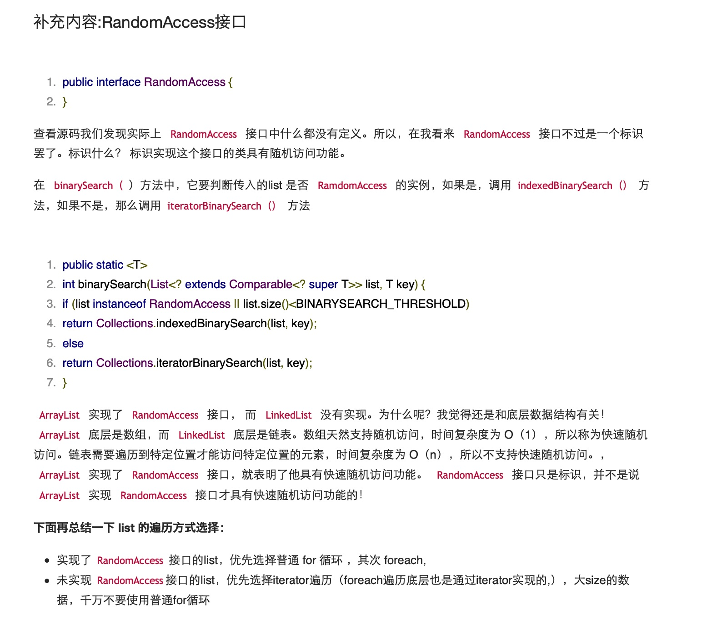
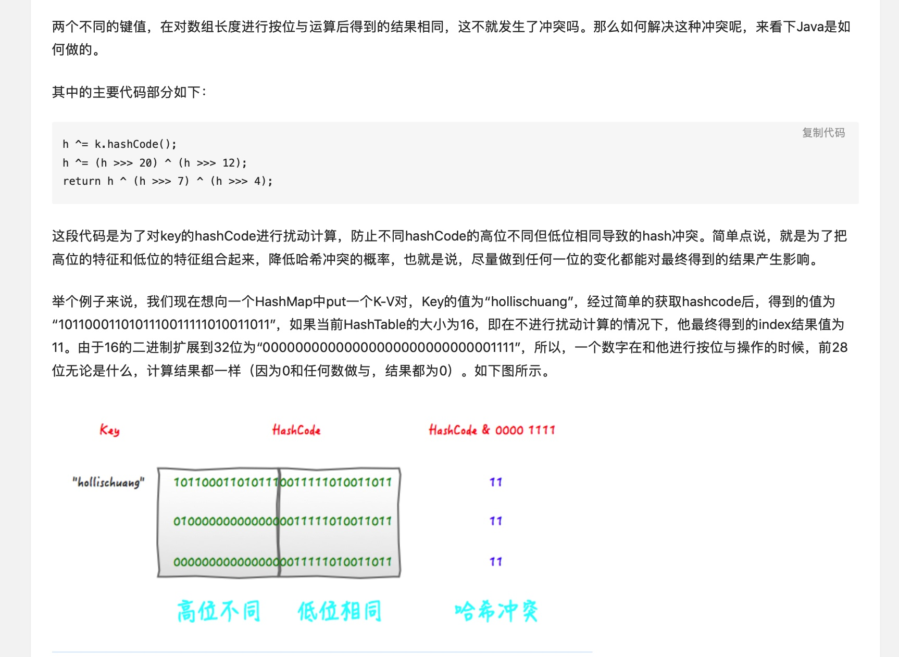
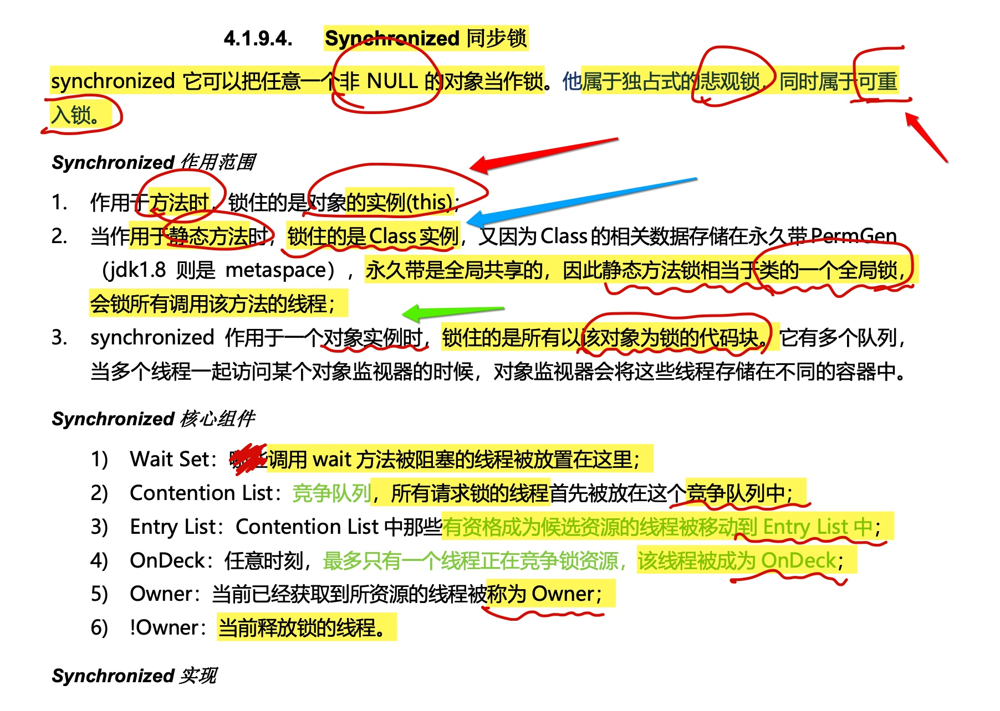
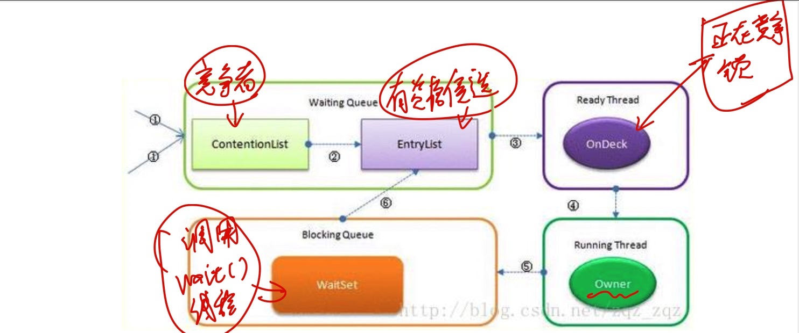
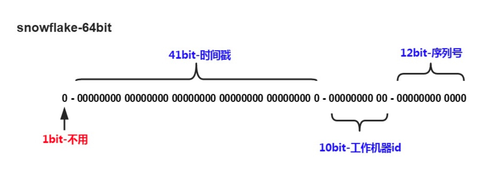
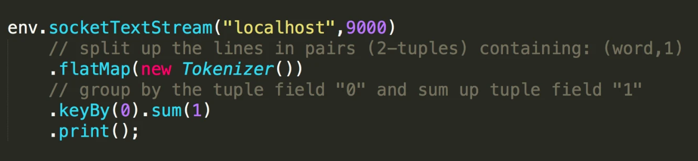
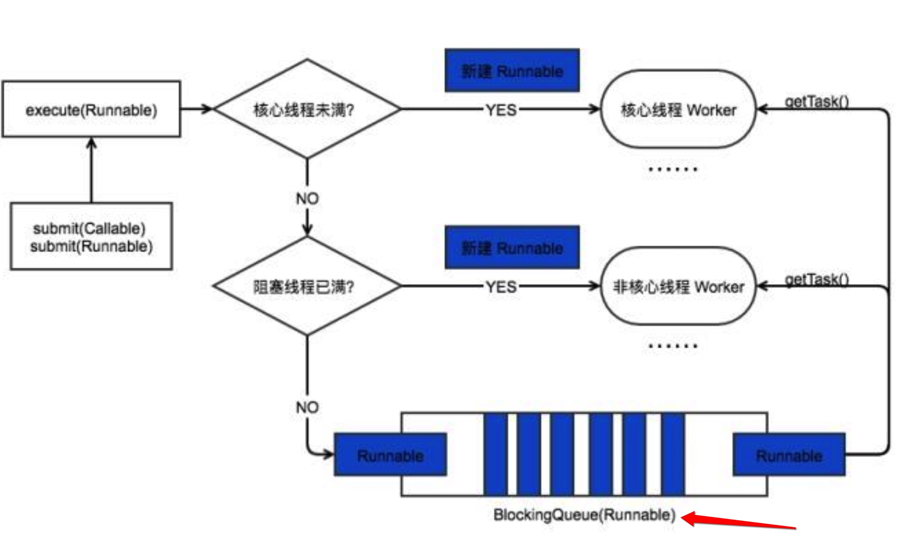
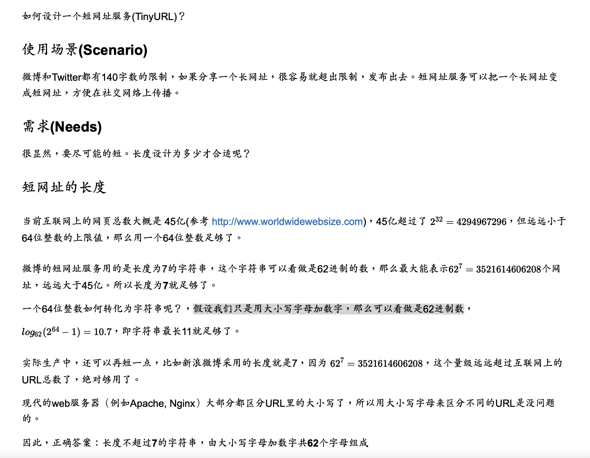

#随机读取 randomAccess 

#HashMap

#sync

#ReentantLock

	private Lock lock = new ReentrantLock();
	//Lock lock=new ReentrantLock(true);//公平锁 
	//Lock lock=new ReentrantLock(false);//非公平锁

 ReentantLock 继承接口 Lock 并实现了接口中定义的方法，他是一种可**重入锁**，除了能完
 成 synchronized 所能完成的所有工作外，还提供了诸如可响应中断锁、可轮询锁请求、定时锁等
 避免多线程死锁的方法。

ReentantLock 提供了是否公平锁的初始化方式，默认为非公平锁。非公平锁实际执行效率要远远超出公平锁，除非程序有特殊需要，否则常用非公平锁。

ReentrantLock 与 synchronized 
1.ReentrantLock 通过方法 lock()与 unlock()来进行加锁与解锁操作，与 synchronized 会被 JVM 自动解锁机制不同，ReentrantLock 加锁后需要手动进行解锁。为了避免程序出现异常而无法正常解锁的情况，使用 ReentrantLock 必须在 finally 控制块中进行解锁操

2.ReentrantLock 相比 synchronized 的优势是可中断、公平锁、多个锁。这种情况下需要使用 ReentrantLock。

JDK1.8之后
相比于之前的版本， JDK1.8之后在解决哈希冲突时有了较大的变化，当链表长度大于阈值(默认为8)时，将链表转化为
红黑树，以减少搜索时间。

#问题：为什么使用红黑树可以减少搜索时间？

#HashMap 的长度为什么是2的幂次方
为了能让 HashMap 存取高效，尽量较少碰撞，也就是要尽量把数据分配均匀。我们上面也讲到了过了，Hash 值的范围 值-2147483648到2147483647，前后加起来大概40亿的映射空间，只要哈希函数映射得比较均匀松散，一般应用是很难 出现碰撞的。但问题是一个40亿长度的数组，内存是放不下的。所以这个散列值是不能直接拿来用的。用之前还要先做对 数组的长度取模运算，得到的余数才能用来要存放的位置也就是对应的数组下标。这个数组下标的计算方法是“
(n - 1) & hash ”。(n代表数组长度)。这也就解释了 HashMap 的长度为什么是2的幂次方。
这个算法应该如何设计呢?
**我们首先可能会想到采用%取余的操作来实现。但是，重点来了:“取余(%)操作中如果除数是2的幂次则等价于与其除数 减一的与(&)操作(也就是说 hash%length==hash&(length-1)的前提是 length 是2的 n 次方;)。” 并且 采用二进制位 操作 &，相对于%能够提高运算效率，这就解释了 HashMap 的长度为什么是2的幂次方。**

#ConcurrentHashMap 和 Hashtable 的区别
ConcurrentHashMap 和 Hashtable 的区别主要体现在实现线程安全的方式上不同。
底层数据结构: JDK1.7的 ConcurrentHashMap 底层采用 分段的数组+链表 实现，JDK1.8 采用的数据结构跟 HashMap1.8的结构一样，数组+链表/红黑二叉树。Hashtable 和 JDK1.8 之前的 HashMap 的底层数据结构类似都是 采用 数组+链表 的形式，数组是 HashMap 的主体，链表则是主要为了解决哈希冲突而存在的; 实现线程安全的方式(重要): 1 在JDK1.7的时候，ConcurrentHashMap(分段锁) 对整个桶数组进行了分割 分段(Segment)，每一把锁只锁容器其中一部分数据，多线程访问容器里不同数据段的数据，就不会存在锁竞争，提 高并发访问率。 到了 JDK1.8 的时候已经摒弃了Segment的概念，而是直接用 Node 数组+链表+红黑树的数据结构 来实现，并发控制使用 synchronized 和 CAS 来操作。(JDK1.6以后 对 synchronized锁做了很多优化) 整个看 起来就像是优化过且线程安全的 HashMap，虽然在JDK1.8中还能看到 Segment 的数据结构，但是已经简化了属 性，只是为了兼容旧版本;2 Hashtable(同一把锁) :使用 synchronized 来保证线程安全，效率非常低下。当一个线 程访问同步方法时，其他线程也访问同步方法，可能会进入阻塞或轮询状态，如使用 put 添加元素，另一个线程不能 使用 put 添加元素，也不能使用 get，竞争会越来越激烈效率越低。

#如何设计一个分布式ID生成器(Distributed ID Generator)，并保证ID按时间粗略有序?

应用场景(Scenario) 现实中很多业务都有生成唯一ID的需求，例如:
用户ID 微博ID 聊天消息ID 帖子ID 订单ID

这个ID往往会作为数据库主键，所以需要保证全局唯一。数据库会在这个字段上建立聚集索引(Clustered Index，参考
MySQL InnoDB)，即该字段会影响各条数据再物理存储上的顺序。
ID还要尽可能短，节省内存，让数据库索引效率更高。基本上64位整数能够满足绝大多数的场景，但是如果能做到比64位更 短那就更好了。需要根据具体业务进行分析，预估出ID的最大值，这个最大值通常比64位整数的上限小很多，于是我们可以 用更少的bit表示这个ID。
查询的时候，往往有分页或者排序的需求，所以需要给每条数据添加一个时间字段，并在其上建立普通索引(Secondary Index)。但是普通索引的访问效率比聚集索引慢，如果能够让ID按照时间粗略有序，则可以省去这个时间字段。为什么不是 按照时间精确有序呢?因为按照时间精确有序是做不到的，除非用一个单机算法，在分布式场景下做到精确有序性能一般很 差。

> 这就引出了ID生成的三大核心需求:

* 全局唯一(unique) 
* 按照时间粗略有序(sortable by time) 
* 尽可能短

**UUID**
用过MongoDB的人会知道，MongoDB会自动给每一条数据赋予一个唯一的ObjectId,保证不会重复，这是怎么做到的呢?实 际上它用的是一种UUID算法，生成的ObjectId占12个字节，由以下几个部分组成，
4个字节表示的Unix timestamp, 3个字节表示的机器的ID 2个字节表示的进程ID 3个字节表示的计数器
UUID是一类算法的统称，具体有不同的实现。UUID的有点是每台机器可以独立产生ID，理论上保证不会重复，所以天然是 分布式的，缺点是生成的ID太长，不仅占用内存，而且索引查询效率低。

MongoDB ObjectId
在前面几个章节中我们已经使用了MongoDB 的对象 Id(ObjectId)。

ObjectId 是一个12字节 BSON 类型数据，有以下格式：
前4个字节表示时间戳（Unix Timestamp)
接下来的3个字节是机器标识码 (机器ID)
紧接的两个字节由进程id组成（进程PID）
最后三个字节是随机数 （随机数）。

每台机器可以独立产生ID，理论上保证不会重复，所以天然是适合分布式系统的。

**8台MySQL服务器，自增+8**
多台MySQL服务器 既然MySQL可以产生自增ID，那么用多台MySQL服务器，能否组成一个高性能的分布式发号器呢? 显然可以。
假设用8台MySQL服务器协同工作，第一台MySQL初始值是1，每次自增8，第二台MySQL初始值是2，每次自增8，依次类 推。**前面用一个 round-robin load balancer 挡着**，每来一个请求，由 round-robin balancer 随机地将请求发给8台MySQL中 的任意一个，然后返回一个ID。
Flickr就是这么做的，仅仅使用了两台MySQL服务器。可见这个方法虽然简单无脑，但是性能足够好。不过要注意，在 MySQL中，不需要把所有ID都存下来，每台机器只需要存一个MAX_ID就可以了。这需要用到MySQL的一个REPLACE INTO特性。

这个方法跟单台数据库比，缺点是ID是不是严格递增的，只是粗略递增的。不过这个问题不大，我们的目标是粗略有序，不 需要严格递增。

#Snowflake雪花算法

Twitter Snowflake
比如 Twitter 有个成熟的开源项目，就是专门生成ID的，Twitter Snowflake 。Snowflake的核心算法如下:

最高位不用，永远为0，其余三组bit占位均可浮动，看具体的业务需求而定。默认情况下41bit的时间戳可以支持该算法使用 到2082年，10bit的工作机器id可以支持1023台机器，**序列号支持1毫秒产生4095个自增序列id。**
Instagram用了类似的方案，41位表示时间戳，13位表示shard Id(一个shard Id对应一台PostgreSQL机器),最低10位表示自增 ID，怎么样，跟Snowflake的设计非常类似吧。这个方案用一个PostgreSQL集群代替了Twitter Snowflake 集群，优点是利用 了现成的PostgreSQL，容易懂，维护方便。
有的面试官会问，如何让ID可以粗略的按照时间排序?上面的这种格式的ID，含有时间戳，且在高位，恰好满足要求。如果 面试官又问，如何保证ID严格有序呢?在分布式这个场景下，是做不到的，要想高性能，只能做到粗略有序，无法保证严格 有序。

#一致性哈希

#Spark基础知识
[https://www.jianshu.com/p/03a0e267c24b](https://www.jianshu.com/p/03a0e267c24b)

1.Spark是什么?
UCBerkeley AMPlab所开源的类HadoopMapReduce的通用的并行计算框架。
dfsSpark基于mapreduce算法实现的分布式计算，拥有HadoopMapReduce所具有的优点;但不同于MapReduce的是Job中间输出和结果可以保存在内存中，从而不再需要读写HDFS，因此Spark能更好地适用于数据挖掘与机器学习等需要迭代的map reduce的算法。

2.Spark与Hadoop的对比(Spark的优势)

**1、Spark的中间数据放到内存中，对于迭代运算效率更高**
2、Spark比Hadoop更通用
3、Spark提供了统一的编程接口
4、容错性– 在分布式数据集计算时通过checkpoint来实现容错
5、可用性– Spark通过提供丰富的Scala, Java，Python API及交互式Shell来提高可用性

3.Spark有那些组件
1、Spark Streaming：支持高吞吐量、支持容错的实时流数据处理
2、Spark SQL， Data frames: 结构化数据查询

1.DataFrame是什么?
DataFrame是一种以RDD为基础的分布式数据集，类似于传统数据库中的二维表格。

2.DataFrame与RDD的主要区别在于?
DataFrame带有schema元信息，即DataFrame所表示的二维表数据集的每一列都带有名称和类型。这使得SparkSQL得以洞察更多的结构信息，从而对藏于DataFrame背后的数据源以及作用于DataFrame之上的变换进行了针对性的优化，最终达到大幅提升运行时效率的目标。
反观RDD，由于无从得知所存数据元素的具体内部结构，Spark Core只能在stage层面进行简单、通用的流水线优化。 

1.RDD，全称为?
Resilient Distributed Datasets，意为容错的、并行的数据结构，可以让用户显式地将数据存储到磁盘和内存中，并能控制数据的分区。同时，RDD还提供了一组丰富的操作来操作这些数据。

2.RDD的特点?

它是在集群节点上的不可变的、已分区的集合对象。
通过并行转换的方式来创建如(map, filter, join, etc)。
失败自动重建。
可以控制存储级别(内存、磁盘等)来进行重用。
必须是可序列化的。
是静态类型的。

4.RDD常见术语
DAGScheduler： 实现将Spark作业分解成一到多个Stage，每个Stage根据RDD的Partition个数决定Task的个数，然后生成相应的Task set放到TaskScheduler中。
TaskScheduler：实现Task分配到Executor上执行。
Task：运行在Executor上的工作单元

5.RDD提供了两种类型的操作：
transformation和action
1，transformation是得到一个新的RDD，方式很多，比如从数据源生成一个新的RDD，从RDD生成一个新的RDD
2，action是得到一个值，或者一个结果(直接将RDD cache到内存中)
3，所有的transformation都是采用的懒策略，就是如果只是将transformation提交是不会执行计算的，计算只有在action被提交的时候才被触发

 

#Hive是什么?
Hive是基于Hadoop的一个数据仓库工具，可以将结构化的数据文件映射为一张数据库表，并提供类SQL查询功能。本质是将HQL转换为MapReduce程序

#Flink Checkpoint
[https://www.infoq.cn/article/wkgozmqqexq6xm5ejl1e](https://www.infoq.cn/article/wkgozmqqexq6xm5ejl1e)

Checkpoint 与 state 的关系
Checkpoint 是从 source 触发到下游所有节点完成的一次全局操作。下图可以有一个对 Checkpoint 的直观感受，红框里面可以看到一共触发了 569K 次 Checkpoint，然后全部都成功完成，没有 fail 的。

state 其实就是 Checkpoint 所做的主要持久化备份的主要数据，看下图的具体数据统计，其 state 也就 9kb 大小 。

什么是 state
我们接下来看什么是 state。先看一个非常经典的 word count 代码，这段代码会去监控本地的 9000 端口的数据并对网络端口输入进行词频统计，我们本地行动 netcat，然后在终端输入 hello world，执行程序会输出什么？

答案很明显，(hello, 1) 和 (word,1)

那么问题来了，如果再次在终端输入 hello world，程序会输入什么？

答案其实也很明显，(hello, 2) 和 (world, 2)。为什么 Flink 知道之前已经处理过一次 hello world，这就是 state 发挥作用了，这里是被称为 keyed state 存储了之前需要统计的数据，所以帮助 Flink 知道 hello 和 world 分别出现过一次。

回顾一下刚才这段 word count 代码。keyby 接口的调用会创建 keyed stream 对 key 进行划分，这是使用 keyed state 的前提。在此之后，sum 方法会调用内置的 StreamGroupedReduce 实现。

Flink 的 Checkpoint 机制只能保证 Flink 的计算过程可以做到 EXACTLY ONCE，端到端的 EXACTLY ONCE 需要 source 和 sink 支持。

#Flink State
https://www.infoq.cn/article/wkgozmqqexq6xm5ejl1e

#Druid
什么场景下应该使用Druid

大多数查询场景为**聚合查询**和**分组查询**（GroupBy），同时还有一定得**检索与扫描查询** 将数据查询延迟目标定位100毫秒到几秒钟之间 **数据具有时间属性**（Druid针对时间做了优化和设计） 在多表场景下，每次查询仅命中一个大的分布式表，查询又可能**命中多个较小的lookup表**

丰富的查询能力( Rich Query )：Druid 支持 Scan、 TopN、 GroupBy、 Approximate 等查询，同时提供了 2 种查询方式：API 和 SQL

为什么我们需要用 Druid
有赞作为一家 SaaS 公司，有很多的业务的场景和非常大量的实时数据和离线数据。在没有是使用 Druid 之前，一些 OLAP 场景的场景分析，开发的同学都是使用 SparkStreaming 或者 Storm 做的。用这类方案会除了需要写实时任务之外，还需要为了查询精心设计存储。带来问题是：开发的周期长，初期的存储设计很难满足需求的迭代发展，不可扩展。

Druid 的架构是 Lambda 架构，分成实时层( Overlord、 MiddleManager )和批处理层( Broker 和 Historical )

#Lambda 架构
 Lambda 架构，分成实时层(RealTime) 和批处理层(Historical历史数据, T-1)

# 冷热数据分离
随着接入的业务增加和长期的运行时间，数据规模也越来越大。Historical 节点加载了大量 Segment 数据，观察发现大部分查询都集中在最近几天，换句话说最近几天的热数据很容易被查询到，因此数据冷热分离对提高查询效率很重要。

首先将 Historical 群进行分组，默认的分组是"_default_tier"，规划少量的 Historical 节点，使用 SATA 盘；把大量的 Historical 节点规划到 “hot” 分组，使用 SSD 盘。然后为每个 DataSource 配置加载 Rule :

#OLAP和OLTP

OLAP： Druid, Hbase, Clickhouse

#Clickhousew为什么这么快
[https://zhuanlan.zhihu.com/p/368148486](https://zhuanlan.zhihu.com/p/368148486)

从数据访问特性角度来看，交互式分析场景具有如下典型特点：

大多数访问是读请求。
写入通常为追加写，较少更新、删除操作。
读写不关注事务、强一致等特性。
查询通常会访问大量的行，但仅部分列是必须的。
查询结果通常明显小于访问的原始数据，且具有可理解的统计意义。

其中部分关键概念介绍如下，分区、数据块、排序等概念会在物理存储模型部分展开介绍：

MergeTree： ClickHouse 中使用非常多的表引擎，底层采用 LSM Tree 架构，写入生成的小文件会持续 Merge。
Distributed： ClickHouse 中的关系映射引擎，它把分布式表映射到指定集群、数据库下对应的本地表上。

接下来，我们来介绍每个分片副本内部的物理存储模型，具体如下：

数据分区： 每个分片副本的内部，数据按照 PARTITION BY 列进行分区，分区以目录的方式管理，本文样例中表按照时间进行分区。
列式存储： 每个数据分区内部，采用列式存储，每个列涉及两个文件，分别是存储数据的 .bin 文件和存储偏移等索引信息的 .mrk2 文件。
数据排序： 每个数据分区内部，所有列的数据是按照 ORDER BY 列进行排序的。可以理解为：对于生成这个分区的原始记录行，先按 ORDER BY 列进行排序，然后再按列拆分存储。
数据分块： 每个列的数据文件中，实际是分块存储的，方便数据压缩及查询裁剪，每个块中的记录数不超过 index_granularity，默认 8192。
主键索引： 主键默认与 ORDER BY 列一致，或为 ORDER BY 列的前缀。由于整个分区内部是有序的，且切割为数据块存储，ClickHouse 抽取每个数据块第一行的主键，生成一份稀疏的排序索引，可在查询时结合过滤条件快速裁剪数据块。

**列存储（只取需要的列）**
ClickHouse 采用列存储，这对于分析型请求非常高效。
一个典型且真实的情况是：如果我们需要分析的数据有 50 列，而每次分析仅读取其中的 5 列，那么通过列存储，我们仅需读取必要的列数据。

**向量化执行 (从CPU执行效率的指令上入手）**
在支持列存的基础上，ClickHouse 实现了一套面向向量化处理的计算引擎，大量的处理操作都是向量化执行的。
相比于传统火山模型中的逐行处理模式，向量化执行引擎采用批量处理模式，可以大幅减少函数调用开销，降低指令、数据的 Cache Miss，提升 CPU 利用效率。

**编码压缩**
由于 ClickHouse 采用列存储，相同列的数据连续存储，且底层数据在存储时是经过排序的，这样数据的局部规律性非常强，有利于获得更高的数据压缩比。
此外，ClickHouse 除了支持 LZ4、ZSTD 等通用压缩算法外，还支持 Delta、DoubleDelta、Gorilla 等专用编码算法，用于进一步提高数据压缩比。

**多索引**

列存用于裁剪不必要的字段读取，而索引则用于裁剪不必要的记录读取。ClickHouse 支持丰富的索引，从而在查询时尽可能的裁剪不必要的记录读取，提高查询性能。
ClickHouse 中最基础的索引是主键索引。前面我们在物理存储模型中介绍，ClickHouse 的底层数据按建表时指定的 ORDER BY 列进行排序，并按 index_granularity 参数切分成数据块，然后抽取每个数据块的第一行形成一份稀疏的排序索引。

物化视图（Cube/Rollup）
OLAP 分析领域有两个典型的方向：
**一是 ROLAP， 通过列存、索引等各类技术手段，提升查询时性能。
另一是 MOLAP， 通过预计算提前生成聚合后的结果数据，降低查询读取的数据量，属于计算换性能方式。
**

分布式管控
分布式系统通常包含三个重要组成部分：

存储引擎
计算引擎
分布式管控层

①分布式表
ClickHouse 对分布式表的抽象并不完整，在多数分布式系统中，用户仅感知集群和表，对分片和副本的管理透明，而在 ClickHouse 中，用户需要自己去管理分片、副本。
例如前面介绍的建表过程：用户需要先创建本地表（分片的副本），然后再创建分布式表，并完成分布式表到本地表的映射。

②弹性伸缩
ClickHouse 集群自身虽然可以方便的水平增加节点，但并不支持自动的数据均衡。
例如，当包含 6 个节点的线上生产集群因存储或计算压力大，需要进行扩容时，我们可以方便的扩容到 10 个节点。

③故障恢复

与弹性伸缩类似，在节点故障的情况下，ClickHouse 并不会利用其它机器补齐缺失的副本数据。需要用户先补齐节点后，然后系统再自动在副本间进行数据同步。

计算引擎
虽然 ClickHouse 在单表性能方面表现非常出色，但是在复杂场景仍有不足，缺乏成熟的 MPP 计算引擎和执行优化器。
例如：多表关联查询、复杂嵌套子查询等场景下查询性能一般，需要人工优化；缺乏 UDF 等能力，在复杂需求下扩展能力较弱等。
这也和 OLAP 系统第三方评测的结果相符。这对于性能如此出众的存储引擎来说，非常可惜。

实时写入
ClickHouse 采用类 LSM Tree 架构，并且建议用户通过批量方式进行写入，每个批次不少于 1000 行 或 每秒钟不超过一个批次，从而提高集群写入性能。
实际测试情况下，32 vCPU&128G 内存的情况下，单节点写性能可达 50 MB/s~200 MB/s，对应 5w~20w TPS。
但 ClickHouse 并不适合实时写入，原因在于 ClickHouse 并非典型的 LSM Tree 架构，它没有实现 Memory Table 结构，每批次写入直接落盘作为一棵 Tree（如果单批次过大，会拆分为多棵 Tree），每条记录实时写入会导致底层大量的小文件，影响查询性能。
这使得 ClickHouse 不适合有实时写入需求的业务，通常需要在业务和 ClickHouse 之间引入一层数据缓存层，实现批量写入。

#BitMap
[https://www.cnblogs.com/dragonsuc/p/10993938.html](https://www.cnblogs.com/dragonsuc/p/10993938.html)

位图（Bitmap），即位（Bit）的集合，是一种数据结构，可用于记录大量的0-1状态，在很多地方都会用到，比如Linux内核（如inode，磁盘块）、Bloom Filter算法等，其优势是可以在一个非常高的空间利用率下保存大量0-1状态。

BitMap的原理

  BitMap 的基本原理就是用一个bit 位来存放某种状态，适用于大规模数据，但数据状态又不是很多的情况。通常是用来判断某个数据存不存在的。

  举例：在Java里面一个int类型占4个字节，假如要对于10亿个int数据进行处理呢？10亿*4/1024/1024/1024=4个G左右，需要4个G的内存。  

 如果能够采用bit储,10_0000_0000Bit=1_2500_0000byte=122070KB=119MB, 那么在存储空间方面可以大大节省。

  在Java里面，BitMap已经有对应实现的数据结构类java.util.BitSet，BitSet的底层使用的是long类型的数组来存储元素。

Map映射表

假设需要排序或者查找的总数N=10000000，那么我们需要申请内存空间的大小为int a[1 + N/32]，其中：a[0]在内存中占32为可以对应十进制数0-31，依次类推： 
    bitmap表为： 
   a[0]--------->0-31 
   a[1]--------->32-63 
   a[2]--------->64-95 
   a[3]--------->96-127 
   .......... 

BitMap算法处理大数据问题的场景：

 （1）给定10亿个不重复的正int的整数，没排过序的，然后再给一个数，如何快速判断这个数是否在那10亿个数当中。

解法：遍历40个亿数字，映射到BitMap中，然后对于给出的数，直接判断指定的位上存在不存在即可。

 （2）使用位图法判断正整形数组是否存在重复

解法：遍历一遍，存在之后设置成1，每次放之前先判断是否存在，如果存在，就代表该元素重复。

 （3）使用位图法进行元素不重复的正整形数组排序 (其实是很大的桶，桶排序）

解法：遍历一遍，设置状态1，然后再次遍历，对状态等于1的进行输出，参考计数排序的原理。

 （4）在2.5亿个整数中找出不重复的正整数，注，内存不足以容纳这2.5亿个整数

解法1：采用2-Bitmap（每个数分配2bit，00表示不存在，01表示出现一次，10表示多次，11无意义）。

解法2 (采用两个bitmap来相当于表示00,01,10,11)：采用两个BitMap，即第一个Bitmap存储的是整数是否出现，接着，在之后的遍历先判断第一个BitMap里面是否出现过，如果出现就设置第二个BitMap对应的位置也为1，最后遍历, 同时查询两个BitMap，仅仅在一个BitMap中出现过的元素，就是不重复的整数。

解法3：分治+Hash取模，拆分成多个小文件，然后一个个文件读取，直到内存装的下，然后采用Hash+Count的方式判断即可。

该类问题的变形问题，如已知某个文件内包含一些电话号码，每个号码为8位数字，统计不同号码的个数。8位最多99 999 999，大概需要99m个bit，大概10几m字节的内存即可。 （可以理解为从0-99 999 999的数字，每个数字对应一个Bit位，所以只需要99M个Bit==12MBytes，这样，就用了小小的12M左右的内存表示了所有的8位数的电话）

BitMap的一些缺点：

（1）**数据碰撞**。比如将字符串映射到 BitMap 的时候会有碰撞的问题，那就可以考虑用 **Bloom Filter 来解决，Bloom Filter 使用多个 Hash 函数来减少冲突的概率。**

（2）**数据稀疏**。又比如要存入(10,8887983,93452134)这三个数据，我们需要建立一个 99999999 长度的 BitMap ，但是实际上只存了3个数据，这时候就有很大的空间浪费，碰到这种问题的话，可以通过引入 Roaring BitMap 来解决。

#Bloom Filter 布隆过滤器

什么是布隆过滤器

本质上布隆过滤器是一种数据结构，比较巧妙的概率型数据结构（probabilistic data structure），特点是高效地插入和查询，可以用来告诉你 “某样东西一定不存在或者可能存在”。

相比于传统的 List、Set、Map 等数据结构，它更高效、占用空间更少，**但是缺点是其返回的结果是概率性的，而不是确切的。**

但是 HashMap 的实现也有缺点，例如存储容量占比高，考虑到**负载因子的存在**，通常空间是不能被用满的，而一旦你的值很多例如上亿的时候，那 HashMap 占据的内存大小就变得很可观了。

如果我们要映射一个值到布隆过滤器中，我们需要**使用多个不同的哈希函数生成多个哈希值**，并对每个生成的哈希值指向的 bit 位置 1，例如针对值 “baidu” 和三个不同的哈希函数分别生成了哈希值 1、4、7，

值得注意的是，4 这个 bit 位由于两个值的哈希函数都返回了这个 bit 位，因此它被覆盖了。现在我们如果想查询 “dianping” 这个值是否存在，哈希函数返回了 1、5、8三个值，结果我们发现 5 这个 bit 位上的值为 0，说明没有任何一个值映射到这个 bit 位上，因此我们可以很确定地说 “dianping” 这个值不存在。而当我们需要查询 “baidu” 这个值是否存在的话，那么哈希函数必然会返回 1、4、7，然后我们检查发现这三个 bit 位上的值均为 1，那么我们可以说 “baidu” 存在了么？答案是不可以，只能是 “baidu” 这个值可能存在。
这是为什么呢？答案跟简单，因为随着增加的值越来越多，被置为 1 的 bit 位也会越来越多，这样某个值 “taobao” 即使没有被存储过，但是万一哈希函数返回的三个 bit 位都被其他值置位了 1 ，那么程序还是会判断 “taobao” 这个值存在。

**最佳实践**

常见的适用常见有，**利用布隆过滤器减少磁盘 IO 或者网络请求**，**因为一旦一个值必定不存在的话，我们可以不用进行后续昂贵的查询请求。
**
另外，既然你使用布隆过滤器来加速查找和判断是否存在，那么性能很低的哈希函数不是个好选择，推荐 MurmurHash、Fnv 这些。

**大Value拆分**

Redis 因其支持 setbit 和 getbit 操作，且纯内存性能高等特点，因此天然就可以作为布隆过滤器来使用。但是布隆过滤器的不当使用极易产生大 Value，增加 Redis 阻塞风险，因此生成环境中建议对体积庞大的布隆过滤器进行拆分。

拆分的形式方法多种多样，但是本质是不要将 Hash(Key) 之后的请求分散在多个节点的多个小 bitmap 上，而是应该拆分成多个小 bitmap 之后，对一个 Key 的所有哈希函数都落在这一个小 bitmap 上。

极端情况下，**当布隆过滤器没有空闲空间时（满），每一次查询都会返回 true **。这也就意味着 m 的选择取决于期望预计添加元素的数量 n ，并且 m 需要远远大于 n 。

二、布隆过滤器应用
在实际工作中，布隆过滤器常见的应用场景如下：

网页爬虫对 URL 去重，避免爬取相同的 URL 地址；
反垃圾邮件，从数十亿个垃圾邮件列表中判断某邮箱是否垃圾邮箱；
Google Chrome 使用布隆过滤器识别恶意 URL；
Medium 使用布隆过滤器避免推荐给用户已经读过的文章；
Google BigTable，Apache HBbase 和 Apache Cassandra 使用布隆过滤器减少对不存在的行和列的查找。
除了上述的应用场景之外，布隆过滤器还有一个应用场景就是解决缓存穿透的问题。所谓的缓存穿透就是服务调用方每次都是查询不在缓存中的数据，这样每次服务调用都会到数据库中进行查询，如果这类请求比较多的话，就会导致数据库压力增大，这样缓存就失去了意义。

利用布隆过滤器我们可以预先把数据查询的主键，比如用户 ID 或文章 ID 缓存到过滤器中。当根据 ID 进行数据查询的时候，我们先判断该 ID 是否存在，若存在的话，则进行下一步处理。若不存在的话，直接返回，这样就不会触发后续的数据库查询。需要注意的是缓存穿透不能完全解决，我们只能将其控制在一个可以容忍的范围内。

[https://juejin.cn/post/6844904007790673933](https://juejin.cn/post/6844904007790673933)

布隆过滤器有很多实现和优化，由 Google 开发著名的 Guava 库就提供了布隆过滤器（Bloom Filter）的实现。在基于 Maven 的 Java 项目中要使用 Guava 提供的布隆过滤器，只需要引入以下坐标：

	<dependency>
	   <groupId>com.google.guava</groupId>
	   <artifactId>guava</artifactId>
	   <version>28.0-jre</version>
	</dependency>

复制代码在导入 Guava 库后，我们新建一个 BloomFilterDemo 类，在 main 方法中我们通过 BloomFilter.create 方法来创建一个布隆过滤器，接着我们初始化 1 百万条数据到过滤器中，然后在原有的基础上增加 10000 条数据并判断这些数据是否存在布隆过滤器中：

	import com.google.common.base.Charsets;
	import com.google.common.hash.BloomFilter;
	import com.google.common.hash.Funnels;
	
	public class BloomFilterDemo {
	    public static void main(String[] args) {
	        int total = 1000000; // 总数量
	        BloomFilter<CharSequence> bf = 
	          BloomFilter.create(Funnels.stringFunnel(Charsets.UTF_8), total);
	        // 初始化 1000000 条数据到过滤器中
	        for (int i = 0; i < total; i++) {
	            bf.put("" + i);
	        }
	        // 判断值是否存在过滤器中
	        int count = 0;
	        for (int i = 0; i < total + 10000; i++) {
	            if (bf.mightContain("" + i)) {
	                count++;
	            }
	        }
	        System.out.println("已匹配数量 " + count);
	    }
	}

复制代码当以上代码运行后，控制台会输出以下结果：
已匹配数量 1000309
复制代码很明显以上的输出结果已经出现了误报，因为相比预期的结果多了 309 个元素，误判率为：
309/(1000000 + 10000) * 100 ≈ 0.030594059405940593
复制代码如果要提高匹配精度的话，我们可以在创建布隆过滤器的时候设置误判率 fpp：
	BloomFilter<CharSequence> bf = BloomFilter.create(
	  Funnels.stringFunnel(Charsets.UTF_8), total, 0.0002
	);
	复制代码在 BloomFilter 内部，误判率 fpp 的默认值是 0.03：
	// com/google/common/hash/BloomFilter.class
	public static <T> BloomFilter<T> create(Funnel<? super T> funnel, long expectedInsertions) {
	  return create(funnel, expectedInsertions, 0.03D);
	}
复制代码在重新设置误判率为 0.0002 之后，我们重新运行程序，这时控制台会输出以下结果：
已匹配数量 1000003
复制代码通过观察以上的结果，可知误判率 fpp 的值越小，匹配的精度越高。当减少误判率 fpp 的值，需要的存储空间也越大，所以在实际使用过程中需要在误判率和存储空间之间做个权衡。

#HashMap 负载因子为什么是0.75，为什么用布隆过滤器，不用HashMap

HashMap负载因子，与扩容机制有关；即若当前容器的容量，达到设定最大值，就需要要执行扩容操作。 举个例子：当前的容器容量是16，负载因子是0.75；16*0.75=12，也就是说，当容量达到了12的时就会执行扩容操作。 作用很简单，相当于是一个扩容机制的阈值。

数据一开始是保存在数组里，当发生了Hash碰撞的时候，就是在这个数据节点上，生出一个链表，当链表长度达到一定长度的时候，就会把链表转化为红黑树。

考虑极限情况：

**当负载因子是1.0时**，也就意味着，只有当数组的8个值（这个图表示了8个）全部填充了，才会发生扩容。这就带来了很大的问题，因为Hash冲突时避免不了的。

后果：当负载因子是1.0的时候，意味着会出现大量的Hash的冲突，底层的红黑树变得异常复杂。对于查询效率极其不利。这种情况就是牺牲了时间来保证空间的利用率。

**负载因子是0.5**

后果：负载因子是0.5的时候，这也就意味着，当数组中的元素达到了一半就开始扩容，既然填充的元素少了，Hash冲突也会减少，那么底层的链表长度或者是红黑树的高度就会降低。查询效率就会增加。

但是，此时空间利用率就会大大的降低，原本存储1M的数据，现在就意味着需要2M的空间。
总之，就是负载因子太小，虽然时间效率提升了，但是空间利用率降低了。

**负载因子0.75**

经过前面的分析，基本上为什么是0.75的答案也就出来了，这是时间和空间的权衡。当然这个答案不是我自己想出来的。答案就在源码上，我们可以看看：

**意思就是说：负载因子是0.75的时，空间利用率比较高，而且避免了相当多的Hash冲突，使得底层的链表或者是红黑树的高度比较低，提升了空间效率。**

#Clickhouse

[https://z.itpub.net/article/detail/7486371E68AF3E686A20BE30859E27EA](https://z.itpub.net/article/detail/7486371E68AF3E686A20BE30859E27EA)

优势和局限性
ClickHouse主要特点：
ROLAP(关系型的联机分析处理，和它一起比较的还有OLTP联机事务处理，我们常见的ERP,CRM系统就属于OLTP)

在线实时查询
完整的DBMS(关系数据库)
列式存储(区别与HBase，ClickHouse的是完全列式存储，HBase具体说是列族式存储)
不需要任何数据预处理
支持批量更新
拥有完善的SQl支持和函数
支持高可用(多主结构，在后面的结构设计中会讲到)
不依赖Hadoop复杂生态(像ES一样，开箱即用)

一些不足：
不支持事务(这其实也是大部分OLAP数据库的缺点)
不擅长根据主键按行粒度查询(但是支持这种操作)
不擅长按行删除数据(但是支持这种操作)

**列式存储&数据压缩**

**按列存储与按行存储相比，前者可以有效减少查询时所需扫描的数据量**，这一点可以用一个示例简单说明。假设一张数据表A拥有50个字段A1～A50，以及100行数**据。现在需要查询前5个字段并进行数据分析，那么通过列存储，我们仅需读取必要的列数据，相比于普通行存，可减少 10 倍左右的读取**、解压、处理等开销，对性能会有质的影响。
如果数据按行存储，数据库首先会逐行扫描，并获取每行数据的所有50个字段，再从每一行数据中返回A1～A5这5个字段。不难发现，尽管只需要前面的5个字段，但由于数据是按行进行组织的，实际上还是扫描了所有的字段。如果数据按列存储，就不会发生这样的问题。由于数据按列组织，数据库可以直接获取A1～A5这5列的数据，从而避免了多余的数据扫描。
按列存储相比按行存储的另一个优势是对数据压缩的友好性。ClickHouse的数据按列进行组织，属于同一列的数据会被保存在一起，列与列之间也会由不同的文件分别保存 ( 这里主要指MergeTree表引擎 )。数据默认使用LZ4算法压缩，在Yandex.Metrica的生产环境中，数据总体的压缩比可以达到8:1 ( 未压缩前17PB，压缩后2PB )。列式存储除了降低IO和存储的压力之外，还为向量化执行做好了铺垫。

**向量化执行**
坊间有句玩笑，即"能用钱解决的问题，千万别花时间"。而业界也有种调侃如出一辙，即"能升级硬件解决的问题，千万别优化程序"。有时候，你千辛万苦优化程序逻辑带来的性能提升，还不如直接升级硬件来得简单直接。这虽然只是一句玩笑不能当真，但硬件层面的优化确实是最直接、最高效的提升途径之一。向量化执行就是这种方式的典型代表，这项寄存器硬件层面的特性，为上层应用程序的性能带来了指数级的提升。
向量化执行，可以简单地看作一项消除程序中循环的优化。这里用一个形象的例子比喻。小胡经营了一家果汁店，虽然店里的鲜榨苹果汁深受大家喜爱，但客户总是抱怨制作果汁的速度太慢。小胡的店里只有一台榨汁机，每次他都会从篮子里拿出一个苹果，放到榨汁机内等待出汁。如果有8个客户，每个客户都点了一杯苹果汁，那么小胡需要重复循环8次上述的榨汁流程，才能榨出8杯苹果汁。如果制作一杯果汁需要5分钟，那么全部制作完毕则需要40分钟。为了提升果汁的制作速度，小胡想出了一个办法。他将榨汁机的数量从1台增加到了8台，这么一来，他就可以从篮子里一次性拿出8个苹果，分别放入8台榨汁机同时榨汁。此时，小胡只需要5分钟就能够制作出8杯苹果汁。为了制作n杯果汁，非向量化执行的方式是用1台榨汁机重复循环制作n次，而向量化执行的方式是用n台榨汁机只执行1次。
为了实现向量化执行，需要利用CPU的SIMD指令。SIMD的全称是Single Instruction Multiple Data，即用单条指令操作多条数据。现代计算机系统概念中，它是通过数据并行以提高性能的一种实现方式 ( 其他的还有指令级并行和线程级并行 )，它的原理是在CPU寄存器层面实现数据的并行操作。
在计算机系统的体系结构中，存储系统是一种层次结构。典型服务器计算机的存储层次结构如图1所示。一个实用的经验告诉我们，存储媒介距离CPU越近，则访问数据的速度越快。

从上图中可以看到，从左向右，距离CPU越远，则数据的访问速度越慢。从寄存器中访问数据的速度，是从内存访问数据速度的300倍，是从磁盘中访问数据速度的3000万倍。所以利用CPU向量化执行的特性，对于程序的性能提升意义非凡。
ClickHouse目前利用SSE4.2指令集实现向量化执行。

**数据分片与分布式查询**
数据分片是将数据进行横向切分，这是一种在面对海量数据的场景下，解决存储和查询瓶颈的有效手段，是一种分治思想的体现。ClickHouse支持分片，而分片则依赖集群。每个集群由1到多个分片组成，而每个分片则对应了ClickHouse的1个服务节点。分片的数量上限取决于节点数量 ( 1个分片只能对应1个服务节点 )。
ClickHouse并不像其他分布式系统那样，拥有高度自动化的分片功能。ClickHouse提供了**本地表 ( Local Table ) 与分布式表 ( Distributed Table ) **的概念。一张本地表等同于一份数据的分片。而**分布式表本身不存储任何数据，它是本地表的访问代理，其作用类似分库中间件。借助分布式表，能够代理访问多个数据分片，从而实现分布式查询。
**这种设计类似数据库的分库和分表，十分灵活。例如在业务系统上线的初期，数据体量并不高，此时数据表并不需要多个分片。所以使用单个节点的本地表 ( 单个数据分片 ) 即可满足业务需求，待到业务增长、数据量增大的时候，再通过新增数据分片的方式分流数据，并通过分布式表实现分布式查询。这就好比一辆手动挡赛车，它将所有的选择权都交到了使用者的手中。

以下是携程使用ClickHouse的经验：

**1、数据导入之前要评估好分区字段**
**ClickHouse 因为是根据分区文件存储的，如果说你的分区字段真实数据粒度很细，数据导入的时候就会把你的物理机打爆**。其实数据量可能没有多少，但是因为你用的字段不合理，会产生大量的碎片文件，磁盘空间就会打到底。

**2、数据导入提前根据分区做好排序，避免同时写入过多分区导致 clickhouse 内部来不及 Merge
数据导入之前我们做好排序，这样可以降低数据导入后 ClickHouse 后台异步 Merge 的时候涉及到的分区数，肯定是涉及到的分区数越少服务器压力也会越小。**

3、左右表 join 的时候要注意数据量的变化
再就是左右表 join 的问题，ClickHouse 它必须要大表在左边，小表在右边。但是我们可能某些业务场景跑着跑着数据量会返过来了，这个时候我们需要有监控能及时发现并修改这个 join 关系。

5、监控好服务器的 CPU/内存波动
再就是做好监控，我前面说过 ClickHouse 的 CPU 拉到 60%的时候，基本上你的慢查询马上就出来了，所以我这边是有对 CPU 和内存的波动进行监控的，类似于 dump，这个我们抓下来以后就可以做分析。

#Clickhouse物化视图
[https://blog.csdn.net/penriver/article/details/122090634](https://blog.csdn.net/penriver/article/details/122090634)
[https://cloud.tencent.com/developer/article/1988528](https://cloud.tencent.com/developer/article/1988528)

什么是视图：

什么是MaterializedView？

CREATE MATERIALIZED VIEW [IF NOT EXISTS] [db.]table_name 
[ON CLUSTER] [TO[db.]name] 
[ENGINE = engine] [POPULATE] AS SELECT ...

物化视图是查询结果集的一份持久化存储，所以它与普通视图完全不同，而非常趋近于表
产生物化视图的过程就叫做“物化”（materialization）。**广义地讲，物化视图是数据库中的预计算逻辑+显式缓存，典型的空间换时间思路。**

物化视图存储由相应的SELECT查询转换的数据。
具体实现如下:当向SELECT指定的表中插入数据时，插入的部分数据通过SELECT查询进行转换，结果插入到物化视图中。
**在插入到目标表期间**，ClickHouse中的物化视图使用列名而不是列顺序。如果SELECT查询结果中没有出现某些列名，那么ClickHouse使用默认值，即使该列不是Nullable。一个安全的做法是在使用物化视图时为每一列添加别名。
**ClickHouse的物化视图实现类似插入触发器，在插入的行上运行查询，并将结果存储在第二个表【物化视图定义的表】中**
**如果视图查询【即使包含一些聚合 DISTINCT, GROUP BY, ORDER BY, LIMIT操作】，只应用于新插入的数据批**
**任何对源表现有数据的更改(如更新、删除、删除分区等)都不会改变物化视图。**
如果你指定了**POPULATE**，当创建它的时候，已经存在的表数据被插入到视图中，如同CREATE TABLE ... AS SELECT ... .。否则，查询只包含创建视图后插入表中的数据。不建议使用POPULATE，因为 在视图创建期间插入到表中的数据不会被插入到表中。
**物化视图允许显式指定目标表【TO Target Table】**，可以简化模式迁移，并可以通过向视图SELECT定义添加筛选条件并手动加载丢失的数据来减轻可能丢失的视图更新。
物化视图受optimize_on_insert设置的影响。默认情况下数据在插入到视图之前被合并
**在物化视图上也可以建立分布式表**

**源表、物化视图、目标表的关系**
源表： 指创建物化视图select从句中指定的表
物化视图
目标表：指通过TO从句指定的表 或 CH自动产生的内部表（以.inner_id开头)

**-State和-Merge语法都是CK规定好的，称为聚合函数的组合器（combinator）。**

视图是由若干个字段以及若干条记录构成(也常称为虚标)，它与表有很多相似的地方，视图中的数据源来自于原表,视图本身不存储数据,**视图它保存的仅仅是一条select语句，并没有保存真正的数据。**

那什么是ck中的物化视图呢 : **物化视图是包括一个查询结果的数据库对象，它是远程数据的的本地副本，或者用来生成基于数据表求和的汇总表**。物化视图存储基于远程表的数据，简单的来理解就是它在普通视图的基础上加上了视图中select后所存储的数据。

总结：
物化视图查询如此之快？

思路也是空间换时间,因为物化视图这些规则已经全部写好并且条件所过滤后的数据已经存储在了本地表中，所以它比原数据查询快了很多，总的行数少了，因为都预计算好了。

缺点：
它的本质是一个流式数据的使用场景，是累加式的技术，所以要用历史数据做去重、去核这样的分析，在物化视图里面是不太好用的。在某些场景的使用也是有限的。而且如果一张表加了好多物化视图，在写这张表的时候，就会消耗很多机器的资源，比如数据带宽占满、存储一下子增加了很多。

#HBase

[https://blog.csdn.net/woshiwanxin102213/article/details/17584043](https://blog.csdn.net/woshiwanxin102213/article/details/17584043)

HBase是一个构建在HDFS上的分布式列存储系统；
HBase是基于Google BigTable模型开发的，典型的key/value系统；
HBase是Apache Hadoop生态系统中的重要一员，主要用于海量结构化数据存储；
从逻辑上讲，HBase将数据按照表、行和列进行存储。
与hadoop一样，Hbase目标主要依靠横向扩展，通过不断增加廉价的商用服务器，来增加计算和存储能力。
Hbase表的特点
大：一个表可以有数十亿行，上百万列；
无模式：每行都有一个可排序的主键和任意多的列，列可以根据需要动态的增加，同一张表中不同的行可以有截然不同的列；
面向列：面向列（族）的存储和权限控制，列（族）独立检索；
稀疏：空（null）列并不占用存储空间，表可以设计的非常稀疏；
数据多版本：每个单元中的数据可以有多个版本，默认情况下版本号自动分配，是单元格插入时的时间戳；
数据类型单一：Hbase中的数据都是字符串，没有类型。

Hbase基本概念

 RowKey：是Byte array，是表中每条记录的“主键”，方便快速查找，Rowkey的设计非常重要。 
Column Family：列族，拥有一个名称(string)，包含一个或者多个相关列 
Column：属于某一个columnfamily，familyName:columnName，每条记录可动态添加 
Version Number：类型为Long，默认值是系统时间戳，可由用户自定义 
Value(Cell)：Byte array

Hbase物理模型
每个column family存储在HDFS上的一个单独文件中，空值不会被保存。
Key 和 Version number在每个 column family中均有一份；
HBase 为每个值维护了多级索引，即：<key, column family, column name, timestamp>

物理存储:
1、Table中所有行都按照row key的字典序排列；
2、Table在行的方向上分割为多个Region；
3、Region按大小分割的，每个表开始只有一个region，随着数据增多，region不断增大，当增大到一个阈值的时候，region就会等分会两个新的region，之后会有越来越多的region；
4、Region是Hbase中分布式存储和负载均衡的最小单元，不同Region分布到不同RegionServer上。
5、Region虽然是分布式存储的最小单元，但并不是存储的最小单元。Region由一个或者多个Store组成，每个store保存一个columns family；每个Strore又由一个memStore和0至多个StoreFile组成，StoreFile包含HFile；memStore存储在内存中，StoreFile存储在HDFS上。

**Hbase使用场景**
storing large amounts  of data(100s of TBs)
need high write throughput
need efficient random access(key lookups) within large data sets
need to scale gracefully with data
for structured and semi-structured data
don't need fullRDMS capabilities(cross row/cross table transaction, joins,etc.)
大数据量存储，大数据量高并发操作
需要对数据随机读写操作
读写访问均是非常简单的操作
不支持跨row，跨表的事务，不支持join

**Hbase与HDFS对比**
两者都具有良好的容错性和扩展性，都可以扩展到成百上千个节点；
HDFS适合批处理场景
不支持数据随机查找
不适合增量数据处理
不支持数据更新

#稀疏数据类型

什么是稀疏数据？什么是池化？
    在数据库中，稀疏数据是指在二维表中含有大量空值的数据；即稀疏数据是指，在数据集中绝大多数数值缺失或者为零的数据。稀疏数据绝对不是无用数据，只不过是信息不完全，通过适当的手段是可以挖掘出大量有用信息。

#KV数据库
Ti-DB
HBase

#Mysql读写分离

面试题
你们有没有做 MySQL 读写分离？如何实现 MySQL 的读写分离？MySQL 主从复制原理的是啥？如何解决 MySQL 主从同步的延时问题？

面试官心理分析
高并发这个阶段，肯定是需要做读写分离的，啥意思？因为实际上大部分的互联网公司，一些网站，或者是 app，其实都是读多写少。所以针对这个情况，就是写一个主库，但是主库挂多个从库，然后从多个从库来读，那不就可以支撑更高的读并发压力了吗？

面试题剖析
如何实现 MySQL 的读写分离？
其实很简单，就是基于主从复制架构，简单来说，就搞一个主库，挂多个从库，然后我们就单单只是写主库，然后主库会自动把数据给同步到从库上去。

MySQL 主从复制原理的是啥？
主库将变更写入 binlog 日志，然后从库连接到主库之后，从库有一个 IO 线程，将主库的 binlog 日志拷贝到自己本地，写入一个 relay 中继日志中。接着从库中有一个 SQL 线程会从中继日志读取 binlog，然后执行 binlog 日志中的内容，也就是在自己本地再次执行一遍 SQL，这样就可以保证自己跟主库的数据是一样的。

这里有一个非常重要的一点，就是从库同步主库数据的过程是串行化的，也就是说主库上并行的操作，在从库上会串行执行。所以这就是一个非常重要的点了，由于从库从主库拷贝日志以及串行执行 SQL 的特点，在高并发场景下，从库的数据一定会比主库慢一些，是有延时的。所以经常出现，刚写入主库的数据可能是读不到的，要过几十毫秒，甚至几百毫秒才能读取到。

而且这里还有另外一个问题，就是如果主库突然宕机，然后恰好数据还没同步到从库，那么有些数据可能在从库上是没有的，有些数据可能就丢失了。

所以 MySQL 实际上在这一块有两个机制，一个是半同步复制，用来解决主库数据丢失问题；一个是并行复制，用来解决主从同步延时问题。

这个所谓半同步复制，也叫 semi-sync 复制，指的就是主库写入 binlog 日志之后，就会将强制此时立即将数据同步到从库，从库将日志写入自己本地的 relay log 之后，接着会返回一个 ack 给主库，主库接收到至少一个从库的 ack 之后才会认为写操作完成了。

所谓并行复制，指的是从库开启多个线程，并行读取 relay log 中不同库的日志，然后并行重放不同库的日志，这是库级别的并行。

MySQL 主从同步延时问题（精华）
以前线上确实处理过因为主从同步延时问题而导致的线上的 bug，属于小型的生产事故。

是这个么场景。有个同学是这样写代码逻辑的。先插入一条数据，再把它查出来，然后更新这条数据。在生产环境高峰期，写并发达到了 2000/s，这个时候，主从复制延时大概是在小几十毫秒。线上会发现，每天总有那么一些数据，我们期望更新一些重要的数据状态，但在高峰期时候却没更新。用户跟客服反馈，而客服就会反馈给我们。

我们通过 MySQL 命令：

show slave status
查看 Seconds_Behind_Master ，可以看到从库复制主库的数据落后了几 ms。

一般来说，如果主从延迟较为严重，有以下解决方案：

分库，将一个主库拆分为多个主库，每个主库的写并发就减少了几倍，此时主从延迟可以忽略不计。
打开 MySQL 支持的并行复制，多个库并行复制。如果说某个库的写入并发就是特别高，单库写并发达到了 2000/s，并行复制还是没意义。
重写代码，写代码的同学，要慎重，插入数据时立马查询可能查不到。
如果确实是存在必须先插入，立马要求就查询到，然后立马就要反过来执行一些操作，对这个查询设置直连主库。不推荐这种方法，你要是这么搞，读写分离的意义就丧失了。

#消息队列不被重复消费，如何保证幂等性

如何保证消息不被重复消费？或者说，如何保证消息消费的幂等性？

面试官心理分析
其实这是很常见的一个问题，这俩问题基本可以连起来问。既然是消费消息，那肯定要考虑会不会重复消费？能不能避免重复消费？或者重复消费了也别造成系统异常可以吗？这个是 MQ 领域的基本问题，其实本质上还是问你使用消息队列如何保证幂等性，这个是你架构里要考虑的一个问题。

面试题剖析
回答这个问题，首先你别听到重复消息这个事儿，就一无所知吧，你先大概说一说可能会有哪些重复消费的问题。

首先，比如 RabbitMQ、RocketMQ、Kafka，都有可能会出现消息重复消费的问题，正常。因为这问题通常不是 MQ 自己保证的，是由我们开发来保证的。挑一个 Kafka 来举个例子，说说怎么重复消费吧。

Kafka 实际上有个 offset 的概念，就是每个消息写进去，都有一个 offset，代表消息的序号，然后 consumer 消费了数据之后，每隔一段时间（定时定期），会把自己消费过的消息的 offset 提交一下，表示“我已经消费过了，下次我要是重启啥的，你就让我继续从上次消费到的 offset 来继续消费吧”。

但是凡事总有意外，比如我们之前生产经常遇到的，就是你有时候重启系统，看你怎么重启了，如果碰到点着急的，直接 kill 进程了，再重启。这会导致 consumer 有些消息处理了，但是没来得及提交 offset，尴尬了。重启之后，少数消息会再次消费一次。

举个栗子。

有这么个场景。数据 1/2/3 依次进入 Kafka，Kafka 会给这三条数据每条分配一个 offset，代表这条数据的序号，我们就假设分配的 offset 依次是 152/153/154。消费者从 Kafka 去消费的时候，也是按照这个顺序去消费。假如当消费者消费了 offset=153 的这条数据，刚准备去提交 offset 到 Zookeeper，此时消费者进程被重启了。那么此时消费过的数据 1/2 的 offset 并没有提交，Kafka 也就不知道你已经消费了 offset=153 这条数据。那么重启之后，消费者会找 Kafka 说，嘿，哥儿们，你给我接着把上次我消费到的那个地方后面的数据继续给我传递过来。由于之前的 offset 没有提交成功，那么数据 1/2 会再次传过来，如果此时消费者没有去重的话，那么就会导致重复消费。

注意：新版的 Kafka 已经将 offset 的存储从 Zookeeper 转移至 Kafka brokers，并使用内部位移主题 __consumer_offsets 进行存储。

如果消费者干的事儿是拿一条数据就往数据库里写一条，会导致说，你可能就把数据 1/2 在数据库里插入了 2 次，那么数据就错啦。

其实重复消费不可怕，可怕的是你没考虑到重复消费之后，怎么保证幂等性。

举个例子吧。假设你有个系统，消费一条消息就往数据库里插入一条数据，要是你一个消息重复两次，你不就插入了两条，这数据不就错了？但是你要是消费到第二次的时候，自己判断一下是否已经消费过了，若是就直接扔了，这样不就保留了一条数据，从而保证了数据的正确性。

一条数据重复出现两次，数据库里就只有一条数据，这就保证了系统的幂等性。

幂等性，通俗点说，就一个数据，或者一个请求，给你重复来多次，你得确保对应的数据是不会改变的，不能出错。

所以第二个问题来了，怎么保证消息队列消费的幂等性？

其实还是得结合业务来思考，我这里给几个思路：

比如你拿个数据要写库，你先根据主键查一下，如果这数据都有了，你就别插入了，update 一下好吧。
比如你是写 Redis，那没问题了，反正每次都是 set，天然幂等性。
比如你不是上面两个场景，那做的稍微复杂一点，你需要让生产者发送每条数据的时候，里面加一个全局唯一的 id，类似订单 id 之类的东西，然后你这里消费到了之后，先根据这个 id 去比如 Redis 里查一下，之前消费过吗？如果没有消费过，你就处理，然后这个 id 写 Redis。如果消费过了，那你就别处理了，保证别重复处理相同的消息即可。
比如基于数据库的唯一键来保证重复数据不会重复插入多条。因为有唯一键约束了，重复数据插入只会报错，不会导致数据库中出现脏数据。

#如何设计高并发系统

如何设计一个高并发系统？

假设你在某知名电商公司干过高并发系统，用户上亿，一天流量几十亿，高峰期并发量上万，甚至是十万。那么人家一定会仔细盘问你的系统架构，你们系统啥架构？怎么部署的？部署了多少台机器？缓存咋用的？MQ 咋用的？数据库咋用的？就是深挖你到底是如何扛住高并发的。

如果有面试官问你个问题说，如何设计一个高并发系统？那么不好意思，一定是因为你实际上没干过高并发系统。面试官看你简历就没啥出彩的，感觉就不咋地，所以就会问问你，如何设计一个高并发系统？其实说白了本质就是看看你有没有自己研究过，有没有一定的知识积累

那么如此之高的并发量，加上原本就如此之复杂的业务，咋玩儿？真正厉害的，一定是在复杂业务系统里玩儿过高并发架构的人，但是你没有，那么我给你说一下你该怎么回答这个问题：

可以分为以下 6 点：

系统拆分
缓存
MQ
分库分表
读写分离
ElasticSearch

系统拆分 (系统拆为多个系统，挂多个不同的库，这样就可以抗一部分并发）
将一个系统拆分为多个子系统，用 dubbo 来搞。然后每个系统连一个数据库，这样本来就一个库，现在多个数据库，不也可以扛高并发么。

缓存 （读多写少，用缓存）
缓存，必须得用缓存。大部分的高并发场景，都是读多写少，那你完全可以在数据库和缓存里都写一份，然后读的时候大量走缓存不就得了。毕竟人家 redis 轻轻松松单机几万的并发。所以你可以考虑考虑你的项目里，那些承载主要请求的读场景，怎么用缓存来抗高并发。

MQ （消息队列） （削峰，异步，解耦）
MQ，必须得用 MQ。可能你还是会出现高并发写的场景，比如说一个业务操作里要频繁搞数据库几十次，增删改增删改，疯了。那高并发绝对搞挂你的系统，你要是用 redis 来承载写那肯定不行，人家是缓存，数据随时就被 LRU 了，数据格式还无比简单，没有事务支持。所以该用 mysql 还得用 mysql 啊。那你咋办？用 MQ 吧，大量的写请求灌入 MQ 里，排队慢慢玩儿，后边系统消费后慢慢写，控制在 mysql 承载范围之内。所以你得考虑考虑你的项目里，那些承载复杂写业务逻辑的场景里，如何用 MQ 来异步写，提升并发性。MQ 单机抗几万并发也是 ok 的，这个之前还特意说过。

分库分表 （一个数据库拆分为多个数据库，抗并发，一个表拆为多个表，每个表的数据量尽量保持一致，提高sql跑的性能，explain xxx）
分库分表，可能到了最后数据库层面还是免不了抗高并发的要求，好吧，那么就将一个数据库拆分为多个库，多个库来扛更高的并发；然后将一个表拆分为多个表，每个表的数据量保持少一点，提高 sql 跑的性能。

读写分离 (主从，主用来写入，从库用于读取，读流量很多的时候，可以加更多的库）
读写分离，这个就是说大部分时候数据库可能也是读多写少，没必要所有请求都集中在一个库上吧，可以搞个主从架构，主库写入，从库读取，搞一个读写分离。读流量太多的时候，还可以加更多的从库。

ElasticSearch （分布式的，简单扩机器扩容，查询，统计类的操作，可以用es)
Elasticsearch，简称 es。es 是分布式的，可以随便扩容，分布式天然就可以支撑高并发，因为动不动就可以扩容加机器来扛更高的并发。那么一些比较简单的查询、统计类的操作，可以考虑用 es 来承载，还有一些全文搜索类的操作，也可以考虑用 es 来承载。

上面的 6 点，基本就是高并发系统肯定要干的一些事儿，大家可以仔细结合之前讲过的知识考虑一下，到时候你可以系统的把这块阐述一下，然后每个部分要注意哪些问题，之前都讲过了，你都可以阐述阐述，表明你对这块是有点积累的。

#缓存雪崩

面试题
了解什么是 Redis 的雪崩、穿透和击穿？Redis 崩溃之后会怎么样？系统该如何应对这种情况？如何处理 Redis 的穿透？

面试官心理分析
其实这是问到缓存必问的，因为缓存雪崩和穿透，是缓存最大的两个问题，要么不出现，一旦出现就是致命性的问题，所以面试官一定会问你。

缓存雪崩
对于系统 A，假设每天高峰期每秒 5000 个请求，本来缓存在高峰期可以扛住每秒 4000 个请求，但是缓存机器意外发生了全盘宕机。缓存挂了，此时 1 秒 5000 个请求全部落数据库，数据库必然扛不住，它会报一下警，然后就挂了。此时，如果没有采用什么特别的方案来处理这个故障，DBA 很着急，重启数据库，但是数据库立马又被新的流量给打死了。

这就是缓存雪崩。

缓存穿透
对于系统 A，假设一秒 5000 个请求，结果其中 4000 个请求是黑客发出的恶意攻击。

黑客发出的那 4000 个攻击，缓存中查不到，每次你去数据库里查，也查不到。

举个栗子。数据库 id 是从 1 开始的，结果黑客发过来的请求 id 全部都是负数。这样的话，缓存中不会有，请求每次都“视缓存于无物”，直接查询数据库。这种恶意攻击场景的缓存穿透就会直接把数据库给打死。

**(查不到，设置UNKNOW)**
解决方式很简单，每次系统 A 从数据库中只要没查到，就写一个空值到缓存里去，比如 set -999 UNKNOWN 。然后设置一个过期时间，这样的话，下次有相同的 key 来访问的时候，在缓存失效之前，都可以直接从缓存中取数据。

**布隆过滤器**   (如果显示存在，有可能不存在，但是显示不存在，一定不存在）
当然，如果黑客如果每次使用不同的负数 id 来攻击，写空值的方法可能就不奏效了。更为经常的做法是在缓存之前增加**布隆过滤器**，将数据库中所有可能的数据哈希映射到布隆过滤器中。然后对每个请求进行如下判断：

**请求数据的 key 不存在于布隆过滤器中，可以确定数据就一定不会存在于数据库中，系统可以立即返回不存在。**

请求数据的 key 存在于布隆过滤器中，则继续再向缓存中查询。
使用布隆过滤器能够对访问的请求起到了一定的初筛作用，避免了因数据不存在引起的查询压力。

**缓存击穿**
缓存击穿，就是说某个 key 非常热点，访问非常频繁，**处于集中式高并发访问的情况，当这个 key 在失效的瞬间，大量的请求就击穿了缓存，**直接请求数据库，就像是在一道屏障上凿开了一个洞。

不同场景下的解决方式可如下：

若缓存的数据是基本不会发生更新的，则可尝试将该热点数据设置为**永不过期。**
若缓存的数据更新不频繁，且缓存刷新的整个流程耗时较少的情况下，则可以采用基于 Redis、zookeeper 等分布式中间件的**分布式互斥锁**，**或者本地互斥锁以保证仅少量的请求能请求数据库并重新构建缓存，其余线程则在锁释放后能访问到新缓存。**
若缓存的数据更新频繁或者在缓存刷新的流程耗时较长的情况下，可以利用定时线程在缓存过期前主动地重新构建缓存或者延后缓存的过期时间，以保证所有的请求能一直访问到对应的缓存。
还有一个方法，就是二级缓存，两个缓存的expiry时间不一样（如果查到第一级在，则直接返回，如果第一级不存在，才查第二级缓存，然后用第二级重置第一级缓存），然后使用分布式互斥锁，如果缓存不存在，则加锁，仅仅允许少量请求打到数据库上，从数据库load进缓存，然后释放锁.

#分布式互斥锁

#如何保证消息的可靠性

面试题
如何保证消息的可靠性传输？或者说，如何处理消息丢失的问题？

面试官心理分析
这个是肯定的，用 MQ 有个基本原则，就是数据不能多一条，也不能少一条，不能多，就是前面说的重复消费和幂等性问题。不能少，就是说这数据别搞丢了。那这个问题你必须得考虑一下。

如果说你这个是用 MQ 来传递非常核心的消息，比如说计费、扣费的一些消息，那必须确保这个 MQ 传递过程中绝对不会把计费消息给弄丢。

Kafka
消费端弄丢了数据
唯一可能导致消费者弄丢数据的情况，就是说，你消费到了这个消息，然后消费者那边自动提交了 offset，让 Kafka 以为你已经消费好了这个消息，但其实你才刚准备处理这个消息，你还没处理，你自己就挂了，此时这条消息就丢咯。

这不是跟 RabbitMQ 差不多吗，大家都知道 Kafka 会自动提交 offset，那么只要关闭自动提交 offset，在处理完之后自己手动提交 offset，就可以保证数据不会丢。但是此时确实还是可能会有重复消费，比如你刚处理完，还没提交 offset，结果自己挂了，此时肯定会重复消费一次，自己保证幂等性就好了。

生产环境碰到的一个问题，就是说我们的 Kafka 消费者消费到了数据之后是写到一个内存的 queue 里先缓冲一下，结果有的时候，你刚把消息写入内存 queue，然后消费者会自动提交 offset。然后此时我们重启了系统，就会导致内存 queue 里还没来得及处理的数据就丢失了。

Kafka 弄丢了数据
这块比较常见的一个场景，就是 Kafka 某个 broker 宕机，然后重新选举 partition 的 leader。大家想想，要是此时其他的 follower 刚好还有些数据没有同步，结果此时 leader 挂了，然后选举某个 follower 成 leader 之后，不就少了一些数据？这就丢了一些数据啊。

生产环境也遇到过，我们也是，之前 Kafka 的 leader 机器宕机了，将 follower 切换为 leader 之后，就会发现说这个数据就丢了。

所以此时一般是要求起码设置如下 4 个参数：

给 topic 设置 replication.factor 参数：这个值必须大于 1，要求每个 partition 必须有至少 2 个副本。
在 Kafka 服务端设置 min.insync.replicas 参数：这个值必须大于 1，这个是要求一个 leader 至少感知到有至少一个 follower 还跟自己保持联系，没掉队，这样才能确保 leader 挂了还有一个 follower 吧。
在 producer 端设置 acks=all ：这个是要求每条数据，必须是写入所有 replica 之后，才能认为是写成功了。
在 producer 端设置 retries=MAX （很大很大很大的一个值，无限次重试的意思）：这个是要求一旦写入失败，就无限重试，卡在这里了。
我们生产环境就是按照上述要求配置的，这样配置之后，至少在 Kafka broker 端就可以保证在 leader 所在 broker 发生故障，进行 leader 切换时，数据不会丢失。

生产者会不会弄丢数据？
如果按照上述的思路设置了 acks=all ，一定不会丢，要求是，你的 leader 接收到消息，所有的 follower 都同步到了消息之后，才认为本次写成功了。如果没满足这个条件，生产者会自动不断的重试，重试无限次。

#信息积压

如何解决消息队列的延时以及过期失效问题？消息队列满了以后该怎么处理？有几百万消息持续积压几小时，说说怎么解决？

面试官心理分析
你看这问法，其实本质针对的场景，都是说，可能你的消费端出了问题，不消费了；或者消费的速度极其慢。接着就坑爹了，可能你的消息队列集群的磁盘都快写满了，都没人消费，这个时候怎么办？或者是这整个就积压了几个小时，你这个时候怎么办？或者是你积压的时间太长了，导致比如 RabbitMQ 设置了消息过期时间后就没了怎么办？

所以就这事儿，其实线上挺常见的，一般不出，一出就是大 case。一般常见于，举个例子，消费端每次消费之后要写 mysql，结果 mysql 挂了，消费端 hang 那儿了，不动了；或者是消费端出了个什么岔子，导致消费速度极其慢。

面试题剖析
关于这个事儿，我们一个一个来梳理吧，先假设一个场景，我们现在消费端出故障了，然后大量消息在 mq 里积压，现在出事故了，慌了。

大量消息在 mq 里积压了几个小时了还没解决
几千万条数据在 MQ 里积压了七八个小时，从下午 4 点多，积压到了晚上 11 点多。这个是我们真实遇到过的一个场景，确实是线上故障了，这个时候要不然就是修复 consumer 的问题，让它恢复消费速度，然后傻傻的等待几个小时消费完毕。这个肯定不能在面试的时候说吧。

一个消费者一秒是 1000 条，一秒 3 个消费者是 3000 条，一分钟就是 18 万条。所以如果你积压了几百万到上千万的数据，即使消费者恢复了，也需要大概 1 小时的时间才能恢复过来。

一般这个时候，只能临时紧急扩容了，具体操作步骤和思路如下：

先修复 consumer 的问题，确保其恢复消费速度，然后将现有 consumer 都停掉。
新建一个 topic，partition 是原来的 10 倍，临时建立好原先 10 倍的 queue 数量。
然后写一个临时的分发数据的 consumer 程序，这个程序部署上去消费积压的数据，消费之后不做耗时的处理，直接均匀轮询写入临时建立好的 10 倍数量的 queue。
接着临时征用 10 倍的机器来部署 consumer，每一批 consumer 消费一个临时 queue 的数据。这种做法相当于是临时将 queue 资源和 consumer 资源扩大 10 倍，以正常的 10 倍速度来消费数据。
等快速消费完积压数据之后，得恢复原先部署的架构，重新用原先的 consumer 机器来消费消息。
mq 中的消息过期失效了
假设你用的是 RabbitMQ，RabbtiMQ 是可以设置过期时间的，也就是 TTL。如果消息在 queue 中积压超过一定的时间就会被 RabbitMQ 给清理掉，这个数据就没了。那这就是第二个坑了。这就不是说数据会大量积压在 mq 里，而是大量的数据会直接搞丢。

这个情况下，就不是说要增加 consumer 消费积压的消息，因为实际上没啥积压，而是丢了大量的消息。我们可以采取一个方案，就是批量重导，这个我们之前线上也有类似的场景干过。就是大量积压的时候，我们当时就直接丢弃数据了，然后等过了高峰期以后，比如大家一起喝咖啡熬夜到晚上 12 点以后，用户都睡觉了。这个时候我们就开始写程序，将丢失的那批数据，写个临时程序，一点一点的查出来，然后重新灌入 mq 里面去，把白天丢的数据给他补回来。也只能是这样了。

假设 1 万个订单积压在 mq 里面，没有处理，其中 1000 个订单都丢了，你只能手动写程序把那 1000 个订单给查出来，手动发到 mq 里去再补一次。

mq 都快写满了
如果消息积压在 mq 里，你很长时间都没有处理掉，此时导致 mq 都快写满了，咋办？这个还有别的办法吗？没有，谁让你第一个方案执行的太慢了，你临时写程序，接入数据来消费，消费一个丢弃一个，都不要了，快速消费掉所有的消息。然后走第二个方案，到了晚上再补数据吧。

对于 RocketMQ，官方针对消息积压问题，提供了解决方案。

1. 提高消费并行度
绝大部分消息消费行为都属于 IO 密集型，即可能是操作数据库，或者调用 RPC，这类消费行为的消费速度在于后端数据库或者外系统的吞吐量，通过增加消费并行度，可以提高总的消费吞吐量，但是并行度增加到一定程度，反而会下降。所以，应用必须要设置合理的并行度。 如下有几种修改消费并行度的方法：

同一个 ConsumerGroup 下，通过增加 Consumer 实例数量来提高并行度（需要注意的是超过订阅队列数的 Consumer 实例无效）。可以通过加机器，或者在已有机器启动多个进程的方式。 提高单个 Consumer 的消费并行线程，通过修改参数 consumeThreadMin、consumeThreadMax 实现。

2. 批量方式消费
某些业务流程如果支持批量方式消费，则可以很大程度上提高消费吞吐量，例如订单扣款类应用，一次处理一个订单耗时 1 s，一次处理 10 个订单可能也只耗时 2 s，这样即可大幅度提高消费的吞吐量，通过设置 consumer 的 consumeMessageBatchMaxSize 返个参数，默认是 1，即一次只消费一条消息，例如设置为 N，那么每次消费的消息数小于等于 N。

3. 跳过非重要消息
发生消息堆积时，如果消费速度一直追不上发送速度，如果业务对数据要求不高的话，可以选择丢弃不重要的消息。例如，当某个队列的消息数堆积到 100000 条以上，则尝试丢弃部分或全部消息，这样就可以快速追上发送消息的速度。示例代码如下：

publicConsumeConcurrentlyStatus consumeMessage(
            List<MessageExt> msgs,
            ConsumeConcurrentlyContext context) {
    long offset = msgs.get(0).getQueueOffset();
    String maxOffset =
            msgs.get(0).getProperty(Message.PROPERTY_MAX_OFFSET);
    long diff =Long.parseLong(maxOffset) - offset;
    if (diff >100000) {
        // TODO 消息堆积情况的特殊处理returnConsumeConcurrentlyStatus.CONSUME_SUCCESS;
    }
    // TODO 正常消费过程returnConsumeConcurrentlyStatus.CONSUME_SUCCESS;
}
4. 优化每条消息消费过程
举例如下，某条消息的消费过程如下：

根据消息从 DB 查询【数据 1】
根据消息从 DB 查询【数据 2】
复杂的业务计算
向 DB 插入【数据 3】
向 DB 插入【数据 4】
这条消息的消费过程中有 4 次与 DB 的 交互，如果按照每次 5ms 计算，那么总共耗时 20ms，假设业务计算耗时 5ms，那么总过耗时 25ms，所以如果能把 4 次 DB 交互优化为 2 次，那么总耗时就可以优化到 15ms，即总体性能提高了 40%。所以应用如果对时延敏感的话，可以把 DB 部署在 SSD 硬盘，相比于 SCSI 磁盘，前者的 RT 会小很多。

#Kafka的高可用

Kafka的高可用

这么搞，就有所谓的高可用性了，因为如果某个 broker 宕机了，没事儿，那个 broker 上面的 partition 在其他机器上都有副本的。如果这个宕机的 broker 上面有某个 partition 的 leader，那么此时会从 follower 中重新选举一个新的 leader 出来，大家继续读写那个新的 leader 即可。这就有所谓的高可用性了。

写数据的时候，生产者就写 leader，然后 leader 将数据落地写本地磁盘，接着其他 follower 自己主动从 leader 来 pull 数据。一旦所有 follower 同步好数据了，就会发送 ack 给 leader，leader 收到所有 follower 的 ack 之后，就会返回写成功的消息给生产者。（当然，这只是其中一种模式，还可以适当调整这个行为）

消费的时候，只会从 leader 去读，但是只有当一个消息已经被所有 follower 都同步成功返回 ack 的时候，这个消息才会被消费者读到。

看到这里，相信你大致明白了 Kafka 是如何保证高可用机制的了，对吧？不至于一无所知，现场还能给面试官画画图。要是遇上面试官确实是 Kafka 高手，深挖了问，那你只能说不好意思，太深入的你没研究过。

#为什么使用消息队列
面试官问你这个问题，期望的一个回答是说，你们公司有个什么业务场景，这个业务场景有个什么技术挑战，如果不用 MQ 可能会很麻烦，但是你现在用了 MQ 之后带给了你很多的好处。

先说一下消息队列常见的使用场景吧，其实场景有很多，但是比较核心的有 3 个：解耦、异步、削峰。

消息队列有什么优缺点
优点上面已经说了，就是在特殊场景下有其对应的好处，解耦、异步、削峰。

缺点有以下几个：

系统可用性降低

系统引入的外部依赖越多，越容易挂掉。本来你就是 A 系统调用 BCD 三个系统的接口就好了，ABCD 四个系统还好好的，没啥问题，你偏加个 MQ 进来，万一 MQ 挂了咋整？MQ 一挂，整套系统崩溃，你不就完了？如何保证消息队列的高可用，可以点击这里查看。

系统复杂度提高

硬生生加个 MQ 进来，你怎么保证消息没有重复消费？怎么处理消息丢失的情况？怎么保证消息传递的顺序性？头大头大，问题一大堆，痛苦不已。

一致性问题

A 系统处理完了直接返回成功了，人都以为你这个请求就成功了；但是问题是，要是 BCD 三个系统那里，BD 两个系统写库成功了，结果 C 系统写库失败了，咋整？你这数据就不一致了。

所以消息队列实际是一种非常复杂的架构，你引入它有很多好处，但是也得针对它带来的坏处做各种额外的技术方案和架构来规避掉，做好之后，你会发现，妈呀，系统复杂度提升了一个数量级，也许是复杂了 10 倍。但是关键时刻，用，还是得用的。

#为什么要分库分表
为什么要分库分表（设计高并发系统的时候，数据库层面该如何设计）？用过哪些分库分表中间件？不同的分库分表中间件都有什么优点和缺点？你们具体是如何对数据库如何进行垂直拆分或水平拆分的？
分表
比如你单表都几千万数据了，你确定你能扛住么？绝对不行，单表数据量太大，会极大影响你的 sql 执行的性能，到了后面你的 sql 可能就跑的很慢了。一般来说，就以我的经验来看，单表到几百万的时候，性能就会相对差一些了，你就得分表了。

分表是啥意思？就是把一个表的数据放到多个表中，然后查询的时候你就查一个表。比如按照用户 id 来分表，将一个用户的数据就放在一个表中。然后操作的时候你对一个用户就操作那个表就好了。这样可以控制每个表的数据量在可控的范围内，比如每个表就固定在 200 万以内。

分库
分库是啥意思？就是你一个库一般我们经验而言，最多支撑到并发 2000，一定要扩容了，而且一个健康的单库并发值你最好保持在每秒 1000 左右，不要太大。那么你可以将一个库的数据拆分到多个库中，访问的时候就访问一个库好了。

这就是所谓的分库分表，为啥要分库分表？你明白了吧。

分库分表前	分库分表后

并发支撑情况	MySQL 单机部署，扛不住高并发	MySQL 从单机到多机，能承受的并发增加了多倍
磁盘使用情况	MySQL 单机磁盘容量几乎撑满	拆分为多个库，数据库服务器磁盘使用率大大降低
SQL 执行性能	单表数据量太大，SQL 越跑越慢	单表数据量减少，SQL 执行效率明显提升

水平拆分的意思，就是把一个表的数据给弄到多个库的多个表里去，但是每个库的表结构都一样，只不过每个库表放的数据是不同的，所有库表的数据加起来就是全部数据。水平拆分的意义，就是将数据均匀放更多的库里，然后用多个库来扛更高的并发，还有就是用多个库的存储容量来进行扩容。

垂直拆分的意思，就是把一个有很多字段的表给拆分成多个表，或者是多个库上去。每个库表的结构都不一样，每个库表都包含部分字段。一般来说，会将较少的访问频率很高的字段放到一个表里去，然后将较多的访问频率很低的字段放到另外一个表里去。因为数据库是有缓存的，你访问频率高的行字段越少，就可以在缓存里缓存更多的行，性能就越好。这个一般在表层面做的较多一些。

还有表层面的拆分，就是分表，将一个表变成 N 个表，就是让每个表的数据量控制在一定范围内，保证 SQL 的性能。否则单表数据量越大，SQL 性能就越差。一般是 200 万行左右，不要太多，但是也得看具体你怎么操作，也可能是 500 万，或者是 100 万。你的 SQL 越复杂，就最好让单表行数越少。

好了，无论分库还是分表，上面说的那些数据库中间件都是可以支持的。就是基本上那些中间件可以做到你分库分表之后，**中间件可以根据你指定的某个字段值，比如说 userid，自动路由到对应的库上去，然后再自动路由到对应的表里去。**

而且这儿还有两种分库分表的方式：

一种是按照 range 来分，就是每个库一段连续的数据，这个一般是按比如时间范围来的，但是这种一般较少用，因为很容易产生热点问题，大量的流量都打在最新的数据上了。
或者是按照某个字段 hash 一下均匀分散，这个较为常用。

hash 分发，好处在于说，可以平均分配每个库的数据量和请求压力；坏处在于说扩容起来比较麻烦，会有一个数据迁移的过程，之前的数据需要重新计算 hash 值重新分配到不同的库或表。

#为什么使用302 临时重定向

为什么返回302?
301 和 302 都是重定向，到底该用哪个?
301，代表 永久重定向，也就是说第一次请求拿到长链接后，下次浏览器再去请求短链的话，不会向短网址服务器 请求了，而是直接从浏览器的缓存里拿，这样在我们的 server 层面就无法获取到短网址的点击数了，如果这个链 接刚好是某个活动的链接，也就无法分析此活动的效果。所以我们一般不采用 301。
302，代表 临时重定向，也就是说每次去请求短链都会去请求短网址服务器(除非响应中用 Cache-Control 或 Expired 暗示浏览器缓存),这样就便于 server 统计点击数，所以虽然用 302 会给 server 增加一点压力，但在 数据异常重要的今天，这点代码是值得的，所以推荐使用 302!

#Atomic

我们知道，在多线程程序中，诸如++i 或 i++等运算不具有原子性，是不安全的线程操作之一。通常我们会使用 synchronized 将该操作变成一个原子操作，但 JVM 为此类操作特意提供了一些同步类，使得使用更方便，且使程序运行效率变得更高。通过相关资料显示，通常 AtomicInteger的性能是 ReentantLock 的好几倍。

在 JDK 5 的 java.util.concurrent.atomic 包下提供了一些原子操作类，例如 AtomicInteger、AtomicLong、AtomicBoolean，这些操作是原子性操作。它们是利用 CAS 来实现原子性操作的（Compare And Swap），CAS实际上是利用处理器提供的 CMPXCHG 指令实现的，而处理器执行 CMPXCHG 指令是一个原子性操作。

#可重入锁(递归锁)
本文里面讲的是广义上的可重入锁，而不是单指 JAVA 下的 ReentrantLock。可重入锁，也叫做递归锁，指的是同一线程 外层函数获得锁之后 ，内层递归函数仍然有获取该锁的代码，但不受影响。在 JAVA 环境下 ReentrantLock 和 synchronized 都是 可重入锁。

#非公平锁性能比公平锁高 5~10 倍
非公平锁性能比公平锁高 5~10 倍，因为公平锁需要在多核的情况下维护一个队列
 Java 中的 synchronized 是非公平锁，ReentrantLock 默认的 lock()方法采用的是非公平锁。

#4.1.9.10. ReadWriteLock 读写锁

为了提高性能，Java 提供了读写锁，在读的地方使用读锁，在写的地方使用写锁，灵活控制，如果没有写锁的情况下，读是无阻塞的,在一定程度上提高了程序的执行效率。读写锁分为读锁和写锁，多个读锁不互斥，读锁与写锁互斥，这是由 jvm 自己控制的，你只要上好相应的锁即可。
**读锁**
如果你的代码只读数据，可以很多人同时读，但不能同时写，那就上读锁
**读锁**
如果你的代码修改数据，只能有一个人在写，且不能同时读取，那就上写锁。总之，读的时候上读锁，写的时候上写锁!
Java 中 读 写 锁 有 个 接 口 java.util.concurrent.locks.ReadWriteLock ， 也 有 具 体 的 实 现
ReentrantReadWriteLock。

#4.1.13.4.Java 线程池工作过程

Java 线程池工作过程
线程池刚创建时，里面没有一个线程。任务队列是作为参数传进来的。不过，就算队列里面
有任务，线程池也不会马上执行它们。
当调用 execute() 方法添加一个任务时，线程池会做如下判断:
如果正在运行的线程数量小于 corePoolSize，那么马上创建线程运行这个任务;
如果正在运行的线程数量大于或等于 corePoolSize，那么将这个任务放入队列;
如果这时候队列满了，而且正在运行的线程数量小于 maximumPoolSize，那么还是要
创建非核心线程立刻运行这个任务;
如果队列满了，而且正在运行的线程数量大于或等于 maximumPoolSize，那么线程池
会抛出异常 RejectExecutionException。
当一个线程完成任务时，它会从队列中取下一个任务来执行。
当一个线程无事可做，超过一定的时间(keepAliveTime)时，线程池会判断，如果当前运
行的线程数大于 corePoolSize，那么这个线程就被停掉。所以线程池的所有任务完成后，它
最终会收缩到 corePoolSize 的大小。

#java阻塞队列原理

4.1.14. JAVA 阻塞队列原理 阻塞队列，关键字是阻塞，先理解阻塞的含义，在阻塞队列中，线程阻塞有这样的**两种情况:**
1. 当队列中没有数据的情况下，消费者端的所有线程都会被自动阻塞(挂起)，直到有数据放 入队列。
 
2. 当队列中填满数据的情况下，生产者端的所有线程都会被自动阻塞(挂起)，直到队列中有 空的位置，线程被自动唤醒。

#Java 中的阻塞队列
ArrayBlockingQueue :由数组结构组成的有界阻塞队列。
LinkedBlockingQueue :由链表结构组成的有界阻塞队列。
PriorityBlockingQueue :支持优先级排序的无界阻塞队列。
DelayQueue:使用优先级队列实现的无界阻塞队列。
SynchronousQueue:不存储元素的阻塞队列。
LinkedTransferQueue:由链表结构组成的无界阻塞队列。
LinkedBlockingDeque:由链表结构组成的双向阻塞队列
 
 
# CountDownLatch(线程计数器 )
 CountDownLatch 类位于 java.util.concurrent 包下，利用它可以实现类似计数器的功能。比如有
一个任务 A，它要等待其他 4 个任务执行完毕之后才能执行，此时就可以利用 CountDownLatch
来实现这种功能了。
 
	 final CountDownLatch latch = new CountDownLatch(2);
	new Thread(){public void run() { System.out.println("子线程"+Thread.currentThread().getName()+"正在执行");
	Thread.sleep(3000); System.out.println("子线程"+Thread.currentThread().getName()+"执行完毕"); latch.countDown();
	};}.start();
	new Thread(){ public void run() {
	System.out.println("子线程"+Thread.currentThread().getName()+"正在执行"); Thread.sleep(3000); System.out.println("子线程"+Thread.currentThread().getName()+"执行完毕"); latch.countDown();
	};}.start();
	System.out.println("等待 2 个子线程执行完毕..."); latch.await();
	System.out.println("2 个子线程已经执行完毕"); System.out.println("继续执行主线程");
	}
 
 
# CyclicBarrier,回环栅栏-等待至 barrier 状态再全部同时执行)

CyclicBarrier 中最重要的方法就是 await 方法，它有 2 个重载版本:
1. public int await():用来挂起当前线程，直至所有线程都到达 barrier 状态再同时执行后续任 务;
2.
字面意思回环栅栏，通过它可以实现让一组线程等待至某个状态之后再全部同时执行。叫做回环
是因为当所有等待线程都被释放以后，CyclicBarrier 可以被重用。我们暂且把这个状态就叫做
barrier，当调用 await()方法之后，线程就处于 barrier 了。
 public int await(long timeout, TimeUnit unit):让这些线程等待至一定的时间，如果还有
 线程没有到达 barrier 状态就直接让到达 barrier 的线程执行后续任务。
 具体使用如下，另外 CyclicBarrier 是可以重用的。
 
	 public static void main(String[] args) {
	 int N = 4;
	 CyclicBarrier barrier = new CyclicBarrier(N);
	 for(int i=0;i<N;i++)
	 } }
	}
	}
	new Writer(barrier).start();
	 static class Writer extends Thread{
	 private CyclicBarrier cyclicBarrier;
	 public Writer(CyclicBarrier cyclicBarrier) {
	 this.cyclicBarrier = cyclicBarrier;
	@Override
	public void run() {
		try {
	Thread.sleep(5000); //以睡眠来模拟线程需要预定写入数据操作
	System.out.println(" 线 程 "+Thread.currentThread().getName()+" 写 入 数 据 完毕，等待其他线程写入完毕");
	cyclicBarrier.await();
	} catch (InterruptedException e) {
	e.printStackTrace();
	}catch(BrokenBarrierException e){
	e.printStackTrace();
	}
	System.out.println("所有线程写入完毕，继续处理其他任务，比如数据操作");
	   }
		}
		 
CountDownLatch 和 CyclicBarrier 都能够实现线程之间的等待，只不过它们侧重点不 同;**CountDownLatch 一般用于某个线程 A 等待若干个其他线程执行完任务之后，它才执行;**而 **CyclicBarrier 一般用于一组线程互相等待至某个状态，然后这一组线程再同时
执行**;另外，**CountDownLatch 是不能够重用的，而 CyclicBarrier 是可以重用的。**

 􏰀 Semaphore其实和锁有点类似，它一般用于控制对某组资源的访问权限。

#volatile(变量可见性、禁止重排序)

Java 语言提供了一种稍弱的同步机制，即 volatile 变量，用来确保将变量的更新操作通知到其他 线程。volatile 变量具备两种特性，volatile 变量不会被缓存在寄存器或者对其他处理器不可见的 地方，因此在读取 volatile 类型的变量时总会返回最新写入的值。

**变量可见性**
其一是保证该变量对所有线程可见，这里的可见性指的是当一个线程修改了变量的值，那么新的 值对于其他线程是可以立即获取的。

**禁止重排序**
volatile 禁止了指令重排。

**比 sychronized 更轻量级的同步锁**
在访问 volatile 变量时不会执行加锁操作，因此也就不会使执行线程阻塞，因此 volatile 变量是一 种比 sychronized 关键字更轻量级的同步机制。volatile 适合这种场景:一个变量被多个线程共 享，线程直接给这个变量赋值。

总的来说，必须同时满足下面两个条件才能保证在并发环境的线程安 全:
(1)对变量的写操作不依赖于当前值(比如 i++)，或者说是单纯的变量赋值(boolean flag = true)。
(2)该变量没有包含在具有其他变量的不变式中，也就是说，不同的 volatile 变量之间，不 能互相依赖。**只有在状态真正独立于程序内其他内容时才能使用 volatile。**

**那么 volatile 不能保证原子性，那么该如何保证原子性呢？**

在 JDK 5 的 java.util.concurrent.atomic 包下提供了一些原子操作类，例如 AtomicInteger、AtomicLong、AtomicBoolean，这些操作是原子性操作。它们是利用 CAS 来实现原子性操作的（Compare And Swap），CAS实际上是利用处理器提供的 CMPXCHG 指令实现的，而处理器执行 CMPXCHG 指令是一个原子性操作。

#如何在两个线程之间共享数据

Java 里面进行多线程通信的主要方式就是共享内存的方式，共享内存主要的关注点有两个:**可见
性和有序性原子性**。
**Java 内存模型(JMM)解决了可见性和有序性的问题，**
**而锁解决了原子性的**
问题，理想情况下我们希望做到“同步”和“互斥”。有以下常规实现方法

将数据抽象成一个类，并将对这个数据的操作作为这个类的方法，这么设计可以和容易做到
同步，只要在方法上加”**synchronized**“

#ThreadLocal 作用(线程本地存储)

 **ThreadLocal**，很多地方叫做线程本地变量，也有些地方叫做线程本地存储，ThreadLocal 的作用
 是提供线程内的局部变量**，这种变量在线程的生命周期内起作用，减少同一个线程内多个函数或
 者组件之间一些公共变量的传递的复杂度。
**
1. 每个线程中都有一个自己的 ThreadLocalMap 类对象，可以将线程自己的对象保持到其中，
各管各的，线程可以正确的访问到自己的对象。
2. 将一个共用的 ThreadLocal 静态实例作为 key，将不同对象的引用保存到不同线程的ThreadLocalMap 中，然后在线程执行的各处通过这个静态 ThreadLocal 实例的 get()方法取得自己线程保存的那个对象，避免了将这个对象作为参数传递的麻烦。
3. ThreadLocalMap 其实就是线程里面的一个属性，它在 Thread 类中定义

	ThreadLocal.ThreadLocalMap threadLocals = null;

**那么 volatile 能不能保证有序性呢？**

从这个表中可以看出来，读写操作有四种，即不加任何修饰的普通读写和使用 volatile 修饰的读写。

从这个表中，我们可以得出下面这些结论

只要第二个操作（这个操作就指的是代码执行指令）是 volatile 修饰的写操作，那么无论第一个操作是什么，都不能被重排序。
当第一个操作是 volatile 读时，不管第二个操作是什么，都不能进行重排序。
当第一个操作是 volatile 写之后，第二个操作是 volatile 读/写都不能重排序。
为了实现这种有序性，编译器会在生成字节码中，会在指令序列中插入内存屏障来禁止特定类型的处理器重排序。

这里我们先来了解一下内存屏障的概念。
内存屏障也叫做栅栏，它是一种底层原语。它使得 CPU 或编译器在对内存进行操作的时候, **要严格按照一定的顺序来执行**, 也就是说在 memory barrier 之前的指令和 memory barrier 之后的指令不会由于系统优化等原因而导致乱序。

很多并发专家都推荐远离 volatile 变量，因为它们相对于锁更加容易出错，但是如果你谨慎的遵从一些模式，就能够安全的使用 volatile 变量，这里有一个 volatile 使用原则

> **只有在状态真正独立于程序内其他内容时才能使用 volatile。**

#单例模式

    /**
     * 1、适用于单线程环境（不推荐）
     */
    public static Singleton1 getInstanceA() {
        if (null == instance) {
            instance = new Singleton1();
        }
        return instance;
    }

    /**
     * 2、适用于多线程环境，但效率不高（不推荐）
     */
    public static synchronized Singleton1 getInstanceB() {
        if (instance == null) {
            instance = new Singleton1();
        }
        return instance;
    }

    /**
     * 3、双重检查加锁（推荐）
     */
    public static Singleton1 getInstanceC() {
        // 先判断实例是否存在，若不存在再对类对象进行加锁处理
        if (instance == null) {
            synchronized (Singleton1.class) {
                if (instance == null) {
                    instance = new Singleton1();
                }
            }
        }
        return instance;
    }
    
饿汉式单例类:在类初始化时，已经自行实例化。

	public class Singleton2 {
	
	    private static final Singleton2 instance = new Singleton2();
	
	    private Singleton2() {
	    }
	
	    public static Singleton2 getInstance() {
	        return instance;
	    }
	}

枚举方式（推荐）

创建枚举默认就是线程安全的，所以不需要担心double checked locking，而且还能防止反序列化导致重新创建新的对象。保证只有一个实例（即使使用反射机制也无法多次实例化一个枚举量）。

	public class Singleton {
	
	    public static void main(String[] args) {
	        Single single = Single.SINGLE;
	        single.print();
	    }
	
	    enum Single {
	        SINGLE;
	
	        private Single() {
	        }
	
	        public void print() {
	            System.out.println("hello world");
	        }
	    }
	}
    
[https://blog.csdn.net/u011595939/article/details/79972371](https://blog.csdn.net/u011595939/article/details/79972371)

#HashMap 为啥线程不安全

**HashMap 为啥线程不安全**

HashMap 不是一个线程安全的容器，不安全性体现在多线程并**发对 HashMap 进行 put 操作上**。如果有两个线程 A 和 B ，首先 A 希望插入一个键值对到 HashMap 中，在决定好桶的位置进行 put 时，此时 A 的时间片正好用完了，轮到 B 运行，B 运行后执行和 A 一样的操作，只不过 B 成功把键值对插入进去了。如果 A 和 B 插入的位置（桶）是一样的，那么线程 A 继续执行后就会覆盖 B 的记录，造成了数据不一致问题。

还有一点在于 HashMap 在扩容时，因 resize 方法会形成环，造成死循环，导致 CPU 飙高。

#HashMap如何处理碰撞
HashMap 是如何处理哈希碰撞的

HashMap 底层是使用位桶 + 链表实现的，位桶决定元素的插入位置，位桶是由 hash 方法决定的，当多个元素的 hash 计算得到相同的哈希值后，HashMap 会把多个 Node 元素都放在对应的位桶中，形成链表，这种处理哈希碰撞的方式被称为链地址法。

其他处理 hash 碰撞的方式还有 开放地址法、rehash 方法、建立一个公共溢出区这几种方法。

#HashMap 与 HashTable的区别

HashTable<String, Integer> table=new HashTable<>();
table.put("1",1);

Enumeration e=table.keys();
while(e.hasMoreElements()){
	String key=e.nextElement();
	System.out.println(key+" " +table.get(key) );
}

table.foreach(
(key,value) - > {
	System.out.println(key+" "+value); 
}

**HashMap是非synchronized，而Hashtable是synchronized，这意味着Hashtable是线程安全的，多个线程可以共享一个Hashtable；**

#19、HashMap 和 ConcurrentHashMap 的区别是什么？ConcurrentHashMap 具体是怎么实现线程安全的，了解么？HashMap底层的数据结构了解么？二叉搜索树和平衡二叉树有什么区别？如何将一个二叉搜索树变成一个平衡二叉树？

HashMap：

数据结构：数组 + 链表 + 红黑树。
安全性：非线程安全，因为底层代码操作数组时未加锁。
ConcurrentHashMap：

数据结构：分段数组 + 链表 + 红黑树
安全性：线程安全，因为底层代码在操作每一个segment时都会对segment加锁，保证线程安全。
二叉搜索树：根节点的值大于其左子树任意节点的值，小于其右子树任意节点的值。这一规则适用于二叉查找树中的每一个节点。且没有键值相等的节点。

平衡二叉树：每个节点的左右子树的高度差的绝对值最大为1。平衡二叉搜索树，又被称为AVL树，且具有以下性质：它是一棵空树或它的左右两个子树的高度差的绝对值不超过1，并且左右两个子树都是一棵平衡二叉树。

二叉搜索树变成一个平衡二叉树：通过左右旋转来实现。

https://blog.csdn.net/weixin_45545090/article/details/126043594

#25、进程和线程的区别？进程间通信的方式？

进程：资源分配的基本单位。进程基本上是一个当前正在执行的程序。操作系统的主要功能是管理和处理所有这些进程。当一个程序被加载到内存中并成为一个进程时，它可以分为四个部分——堆栈、堆、文本和数据。

线程：独立调度的基本单位。线程是由程序计数器、线程 ID、堆栈和进程内的一组寄存器组成的执行路径。它是 CPU 利用率的基本单位，它使通信更加有效和高效，使多处理器体系结构的利用率能够达到更大的规模和更高的效率，并减少上下文切换所需的时间。它只是提供了一种通过并行性来改进和提高应用程序性能的方法。线程有时被称为轻量级进程，因为它们有自己的堆栈但可以访问共享数据。

在一个进程中运行的多个线程共享进程的地址空间、堆、静态数据、代码段、文件描述符、全局变量、子进程、待定警报、信号和信号处理程序。

每个线程都有自己的程序计数器、寄存器、堆栈和状态。

进程	线程
它是一个正在执行的计算机程序。	它是进程的组件或实体，是最小的执行单元。
重量级。	轻量级。
它有自己的内存空间。	它使用它们所属进程的内存。
与创建线程相比，创建进程更难。	与创建进程相比，创建线程更容易。
与线程相比，它需要更多资源。	与流程相比，它需要更少的资源。
与线程相比，创建和终止进程需要更多时间。	与进程相比，创建和终止线程所需的时间更少。
它通常运行在单独的内存空间中。	它通常运行在共享内存空间中。
它不共享数据。	它彼此共享数据。
它可以分为多个线程。	不能再细分了。
————————————————
版权声明：本文为CSDN博主「和风与影」的原创文章，遵循CC 4.0 BY-SA版权协议，转载请附上原文出处链接及本声明。
原文链接：https://blog.csdn.net/weixin_45545090/article/details/126043594

#死锁

26、什么是死锁，死锁产生的必要条件有哪些？

死锁通常是一组进程被阻塞的情况，因为每个进程都持有资源并等待获取另一个进程持有的资源。在这种情况下，两个或多个进程只是尝试同时执行并等待每个进程完成它们的执行，因为它们相互依赖。

死锁的必要条件

死锁的必要条件基本上有以下四个：

互斥
请求并保持
不可抢占
循环等待或资源等待
————————————————
版权声明：本文为CSDN博主「和风与影」的原创文章，遵循CC 4.0 BY-SA版权协议，转载请附上原文出处链接及本声明。
原文链接：https://blog.csdn.net/weixin_45545090/article/details/126043594

#27、数据库的事务？事务的特性？分别指的是什么含义？

定义：事务是逻辑上的一组数据库操作，要么都执行，要么都不执行。

特性：

原子性：事务是最小的执行单位，不允许分割。事务的原子性确保动作要么全部完成，要么完全不起作用；例如转账的这两个关键操作（将张三的余额减少200元，将李四的余额增加200元）要么全部完成，要么全部失败。

一致性： 确保从一个正确的状态转换到另外一个正确的状态，这就是一致性。例如转账业务中，将张三的余额减少200元，中间发生断电情况，李四的余额没有增加200元，这个就是不正确的状态，违反一致性。又比如表更新事务，一部分数据更新了，但一部分数据没有更新，这也是违反一致性的；

隔离性：并发访问数据库时，一个用户的事务不被其他事务所干扰，各并发事务之间数据库是独立的；

持久性：一个事务被提交之后，对数据库中数据的改变是持久的，即使数据库发生故障也不应该对其有任何影响。
————————————————
版权声明：本文为CSDN博主「和风与影」的原创文章，遵循CC 4.0 BY-SA版权协议，转载请附上原文出处链接及本声明。
原文链接：https://blog.csdn.net/weixin_45545090/article/details/126043594

#28、数据库的索引，比如MySQL的索引有了解么？B树和B+树有什么区别？聚簇索引和稀疏索引的区别？

B树和B+树：

B Tree(平衡树。平衡树是一颗查找树，并且所有叶子节点位于同一层。)
B+ Tree (是基于 B Tree 和叶子节点顺序访问指针进行实现，它具有 B Tree 的平衡性，并且通过顺序访问指针来提高区间查询的性能，顺序读取不需要进行磁盘寻道。B+ 树访问磁盘数据有更高的性能，数据库系统将索引的一个节点的大小设置为页的大小，使得一次 I/O 就能完全载入一个节点。B+树1-3层，双向链表，建议使用自增主键)

————————————————
版权声明：本文为CSDN博主「和风与影」的原创文章，遵循CC 4.0 BY-SA版权协议，转载请附上原文出处链接及本声明。
原文链接：https://blog.csdn.net/weixin_45545090/article/details/126043594

#聚簇索引和非聚集索引：

聚集索引的顺序就是数据的物理存储顺序。它会根据聚集索引键的顺序来存储表中的数据，即对表的数据按索引键的顺序进行排序，然后重新存储到磁盘上。因为数据在物理存放时只能有一种排列方式，所以一个表只能有一个聚集索引。
非聚集索引： 索引顺序与物理存储顺序不同。非聚集索引的使用场合为： 查询所获数据量较少时； 某字段中的数据的唯一性比较高时。
例：比如字典中，用‘拼音’查汉字，就是聚集索引。因为正文中字都是按照拼音排序的。而用‘偏旁部首’查汉字，就是非聚集索引，因为正文中的字并不是按照偏旁部首排序的，我们通过检字表得到正文中的字在索引中的映射，然后通过映射找到所需要的字。

#稠密索引和稀疏索引：

稠密索引：每个索引键值都对应有一个索引项。稠密索引能够比稀疏索引更快的定位一条记录。但是，稀疏索引相比于稠密索引的优点是：它所占空间更小，且插入和删除时的维护开销也小。
稀疏索引：相对于稠密索引，稀疏索引只为某些搜索码值建立索引记录；在搜索时，找到其最大的搜索码值小于或等于所查找记录的搜索码值的索引项，然后从该记录开始向后顺序查询直到找到为止。
————————————————
版权声明：本文为CSDN博主「和风与影」的原创文章，遵循CC 4.0 BY-SA版权协议，转载请附上原文出处链接及本声明。
原文链接：https://blog.csdn.net/weixin_45545090/article/details/126043594

#29、MySQL的两个引擎InnoDB和MyISAM的区别是什么？

> MyISAM：
> 
> 用途：访问的速度快，以 SELECT、INSERT 为主的应用
> 索引：B tree，FullText，R-tree
> 锁：表锁
> **事务：不支持事务**
> 其他：不支持外键。每个 MyISAM 在磁盘上存储成三个文件。第一个文件的名字以表的名字开始，扩展名指出文件类型。 .frm文件存储表定义。数据文件的扩展名为 .MYD (MYData)。索引文件的扩展名是 .MYI (MYIndex)。
> 
> 
> InnoDB：
> 
> 用途：大部分情况下选择 InnoDB，除非需要用到某些 InnoDB不具备的特性，并且没有其他办法可以替代，否则都应该优先选择 InnoDB 引擎。
> 索引：B+ tree，hash(引擎自适应，无法人为干预)，FullText(5.6开始)
> 锁：行锁
> **事务：支持**
> 其他：对比 MyISAM 的存储引擎，InnoDB 写的处理效率差一些，并且会占用更多的磁盘空间以保存数据和索引。InnoDB 所有的表都保存在同一个数据文件中，InnoDB 表的大小只受限于操作系统文件的大小限制。MyISAM 只缓存索引，不缓存真实数据；InnoDB 不仅缓存索引还要缓存真实数据，对内存要求较高，而且内存大小对性能有决定性的影响。

#30、memchache 和 redis 有了解过吗？

Redis 与 Memchache 都是分布式缓存系统。

数据存储介质： Memchache缓存的数据都是存放在内存中，一旦内存失效，数据就丢失，无法恢复；Redis缓存的数据存放在内存和硬盘中，能够达到持久化存储，Redis能够利用快照和AOF把数据存放到硬盘中，当内存失效，也可以从磁盘中抽取出来，调入内存中，当物理内存使用完毕后，也可以自动的持久化的磁盘中。

数据存储方式：Redis与Memchache都是以键值对的方式存储，而Redis对于值 使用比较丰富，支持Set，Hash，List，Zet（有序集合）等数据结构的存储，Memchache只支持字符串，不过Memchache也可以缓存图片、视频等非结构化数据。

从架构层次：Redis支持Master-Slave（主从）模式的应用，应用在单核上， Memchache支持分布式，应用在多核上

存储数据大小：对于Redis单个Value存储的数据最大为1G，而Memchache存储的最大为1MB，而存储的Value数据值大于100K时，性能会更好

Redis只支持单核，而Memchache支持多核

#31、一致性 Hash 有了解过吗？

简单 Hash 的缺点：当机器数量发生变动的时候，几乎所有的数据都会移动。

需求：当增加或者删除节点时，对于大多数记录，保证原来分配到的某个节点，现在仍然应该分配到那个节点，将数据迁移量的降到最低。

一致性 Hash：

将整个哈希值空间组织成一个虚拟的圆环，如假设某哈希函数 H 的值空间为 0-2^32-1（即哈希值是一个 32 位无符号整形），整个哈希环如下，从 0 ~ 2^32-1 代表的分别是一个个的节点，这个环也叫哈希环。
将我们的节点进行一次哈希，按照一定的规则，比如按照 ip 地址的哈希值，让节点落在哈希环上。
通过数据 key 的哈希值落在哈希环上的节点，如果命中了机器节点就落在这个机器上，否则落在顺时针直到碰到第一个机器。
当节点宕机时，数据记录会被定位到下一个节点上，当新增节点的时候 ，相关区间内的数据记录就需要重新哈希。
问题：一致性 Hash 算法在服务节点太少时，容易因为节点分部不均匀而造成数据倾斜（被缓存的对象大部分集中缓存在某一台服务器上）问题。比如只有 2 台机器，这 2 台机器离的很近，那么顺时针第一个机器节点上将存在大量的数据，第二个机器节点上数据会很少。

虚拟节点解决数据倾斜问题：

为了避免出现数据倾斜问题，一致性 Hash 算法引入了虚拟节点的机制，也就是每个机器节点会进行多次哈希，最终每个机器节点在哈希环上会有多个虚拟节点存在，使用这种方式来大大削弱甚至避免数据倾斜问题。
数据定位算法不变，只是多了一步虚拟节点到实际节点的映射。

#32、linux常用的命令，我们要看操作系统中有哪些进程，用什么命令？如果看端口被哪些程序占用了，用什么看？

常用命令：

命令	命令解释
top	查看内存
df -h	查看磁盘存储情况
iotop	查看磁盘IO读写(yum install iotop安装）
iotop -o	直接查看比较高的磁盘读写程序
netstat -tunlp | grep 端口号	查看端口占用情况
uptime	查看报告系统运行时长及平均负载
ps -ef	查看进程

#33、常用的 vim 命令，如何跳到第一行？怎么跳到最后一行？如何删除一行？

在正常模式下输入ngg 或者 nG，n为指定的行数；如输入 100gg 或者 100G 跳转到第100行。

输入 gg 跳转到当前文件的第一行。

输入 G 跳转光标到当前文件的最后一行。

输入 dd 删除光标所在行

输入 dG 删除到目前行以下的所有行

#34、sed 和 awk 用过么，用这两个实现把一个文件中的空行进行删除。

#35、正则表达式中的贪婪匹配和非贪婪匹配了解吗？这个具体写的时候怎么写了解么？

如：
String str="abcaxc";
Patter p="ab*c";

贪婪匹配: 正则表达式一般趋向于最大长度匹配，也就是所谓的贪婪匹配。如上面使用模式p匹配字符串str，结果就是匹配到：abcaxc(ab*c)。

非贪婪匹配：就是匹配到结果就好，就少的匹配字符。如上面使用模式p匹配字符串str，结果就是匹配到：abc(ab*c)。

默认是贪婪模式；在量词后面直接加上一个问号？就是非贪婪模式。

String rule1="content:\".+\"";    //贪婪模式
String rule2="content:\".+?\"";    //非贪婪模式

#36、常用的版本控制软件，git reset和rebase的区别是什么？

git reset 命令
Git 基本操作Git 基本操作
git reset 命令用于回退版本，可以指定退回某一次提交的版本。
git reset 命令语法格式如下：
git reset [--soft | --mixed | --hard] [HEAD]
--mixed 为默认，可以不用带该参数，用于重置暂存区的文件与上一次的提交(commit)保持一致，工作区文件内容保持不变。
git reset  [HEAD] 
实例：
$ git reset HEAD^            # 回退所有内容到上一个版本  
$ git reset HEAD^ hello.php  # 回退 hello.php 文件的版本到上一个版本  
$ git  reset  052e           # 回退到指定版本

git rebase

定义
rebase命令将某一个分支上的所有修改都转移至另一个分支上

使用场景

**适合场景**
本地未提交至远程的分支上，例如从master上开出一个分支进行开发，开发过程中，其他人将一些提交合并到master分支，此时使用rebase，在进行merge，可以使master的变更历史沿着一条直线前进

**不适合场景**
已提交至远程仓库的分支上，若你push一个分支到远程仓库，此时其他人已经pull下这条分支进行开发，而你又执行rebase操作，则会使变更历史变得混乱。

#git revert 和 git reset的区别
1. git revert是用一次新的commit来回滚之前的commit，git reset是直接删除指定的commit。 
2. 在回滚这一操作上看，效果差不多。但是在日后继续merge以前的老版本时有区别。因为git revert是用一次逆向的commit“中和”之前的提交，因此日后合并老的branch时，导致这部分改变不会再次出现，但是git reset是之间把某些commit在某个branch上删除，因而和老的branch再次merge时，这些被回滚的commit应该还会被引入。 

#Mysql优化
谈谈 SQL 优化的经验
查询语句无论是使用哪种判断条件 等于、小于、大于， WHERE 左侧的条件查询字段不要使用函数或者表达式
使用 EXPLAIN 命令优化你的 SELECT 查询，对于复杂、效率低的 sql 语句，我们通常是使用 explain sql 来分析这条 sql 语句，这样方便我们分析，进行优化。
当你的 SELECT 查询语句只需要使用一条记录时，要使用 LIMIT 1
不要直接使用 SELECT *，而应该使用具体需要查询的表字段，因为使用 EXPLAIN 进行分析时，SELECT * 使用的是全表扫描，也就是 type = all。
为每一张表设置一个 ID 属性
避免在 WHERE 字句中对字段进行 NULL 判断
避免在 WHERE 中使用 != 或 <> 操作符
使用 BETWEEN AND 替代 IN
为搜索字段创建索引
选择正确的存储引擎，InnoDB 、MyISAM 、MEMORY 等
**使用 LIKE %abc% 不会走索引，而使用 LIKE abc% 会走索引**
对于枚举类型的字段(即有固定罗列值的字段)，建议使用ENUM而不是VARCHAR，如性别、星期、类型、类别等
拆分大的 DELETE 或 INSERT 语句
选择合适的字段类型，选择标准是 尽可能小、尽可能定长、尽可能使用整数。
字段设计尽可能使用 NOT NULL
进行水平切割或者垂直分割

	SELECT * FROM Products
	WHERE Price BETWEEN 10 AND 20;
	
**水平分割：通过建立结构相同的几张表分别存储数据。**
**垂直分割：将经常一起使用的字段放在一个单独的表中，分割后的表记录之间是一一对应关系。**

#经典题目: 设计短网址服务

**一对一还是一对多映射?**
一个长网址，对应一个短网址，还是可以对应多个短网址? 这也是个重大选择问题
一般而言，一个长网址，在不同的地点，不同的用户等情况下，生成的短网址应该不一样，这样，在后端数据库中，可以更
好的进行数据分析。如果一个长网址与一个短网址一一对应，那么在数据库中，仅有一行数据，无法区分不同的来源，就无
法做数据分析了。
以这个7位长度的短网址作为唯一ID，这个ID下可以挂各种信息，比如生成该网址的用户名，所在网站，HTTP头部的 User Agent等信息，收集了这些信息，才有可能在后面做大数据分析，挖掘数据的价值。短网址服务商的一大盈利来源就是这些 数据。
正确答案:一对多

**如何计算短网址**
现在我们设定了短网址是一个长度为7的字符串，如何计算得到这个短网址呢? 最容易想到的办法是哈希，先hash得到一个64位整数，将它转化为62进制整，截取低7位即可。但是哈希算法会有冲突，如
何处理冲突呢，又是一个麻烦。这个方法只是转移了矛盾，没有解决矛盾，抛弃。 正确答案:分布式发号器(Distributed ID Generator)

**301还是302重定向** 这也是一个有意思的问题。这个问题主要是考察你对301和302的理解，以及浏览器缓存机制的理解。
301是永久重定向，302是临时重定向。短地址一经生成就不会变化，所以用301是符合http语义的。但是如果用了301， Google，百度等搜索引擎，搜索的时候会直接展示真实地址，那我们就无法统计到短地址被点击的次数了，也无法收集用户 的Cookie, User Agent 等信息，这些信息可以用来做很多有意思的大数据分析，也是短网址服务商的主要盈利来源。
所以，正确答案是302重定向。
可以抓包看看新浪微博的短网址是怎么做的，使用 Chrome 浏览器，访问这个URL http://t.cn/RX2VxjI，是我事先发微博自动
生成的短网址。来抓包看看返回的结果是啥，

**预防攻击** 如果一些别有用心的黑客，短时间内向TinyURL服务器发送大量的请求，会迅速耗光ID，怎么办呢?
首先，限制IP的单日请求总数，超过阈值则直接拒绝服务。 光限制IP的请求数还不够，因为黑客一般手里有上百万台肉鸡的，IP地址大大的有，所以光限制IP作用不大。
可以用一台Redis作为缓存服务器，存储的不是 ID->长网址，而是 长网址->ID，仅存储一天以内的数据，用LRU机制进行淘 汰。这样，如果黑客大量发同一个长网址过来，直接从缓存服务器里返回短网址即可，他就无法耗光我们的ID了。

#请设计一个信息流(news feed)。例如Facebook用户首页的信息流，微博用户的信息流，等等。

#请实现一个定时任务调度器，有很多任务，每个任务都有一个时间戳，任务会在该时间点开始执行。 定时执行任务是一个很常见的需求，例如Uber打车48小时后自动好评，淘宝购物15天后默认好评，等等。

