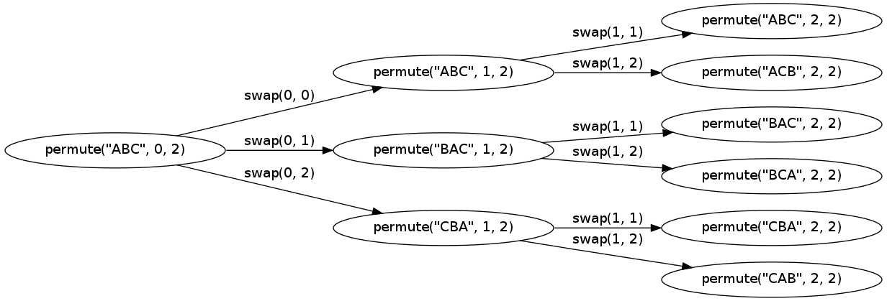

##Combinations

http://stackoverflow.com/a/23718676

There is already plenty of good solutions here, but I would like to share how I solved this problem on my own and hope that this might be helpful for somebody who would also like to derive his own solution.

After some pondering about the problem I have come up with two following conclusions:

For the list L of size n there will be equal number of solutions starting with L1, L2 ... Ln elements of the list. Since in total there are n! permutations of the list of size n, we get n! / n = (n-1)! permutations in each group.
The list of 2 elements has only 2 permutations => [a,b] and [b,a].
Using these two simple ideas I have derived the following algorithm:

permute array
    if array is of size 2
       return first and second element as new array
       return second and first element as new array
    else
        for each element in array
            new subarray = array with excluded element
            return element + permute subarray
Here is how I implemented this in C#:

	public IEnumerable<List<T>> Permutate<T>(List<T> input)
	{
	    if (input.Count == 2) // this are permutations of array of size 2
	    {
	        yield return new List<T>(input);
	        yield return new List<T> {input[1], input[0]}; 
	    }
	    else
	    {
	        foreach(T elem in input) // going through array
	        {
	            var rlist = new List<T>(input); // creating subarray = array
	            rlist.Remove(elem); // removing element
	            foreach(List<T> retlist in Permutate(rlist))
	            {
	                retlist.Insert(0,elem); // inserting the element at pos 0
	                yield return retlist;
	            }
	
	        }
	    }
	}

## Generating all permutations of a given string

http://www.ericleschinski.com/c/java_permutations_recursion/

	public static void permutation(String str) { 
	    permutation("", str); 
	}

	private static void permutation(String prefix, String str) {
	    int n = str.length();
	    if (n == 0) System.out.println(prefix);
	    else {
	        for (int i = 0; i < n; i++)
	            permutation(prefix + str.charAt(i), str.substring(0, i) + str.substring(i+1, n));
	    }
	}
	
	
====> Modified: 	
	
	public static void permutation(String str) { 
	    permutation("", str); 
	}

	private static void permutation(String prefix, String str) {
 
	    int n = str.length();
	    if (n == 0) System.out.println(prefix);
	    else {
	        for (int i = 0; i < n; i++){
	        	System.out.println(prefix +" || "+ str.charAt(i)+" || "+ str.substring(0, i)+ " || "+ str.substring(i+1, n));
	        	
	        	
	            permutation(prefix + str.charAt(i), str.substring(0, i) + str.substring(i+1, n));
	        }
	    }
	}
	

	        	System.out.println(prefix +" || "+ str.charAt(i)+" || "+ str.substring(0, i)+ " || "+ str.substring(i+1, n));

	  || a ||  || bc
	a || b ||  || c
	ab || c ||  || 
	abc
	a || c || b || 
	ac || b ||  || 
	acb
	 || b || a || c
	b || a ||  || c
	ba || c ||  || 
	bac
	b || c || a || 
	bc || a ||  || 
	bca
	 || c || ab || 
	c || a ||  || b
	ca || b ||  || 
	cab
	c || b || a || 
	cb || a ||  || 
	cba

	
	
	System.out.println(prefix +""+ str.charAt(i)+" || "+ str.substring(0, i)+ ""+ str.substring(i+1, n));
	        	

	a || bc
	ab || c
	abc || 
	abc
	ac || b
	acb || 
	acb
	b || ac
	ba || c
	bac || 
	bac
	bc || a
	bca || 
	bca
	c || ab
	ca || b
	cab || 
	cab
	cb || a
	cba || 
	cba

	
	
		
 	substring(a,b);     ===>  [a,b);            a=<x<b

    /**
     * Returns a new string that is a substring of this string. The
     * substring begins at the specified <code>beginIndex</code> and
     * extends to the character at index <code>endIndex - 1</code>.
     * Thus the length of the substring is <code>endIndex-beginIndex</code>.
     * 

     * Examples:
     * <blockquote><pre>
     * "hamburger".substring(4, 8) returns "urge"
     * "smiles".substring(1, 5) returns "mile"
     * </pre></blockquote>
     *
     * @param      beginIndex   the beginning index, inclusive.
     * @param      endIndex     the ending index, exclusive.
     * @return     the specified substring.
     * @exception  IndexOutOfBoundsException  if the
     *             <code>beginIndex</code> is negative, or
     *             <code>endIndex</code> is larger than the length of
     *             this <code>String</code> object, or
     *             <code>beginIndex</code> is larger than
     *             <code>endIndex</code>.
 
    public String substring(int beginIndex, int endIndex) {
        if (beginIndex < 0) {
            throw new StringIndexOutOfBoundsException(beginIndex);
        }
        if (endIndex > value.length) {
            throw new StringIndexOutOfBoundsException(endIndex);
        }
        int subLen = endIndex - beginIndex;
        if (subLen < 0) {
            throw new StringIndexOutOfBoundsException(subLen);
        }
        return ((beginIndex == 0) && (endIndex == value.length)) ? this
                : new String(value, beginIndex, subLen);
    }

	
	
	
##Using set to filter repeated strings.

http://stackoverflow.com/a/20614037

		public static Set<String> generatePerm(String input)
	{
	    Set<String> set = new HashSet<String>();
	    if (input == "")
	        return set;
	
	    Character a = input.charAt(0);
	
	    if (input.length() > 1)
	    {
	        input = input.substring(1);
	
	        Set<String> permSet = generatePerm(input);
	
	        for (String x : permSet)
	        {
	            for (int i = 0; i <= x.length(); i++)
	            {
	                set.add(x.substring(0, i) + a + x.substring(i));
	            }
	        }
	    }
	    else
	    {
	        set.add(a + "");
	    }
	    return set;
	}
	
## Without using recursion

http://stackoverflow.com/a/16753163

Let's use input abc as an example.
	
Start off with just the last element (c) in a set (["c"]), then add the second last element (b) to its front, end and every possible positions in the middle, making it ["bc", "cb"] and then in the same manner it will add the next element from the back (a) to each string in the set making it:
	
"a" + "bc" = ["abc", "bac", "bca"]  and  "a" + "cb" = ["acb" ,"cab", "cba"] 
Thus entire permutation:
	
["abc", "bac", "bca","acb" ,"cab", "cba"]
	
	Code:
	
	public class Test 
	{
	    static Set<String> permutations;
	    static Set<String> result = new HashSet<String>();
	
	    public static Set<String> permutation(String string) {
	        permutations = new HashSet<String>();
	
	        int n = string.length();
	        for (int i = n - 1; i >= 0; i--) 
	        {
	            shuffle(string.charAt(i));
	        }
	        return permutations;
	    }
	
	    private static void shuffle(char c) {
	        if (permutations.size() == 0) {
	            permutations.add(String.valueOf(c));
	        } else {
	            Iterator<String> it = permutations.iterator();
	            for (int i = 0; i < permutations.size(); i++) {
	
	                String temp1;
	                for (; it.hasNext();) {
	                    temp1 = it.next();
	                    for (int k = 0; k < temp1.length() + 1; k += 1) {
	                        StringBuilder sb = new StringBuilder(temp1);
	
	                        sb.insert(k, c);
	
	                        result.add(sb.toString());
	                    }
	                }
	            }
	            permutations = result;
	            //'result' has to be refreshed so that in next run it doesn't contain stale values.
	            result = new HashSet<String>();
	        }
	    }
	
	    public static void main(String[] args) {
	        Set<String> result = permutation("abc");
	
	        System.out.println("\nThere are total of " + result.size() + " permutations:");
	        Iterator<String> it = result.iterator();
	        while (it.hasNext()) {
	            System.out.println(it.next());
	        }
	    }
	}
	
	
##how to understand the method:

	void permute(char a[], int i, int n)
	{
	    int j;
	    if (i == n)                  // If we've chosen all the characters then:
	       cout << a << endl;        // we're done, so output it
	    else
	    {
	        for (j = i; j <= n; j++) // Otherwise, we've chosen characters a[0] to a[j-1]
	        {                        // so let's try all possible characters for a[j]
	            swap(a[i], a[j]);    // Choose which one out of a[j] to a[n] you will choose
	            permute(a, i+1, n);  // Choose the remaining letters
	            swap(a[i], a[j]);    // Undo the previous swap so we can choose the next possibility for a[j]
	        }
	    }
	} 
	
	int main()
	{
	   char a[] = "ABCD";
	   permute(a, 0, 3);
	   getchar();
	   return 0;
	}

PaulR has the right suggestion. You have to run through the code by "hand" (using whatever tools you want - debuggers, paper, logging function calls and variables at certain points) until you understand it. For an explanation of the code I'll refer you to quasiverse's excellent answer.

Perhaps this visualization of the call graph with a slightly smaller string makes it more obvious how it works: 

	

The graph was made with graphviz.
	// x.dot
	// dot x.dot -Tpng -o x.png
	digraph x {
	rankdir=LR
	size="16,10"
	
	node [label="permute(\"ABC\", 0, 2)"] n0;
	 node [label="permute(\"ABC\", 1, 2)"] n1;
	  node [label="permute(\"ABC\", 2, 2)"] n2;
	  node [label="permute(\"ACB\", 2, 2)"] n3;
	 node [label="permute(\"BAC\", 1, 2)"] n4;
	  node [label="permute(\"BAC\", 2, 2)"] n5;
	  node [label="permute(\"BCA\", 2, 2)"] n6;
	 node [label="permute(\"CBA\", 1, 2)"] n7;
	  node [label="permute(\"CBA\", 2, 2)"] n8;
	  node [label="permute(\"CAB\", 2, 2)"] n9;
	
	n0 -> n1 [label="swap(0, 0)"];
	n0 -> n4 [label="swap(0, 1)"];
	n0 -> n7 [label="swap(0, 2)"];
	
	n1 -> n2 [label="swap(1, 1)"];
	n1 -> n3 [label="swap(1, 2)"];
	
	n4 -> n5 [label="swap(1, 1)"];
	n4 -> n6 [label="swap(1, 2)"];
	
	n7 -> n8 [label="swap(1, 1)"];
	n7 -> n9 [label="swap(1, 2)"];
	}
	
	
Implementation of Java:

	public void permute(int[] nums){
		permuteSub(nums,0,nums.length-1);
	}
	
	public void permuteSub(int[] arr,int i, int n){
		
		int j;
		if(i==n)
			{for(int tmp:arr)
				System.out.print(tmp+" ");
			System.out.println();
			}else{
				for(j=i;j<=n;j++){
				   swap(arr,i,j);
				   permuteSub(arr,i+1,n);
				   swap(arr,i,j);
				}
			}
		
	}
	
	public void swap(int[] nums,int i,int j){
		int tmp=nums[i];
		nums[i]=nums[j];
		nums[j]=tmp;
	}
	
	
##by using generics to modify the above method:
http://www.runoob.com/java/java-generics.html

	     Integer[] intArray = { 1, 2, 3, 4, 5 };
        Double[] doubleArray = { 1.1, 2.2, 3.3, 4.4 };
        Character[] charArray = { 'H', 'E', 'L', 'L', 'O' };
        
     Take care you need to convert int[], char[].... to Integer[], Character[]...
    
    How to convert:
    
	  Integer[] newArray = new Integer[ids.length];
	     for (int i = 0; i < ids.length; i++) {
	       newArray[i] = Integer.valueOf(ids[i]);
	     }
	 
 
 	char[] cArr="abc".toCharArray();
		Character[] newArr=new Character[cArr.length];
		for(int i=0;i<cArr.length;i++){
			newArr[i]=Character.valueOf(cArr[i]);
		}
	    
Use Generic implementation:

	public <E>void permute(E[] nums){
		permuteSub(nums,0,nums.length-1);
	}
	
	public <E>void permuteSub(E[] nums,int i, int n){
		
		int j;
		if(i==n)
			{for(E tmp:nums)
				System.out.print(tmp+" ");
			System.out.println();
			}else{
				for(j=i;j<=n;j++){
				   swap(nums,i,j);
				   permuteSub(nums,i+1,n);
				   swap(nums,i,j);
				}
			}
		
	}
	
	public <E>void swap(E[] nums,int i,int j){
		E tmp=nums[i];
		nums[i]=nums[j];
		nums[j]=tmp;
	}

Print out the process:

		public <E>void permute(E[] nums){
			permuteSub(nums,0,nums.length-1);
		}
		
		public <E>void permuteSub(E[] nums,int i, int n){
	
			int j;
			if (i == n) {
				System.out.print("i="+i+" ");
				printArr(nums);
	//			for (E tmp : nums)
	//				System.out.print(tmp + " ");
	//			System.out.println();
			} else {
				for (j = i; j <= n; j++) {
					swap(nums, i, j);
					System.out.print("i="+i+" j="+j+" ");
					printArr(nums);
					permuteSub(nums, i + 1, n);
					swap(nums, i, j);
				}
			}
			
		}
		
		public <E>void swap(E[] nums,int i,int j){
			E tmp=nums[i];
			nums[i]=nums[j];
			nums[j]=tmp;
		}
		
	i=0 j=0 a b c 
	i=1 j=1 a b c 
	i=2 a b c 
	i=1 j=2 a c b 
	i=2 a c b 
	i=0 j=1 b a c 
	i=1 j=1 b a c 
	i=2 b a c 
	i=1 j=2 b c a 
	i=2 b c a 
	i=0 j=2 c b a 
	i=1 j=1 c b a 
	i=2 c b a 
	i=1 j=2 c a b 
	i=2 c a b 

reOrder the print out result:
	
	Loop all the swap(0,k)   k-->n cases:
	i=0 j=0 a b c 
	i=0 j=1 b a c 
	i=0 j=2 c b a 
	
	Loop Sub-process: swap(1,k) for swap(0,0) case extends from previous loop k-->n cases:
	ABC:
	i=1 j=1 a b c 
	i=1 j=2 a c b
	
	Loop Sub-process: swap(1,k) for swap(0,1) case extends from previous loop k-->n cases:
	BAC: 
	i=1 j=1 b a c 
	i=1 j=2 b c a
	
	Loop Sub-process: swap(1,k) for swap(0,2) case extends from previous loop k-->n cases:
	CBA: 
	i=1 j=1 c b a 	
	i=1 j=2 c a b 	
	
	ABC swap(2,2) for swap(1,1) extends from previous loop:
	i=2 a b c
	
	ABC swap(2,2) for swap(1,2) extends from previous loop:
	i=2 a c b 
	
	BAC	swap(2,2) for swap(1,1) extends from previous loop::
	i=2 b a c 
	
	BAC swap(2,2) for swap(1,2) extends from previous loop:
	i=2 b c a 
	
	CBA	swap(2,2) for swap(1,1) extends from previous loop::
	i=2 c b a
	
	CBA	swap(2,2) for swap(1,2) extends from previous loop:: 
	i=2 c a b 

	
