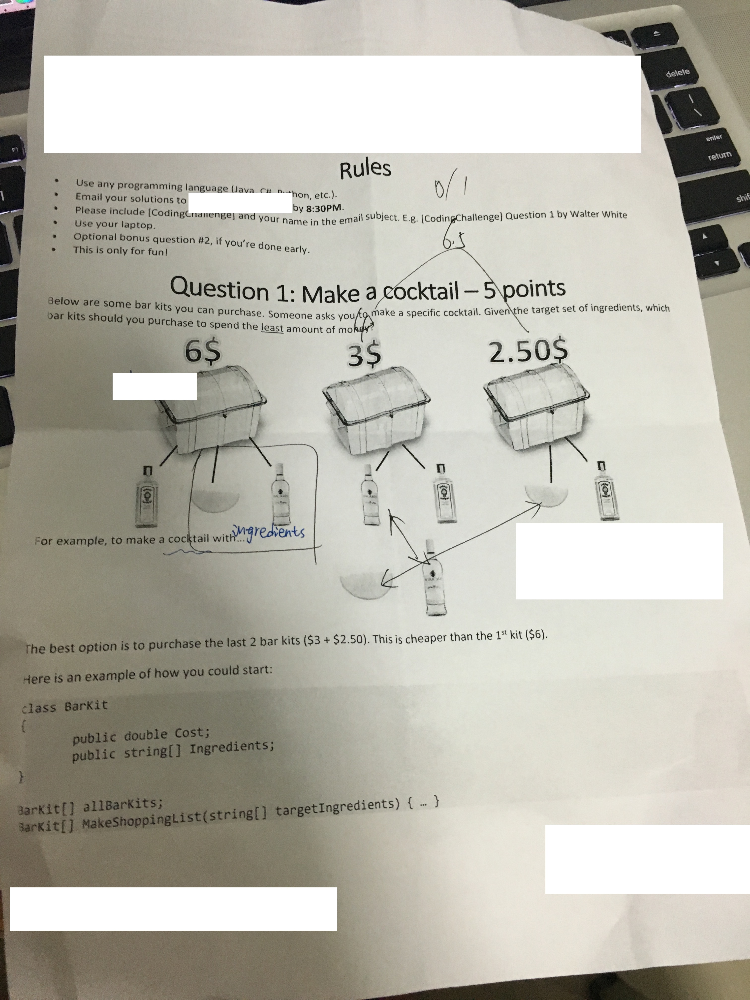

# Competition

These two questions are appeared in one competition around One North.

Questions:

We respect your time! Short answers will work just fine. These questions may sound naive but will help us pre-select the right candidates!

##Multithreading
Have you written multithreaded code? Please provide some context as well as the coding primitives you used.

##Debugging
What is the hardest problem you've had to debug? Please explain which tools / techniques you used and what you uncovered.

##Optimization
Is there any type of code or problems you like to optimize? What is your favorite optimization technique?

##Algorithm
Is there any interesting algorithm you've implemented for a real-world project? What does it do?

