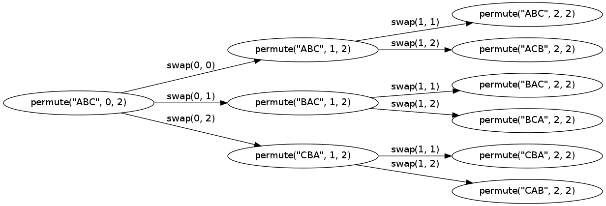

##Graphviz
http://www.graphviz.org/

Welcome to Graphviz
  Available translations:  Romanian, Russian, Russian (more natural?), Serbo-Croatian, Bulgarian Home and About

What is Graphviz?
Graphviz is open source graph visualization software. Graph visualization is a way of representing structural information as diagrams of abstract graphs and networks. It has important applications in networking, bioinformatics,  software engineering, database and web design, machine learning, and in visual interfaces for other technical domains. 

Features
The Graphviz layout programs take descriptions of graphs in a simple text language, and make diagrams in useful formats, such as images and SVG for web pages; PDF or Postscript for inclusion in other documents; or display in an interactive graph browser.  Graphviz has many useful features for concrete diagrams, such as options for colors, fonts, tabular node layouts, line styles, hyperlinks, and custom shapes. 

The graph was made with graphviz.

		// x.dot
		// dot x.dot -Tpng -o x.png
		digraph x {
		rankdir=LR
		size="16,10"
	
	node [label="permute(\"ABC\", 0, 2)"] n0;
	 node [label="permute(\"ABC\", 1, 2)"] n1;
	  node [label="permute(\"ABC\", 2, 2)"] n2;
	  node [label="permute(\"ACB\", 2, 2)"] n3;
	 node [label="permute(\"BAC\", 1, 2)"] n4;
	  node [label="permute(\"BAC\", 2, 2)"] n5;
	  node [label="permute(\"BCA\", 2, 2)"] n6;
	 node [label="permute(\"CBA\", 1, 2)"] n7;
	  node [label="permute(\"CBA\", 2, 2)"] n8;
	  node [label="permute(\"CAB\", 2, 2)"] n9;
	
	n0 -> n1 [label="swap(0, 0)"];
	n0 -> n4 [label="swap(0, 1)"];
	n0 -> n7 [label="swap(0, 2)"];
	
	n1 -> n2 [label="swap(1, 1)"];
	n1 -> n3 [label="swap(1, 2)"];
	
	n4 -> n5 [label="swap(1, 1)"];
	n4 -> n6 [label="swap(1, 2)"];
	
	n7 -> n8 [label="swap(1, 1)"];
	n7 -> n9 [label="swap(1, 2)"];
	}

Using above code to generate this image:
	
	